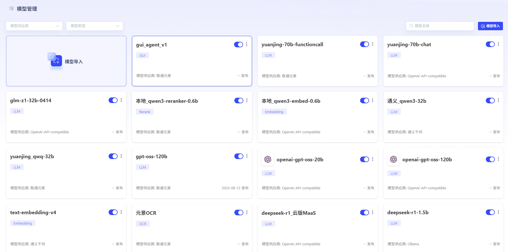
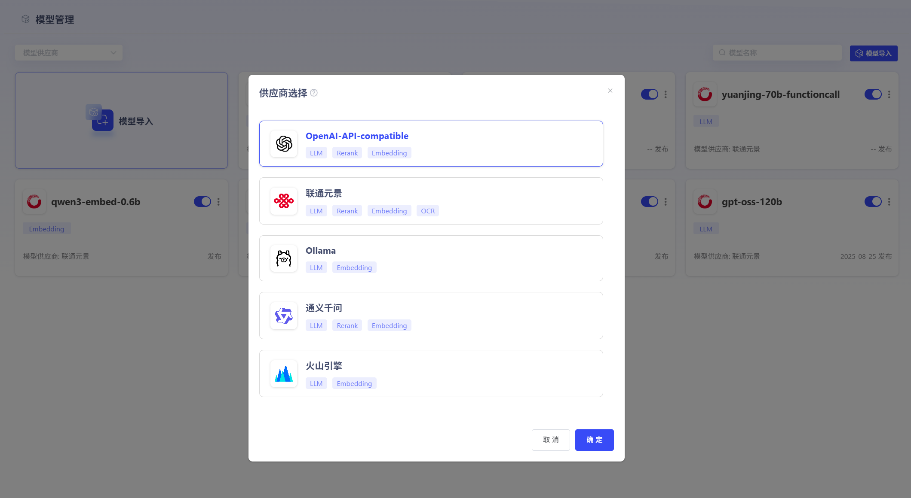
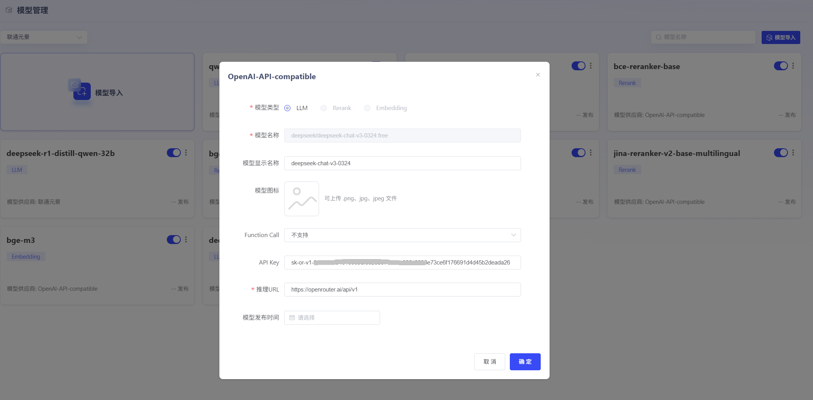

# Model

Management

Users

can

integrate

external

models

into

the

platform

through

configuration.

Associate

inference

URLs

according

to

model

vendor

specifications.

Supported

importable

models

include

LLM,

Embedding,

Rerank,

and

OCR.

After

enabling

services,

they

can

be

used

for

model

inference.

For

specific

import

methods,

see

[Model

Import

Guide

- Detailed](Model

Import

Guide

- Detailed.md)







# APIReference


## LLM


### OpenAI-API-


compatible

- *Request**

```bash

curl

- -location

'URL'

\

- -header

'Content-Type:

application/json'

\

- -header

'Authorization:

Bearer

api-key'

\

- -data

'{

"messages":

[

{

"role":

"user",

"content":

"你 Yes 谁"

}

],

"model":

"gpt-oss-20b",

"stream":

false

}'

```

- *Response**

非流式 Response

```bash

{

"id":

"chatcmpl-ec8ed5bef88849c4ab3147f650b3d3ec",

"object":

"chat.completion",

"created":

1754964185,

"model":

"gpt-oss-20b",

"choices":

[

{

"index":

0,

"message":

{

"role":

"assistant",

"content":

"您好!

\n 我 Yes

ChatGPT,

OpenAI

研发 Artificial

Intelligence 语言 Model,

Able to 根据 Input TextPerform 对话、回答 Problem、ProvidesRecommendation、撰写 Articleetc.

您有什么想聊 or 想了解,

尽管告诉我吧!

",

"tool_calls":

[]

},

"finish_reason":

"stop"

}

],

"usage":

{

"prompt_tokens":

73,

"completion_tokens":

179,

"total_tokens":

252

}

}

```

流式 Response

```bash

{

"id":

"endpoint_common_250891",

"object":

"chat.completion.chunk",

"created":

1754964492,

"model":

"deepseek-r1",

"choices":

[

{

"index":

0,

"delta":

{

"role":

"assistant",

"content":

"吗"

},

"finish_reason":

null

}

]

}

```

### 联通元景


- *Request**

```bash

curl

- -location

'https://maas.ai-yuanjing.com/openapi/compatible-mode/v1/chat/completions'

\

- -header

'Content-Type:

application/json'

\

- -header

'Authorization:

Bearer

api-key'

\

- -data

'{

"messages":

[

{

"role":

"user",

"content":

"你 Yes 谁"

}

],

"model":

"deepseek-r1",

"stream":

false

}'

```

- *Response**

非流式 Response

```bash

{

"id":

"endpoint_common_249820",

"object":

"chat.completion",

"created":

1754965561,

"model":

"deepseek-r1",

"choices":

[

{

"index":

0,

"message":

{

"role":

"assistant",

"content":

"<think>\n 嗯,

User 问了一个很基础 but 也很关 Key Problem:

“你 Yes 谁”.

这可能 YesFirst 次 Use Intelligence 助手 User,

也可能 Yes 想 ConfirmWhen 前对话 Objects 身份 老 User.

\n\nUser 可能带着试探 or 好奇 心态提问,

背后 or 许 Hide 着“你能帮我做什么”“我该怎么 and 你 Exchange”这样 潜 inDemand.

考虑 toProblem 非常简短,

User 可能处于两种 Status:

要么 Yes 匆忙 TestFeatures,

要么 Yes 带着观察 Attitude 谨慎接触新事物.

\n\n 这种 Situation 下,

Reply 需要同 Hour 做 to 三点:

明确身份建立信任感,

ShowcaseFeatures 激发兴趣,

用 Table 情符号传递友好 Attitude.

要 Avoidance 过于 Technology 化 术语,

比如不说“我 Yes 基于 TransformerArchitecture LLM”,

而 Yes 用“Intelligence 助手”这样通俗 Table 达.

\n\nUser 没有 Provides 任何 BackgroundInformation,

所以采用性称呼“你”最 Security.

最后那句“现 in 有什么 Can 帮你 吗”Yes 重要 话术转折,

既开放又带 Guidance 性,

能自然 Driving 对话进入实用 Phase.

\n</think>\n 你好呀!

我 Yes

- *DeepSeek-R1**,

一款由国 「Depth 求索(DeepSeek)」Company 研发 Intelligence 助手.

你 Can 把我 When 作一个 Knowledge 丰富、乐于助人 聊天伙伴

😊\n\n 我 本领 Including:

\n\n-

📚

回答各种 Knowledge 性 Problem(History、科技、文学、生活常识 etc.

\n-

✍️

帮你写 Article、改简历、起 Title、写文案

\n-

📊

ProcessandAnalysisDocumentation(Word、PDF、Exceletc.

\n-

🧠

ProvidesLearning 辅导、解题思路、论文润色

\n-

📅

安排 Program、整理资料、做读书笔记

\n-

💬

陪你聊天谈心、解闷放松

\n\n 我目前 Yes**完全免费 **,

也没有语音 Features(纯文字 Exchange),

but 我 Support 超长 Context 记忆(128K

tokens),

UploadDocumentation 也没 Problem 哦!

\n\n 现 in 有什么 Can 帮你 吗?

🌟",

"tool_calls":

null

},

"finish_reason":

"stop"

}

],

"usage":

{

"prompt_tokens":

6,

"completion_tokens":

378,

"total_tokens":

384

}

}

```

流式 Response

```bash

{

"id":

"endpoint_common_250934",

"object":

"chat.completion.chunk",

"created":

1754965671,

"model":

"deepseek-r1",

"choices":

[

{

"index":

0,

"delta":

{

"role":

"assistant",

"content":

"🌟"

},

"finish_reason":

null

}

]

}

```

### Ollama


- *Request**

```bash

curl

- -location

'http://ip:11434/v1/chat/completions'

\

- -header

'Content-Type:

application/json'

\

- -data

'{

"model":

"deepseek-r1:1.5b",

"messages":

[

{

"role":

"user",

"content":

"你 Yes 谁"

}

]

}'

```

- *Response**

非流式 Response

```bash

{

"id":

"chatcmpl-403",

"object":

"chat.completion",

"created":

1754965819,

"model":

"deepseek-r1:1.5b",

"system_fingerprint":

"fp_ollama",

"choices":

[

{

"index":

0,

"message":

{

"role":

"assistant",

"content":

"<think>\n\n</think>\n\n 您好!

我 Yes 由国 Depth 求索(DeepSeek)CompanyDevelopment Intelligence 助手 DeepSeek-R1.

如您有任何任何 Problem,

我会尽我所能 Provide Help. for 您

"

},

"finish_reason":

"stop"

}

],

"usage":

{

"prompt_tokens":

5,

"completion_tokens":

40,

"total_tokens":

45

}

}

```

流式 Response

```bash

{

"id":

"chatcmpl-323",

"object":

"chat.completion.chunk",

"created":

1754965959,

"model":

"deepseek-r1:1.5b",

"system_fingerprint":

"fp_ollama",

"choices":

[

{

"index":

0,

"delta":

{

"role":

"assistant",

"content":

".

"

},

"finish_reason":

null

}

]

}

```

### 通义千问


- *Request**

```bash

curl

- -location

'https://dashscope.aliyuncs.com/compatible-mode/v1/chat/completions'

\

- -header

'Authorization:

Bearer

api-key'

\

- -header

'Content-Type:

application/json'

\

- -data

'{

"model":

"qwen-flash",

"messages":

[

{

"role":

"user",

"content":

"你好"

}

],

"stream":

false,

"enable_thinking":true

}'

```

- *Response**

非流式 Response

```bash

{

"choices":

[

{

"message":

{

"content":

"你好!

😊

有什么我 Can 帮你 吗?

",

"reasoning_content":

"嗯,

User 发来“你好”,

这 Yes 一个常见 打招呼 Way.

我需要友好地回应.

首先,

ConfirmUser 可能需要 Help,

所以应该用文 Reply,

保持礼貌.

\n\n 接下来,

考虑 User 可能 意图.

他们可能刚接触这个 Platform,

or 有具体 Problem 需要 Solve.

作 forAI,

我应该 ProvidesHelp,

同 Hour 保持简洁.

\n\nInspection 之前 对话 History,

but 这里没有 Context,

所以需要 from 头 Start.

确保 Reply 不带任何 Assumption,

AvoidanceComplexInformation.

\n\n 可能需要询问 User 需要什么 Help,

这样能 Guidance 他们进一步 InstructionsDemand.

例如,

“你好!

有什么我 Can 帮你 吗?

”\n\n 还要 Note 语气,

用 Table 情符号可能让 Reply 更亲切,

but 不 OKUser 偏好,

所以可能保持性.

不过根据之前 例子,

有 Hour 候用😊Can 增加友好感.

\n\nAvoidanceUse Professional 术语,

保持口语化.

比如不要说“请问您需要什么 Help?

”,

而 Yes 更自然 “你好!

有什么我 Can 帮你 吗?

”\n\nInspection 有没有拼写 Error,

确保 Reply 正确.

文 “你好”Yes 正确.

\n\n 可能需要考虑 UserYesNoYesFirst 次 Use,

所以 Reply 要友好且开放,

鼓励他们提出 Problem.

\n\n 最后,

确保 Reply 简短,

不要冗长,

这样 User 不会感 to 压力.

\n\n 所以,

综合起来,

Reply 应该 Yes:

“你好!

😊

有什么我 Can 帮你 吗?

”

这样既友好又明确.

",

"role":

"assistant"

},

"finish_reason":

"stop",

"index":

0,

"logprobs":

null

}

],

"object":

"chat.completion",

"usage":

{

"prompt_tokens":

9,

"completion_tokens":

292,

"total_tokens":

301

},

"created":

1754966125,

"system_fingerprint":

null,

"model":

"qwen-flash",

"id":

"chatcmpl-ae34fd13-c4c1-987d-bc20-09fe6f6d4936"

}

```

流式 Response

```bash

{

"choices":

[

{

"delta":

{

"content":

"

有什么我 Can Help",

"reasoning_content":

null

},

"finish_reason":

null,

"index":

0,

"logprobs":

null

}

],

"object":

"chat.completion.chunk",

"usage":

null,

"created":

1754966192,

"system_fingerprint":

null,

"model":

"qwen-flash",

"id":

"chatcmpl-7143c7c5-2128-9a6a-b8dc-18c2c306bc14"

}

```

### 火山引擎


- *Request**

```bash

curl

- -location

'https://ark.cn-beijing.volces.com/api/v3/chat/completions'

\

- -header

'Content-Type:

application/json'

\

- -header

'Authorization:

Bearer

api-key'

\

- -data

'{

"do_sample":

false,

"messages":

[

{

"content":

"你好",

"role":

"user"

}

],

"model":

"doubao-seed-1-6-flash-250715",

"repetition_penalty":

1.1,

"stream":

true,

"temperature":

0.01

}'

```

- *Response**

非流式 Response(目前思维链尚未兼容

reasoning_content)

```bash

{

"choices":

[

{

"finish_reason":

"stop",

"index":

0,

"logprobs":

null,

"message":

{

"content":

"你好呀!

很高兴见 to 你~

有什么我 Can 帮你 吗?

😊",

"reasoning_content":

"\nUser 现 in 说“你好”,

我需要友好地回应.

首先,

保持礼貌 and 热情,

直接回应 User 问候,

然后 Can 稍微 Guidance 一下,

问问 User 有什么需要 Help,

这样能让对话 Continue 下去.

比如 Can 说“你好呀!

很高兴见 to 你~

有什么我 Can 帮你 吗?

😊”

这样既回应了问候,

又 Table 达了愿意 ProvidesHelp Attitude,

还带了个 Table 情符号显得更亲切.

",

"role":

"assistant"

}

}

],

"created":

1754966401,

"id":

"021754966399956ef34c300eb7cd27671b96789a585234f4250fd",

"model":

"doubao-seed-1-6-flash-250715",

"service_tier":

"default",

"object":

"chat.completion",

"usage":

{

"completion_tokens":

119,

"prompt_tokens":

85,

"total_tokens":

204,

"prompt_tokens_details":

{

"cached_tokens":

0

},

"completion_tokens_details":

{

"reasoning_tokens":

101

}

}

}

```

流式 Response

```bash

{

"choices":

[

{

"delta":

{

"content":

"😊",

"role":

"assistant"

},

"index":

0

}

],

"created":

1754966363,

"id":

"021754966363144ef34c300eb7cd27671b96789a585234fa38263",

"model":

"doubao-seed-1-6-flash-250715",

"service_tier":

"default",

"object":

"chat.completion.chunk",

"usage":

null

}

```

## Rerank


### OpenAI-API-


compatible

- *Request**

```bash

curl

- -location

'URL'

\

- -header

'Authorization:

Bearer

api-key'

\

- -header

'Content-Type:

application/json'

\

- -data

'{

"model":

"Modelid",

"query":

"Apple",

"documents":

[

"你好啊,

世界",

"我爱吃汉堡",

"尖尖我噶奶",

"乌萨奇",

"雷欧奥特曼"

],

"top_n":

2,

"return_documents":

true

}'

```

- *Response**

```bash

{

"model":

"jina-reranker-v2-base-multilingual",

"usage":

{

"total_tokens":

42

},

"results":

[

{

"index":

3,

"document":

{

"text":

"乌萨奇"

},

"relevance_score":

0.9674102663993835

},

{

"index":

0,

"document":

{

"text":

"你好啊,

世界"

},

"relevance_score":

0.16132023930549622

},

{

"index":

1,

"document":

{

"text":

"我爱吃汉堡"

},

"relevance_score":

0.06853749603033066

}

]

}

```

### 联通元景


- *Request**

```bash

curl

- -location

'https://maas-api.ai-yuanjing.com/openapi/bge/v1/rerank'

\

- -header

'Content-Type:

application/json'

\

- -header

'Authorization:

Bearer

api-key'

\

- -data

'{

"query":

"今天天气不错",

"texts":

[

"天气很好",

"Stock 涨跌跟天气 None 关",

"今天北京雾霾严重"

]

}'

```

- *Response**

```bash

[

{

"index":

0,

"score":

4.88899040222168,

"document":

"天气很好"

},

{

"index":

1,

"score":

- 4.119245529174805,

"document":

"Stock 涨跌跟天气 None 关"

},

{

"index":

2,

"score":

- 6.025328159332275,

"document":

"今天北京雾霾严重"

}

]

```

### 通义千问


- *Request**

```bash

curl

- -location

'https://dashscope.aliyuncs.com/api/v1/services/rerank/text-rerank/text-rerank'

\

- -header

'Authorization:

Bearer

api-key'

\

- -header

'Content-Type:

application/json'

\

- -data

'{

"model":

"gte-rerank",

"input":{

"query":

"什么 YesTextSortModel",

"documents":

[

"TextSortModel 广泛 Used for 搜 Index 擎 andRecommendSystem,

它们根据 Text 相关性对候选 TextPerform Sort",

"量子 CalculateYesCalculate 科学 一个前沿 Field",

"预 Training 语言 Model Development 给 TextSortModel 带来了新 进展"

]

},

"parameters":

{

"return_documents":

true,

"top_n":

3

}

}'

```

- *Response**

```bash

{

"output":

{

"results":

[

{

"document":

{

"text":

"TextSortModel 广泛 Used for 搜 Index 擎 andRecommendSystem,

它们根据 Text 相关性对候选 TextPerform Sort"

},

"index":

0,

"relevance_score":

0.7315062086803763

},

{

"document":

{

"text":

"预 Training 语言 Model Development 给 TextSortModel 带来了新 进展"

},

"index":

2,

"relevance_score":

0.5831720487049298

},

{

"document":

{

"text":

"量子 CalculateYesCalculate 科学 一个前沿 Field"

},

"index":

1,

"relevance_score":

0.04973238644524712

}

]

},

"usage":

{

"total_tokens":

79

},

"request_id":

"8baa31dc-a786-9326-8e20-895c74bbff16"

}

```

## Embedding


### OpenAI-API-


compatible

- *Request**

```bash

curl

- -location

'URL'

\

- -header

'Authorization:

Bearer

api-key'

\

- -header

'Content-Type:

application/json'

\

- -data

'{

"model":

"BAAI/bge-large-zh-v1.5",

"input":

[

"风急天高猿啸哀",

"渚清沙白鸟飞回"

],

"encoding_format":

"float"

}'

```

- *Response**

```bash

{

"object":

"list",

"data":

[

{

"embedding":

[

0.018213777,

- 0.026578045,

0.018492958,

- 0.01139059,

0.04650041,

0.021854298,

- 0.056059573,

- 0.034439784,

0.043842606,

……

],

"index":

1,

"object":

"embedding"

}

],

"model":

"BAAI/bge-large-zh-v1.5",

"usage":

{

"prompt_tokens":

18,

"completion_tokens":

0,

"total_tokens":

18

}

}

```

### 联通元景


- *Request**

```bash

curl

- -location

'https://maas-api.ai-yuanjing.com/openapi/compatible-mode/v1/embeddings'

\

- -header

'Content-Type:

application/json'

\

- -header

'Authorization:

Bearer

api-key'

\

- -data

'{

"model":

"qwen3-embed-0.6b",

"input":

[

"

你好"

],

"encoding_format":

"float"

}'

```

- *Response**

```bash

{

"id":

"embd-15c7e7b5-eccf-9140-afe2-42e25e88fd6d",

"object":

"list",

"created":

1754967486,

"model":

"qwen3-embed-0.6b",

"data":

[

{

"object":

"embedding",

"embedding":

[

0.013916015625,

0.0147705078125,

0.06689453125,

……

],

"index":

0

}

],

"usage":

{

"prompt_tokens":

3,

"completion_tokens":

0,

"total_tokens":

3

}

}

```

### Ollama


- *Request**

```bash

curl

- -location

'http://ip:11434/v1/embeddings'

\

- -header

'Content-Type:

application/json'

\

- -data

'{

"encoding_format":

"float",

"input":

[

"

你好"

],

"model":

"granite-embedding:latest"

}'

```

- *Response**

```bash

{

"object":

"list",

"data":

[

{

"object":

"embedding",

"embedding":

[

0.011519907,

- 0.14500324,

0.092740096,

……

],

"index":

0

}

],

"model":

"granite-embedding:latest",

"usage":

{

"prompt_tokens":

5,

"total_tokens":

5

}

}

```

### 通义千问


- *Request**

```bash

curl

- -location

'https://dashscope.aliyuncs.com/compatible-mode/v1/embeddings'

\

- -header

'Authorization:

Bearer

api-key'

\

- -header

'Content-Type:

application/json'

\

- -data

'{

"encoding_format":

"float",

"input":

[

"你好"

],

"model":

"text-embedding-v4"

}'

```

- *Response**

```bash

{

"data":

[

{

"embedding":

[

0.00904093962162733,

0.040408216416835785,

- 0.025859294459223747,

0.03675258532166481,

0.04067809507250786,

……

],

"index":

0,

"object":

"embedding"

}

],

"object":

"list",

"model":

"text-embedding-v4",

"usage":

{

"prompt_tokens":

2,

"total_tokens":

2

},

"id":

"21fe5ad3-c5b7-9ba4-bad2-9d926691b4f3"

}

```

## OCR


### 联通元景


- *Request**

```bash

curl

- -location

'https://maas-api.ai-yuanjing.com/openapi/v1/unicom-ocr'

\

- -header

'Content-Type:

multipart/form-data'

\

- -header

'Authorization:

Bearer

api-key'

\

- -form

'file=UploadFile'

```

- *Response**

```bash

{

"id":

"embd-15c7e7b5-eccf-9140-afe2-42e25e88fd6d",

"object":

"list",

"created":

1754967486,

"model":

"qwen3-embed-0.6b",

"data":

[

{

"object":

"embedding",

"embedding":

[

0.013916015625,

0.0147705078125,

0.06689453125,

……

],

"index":

0

}

],

"usage":

{

"prompt_tokens":

3,

"completion_tokens":

0,

"total_tokens":

3

}

}

```