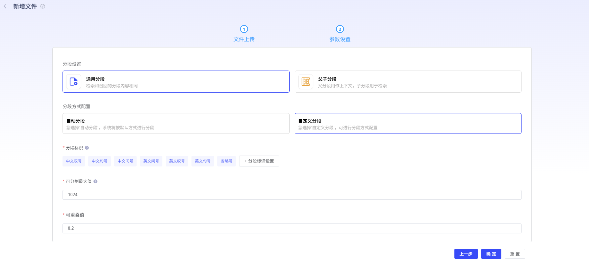
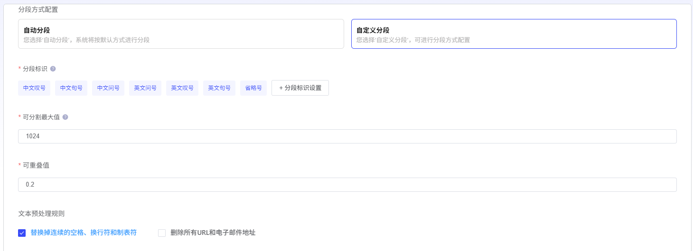

# Minute 段 Configuration

## 1. Minute 段 Settings

PlatformSupportGeneralMinute 段 and 父子 Minute 段2种 Pattern.

- **GeneralMinute 段**:

检索 and 召回 Minute 段 Content 相同

- **父子 Minute 段:

- *父 Minute 段用作 Context,

子 Minute 段 Used for 检索

## 2. Minute 段 WayConfiguration

PlatformSupport 自动 Minute 段 and 自 DefinitionMinute 段2种 Pattern.

- **自动 Minute 段**

- System 将按照 DefaultWayPerform Minute 段(仅 In GeneralMinute 段 Way, 生效)

- **自 DefinitionMinute 段**

- **Minute 段标识:

- *Minute 隔符 YesUsed forMinute 隔 Text Character.

\n\nand

\n

Yes 常 Used forMinute 隔 ParagraphandRow Minute 隔符.

用逗号 ConnectionMinute 隔符(\n\n, \n)WhenParagraph 超过最大块 LengthHour,

会按 RowPerform Minute 割.

您也 Can Use 自 Definition 特殊 Minute 隔符 or 我们 Provides 标点符号 Minute 割.

- **可 Minute 割最大 Value:

- *Minute 段 Content 最大 Length,

Unitfortokens

- **可重叠 Value:

- *SettingsMinute 段之间 重叠 LengthCan 保留 Minute 段之间 语义关系,

提升召回 Effectiveness.

Yes 可 Minute 割最大 Value 百 Minute 比.

(仅 In GeneralMinute 段 Way, 生效)

- **Text 预 ProcessRules:

- *Replace 掉连续 空格、换 Row 符 and 制 Table 符;

Delete 所有

URL

and 电子邮件 Address

