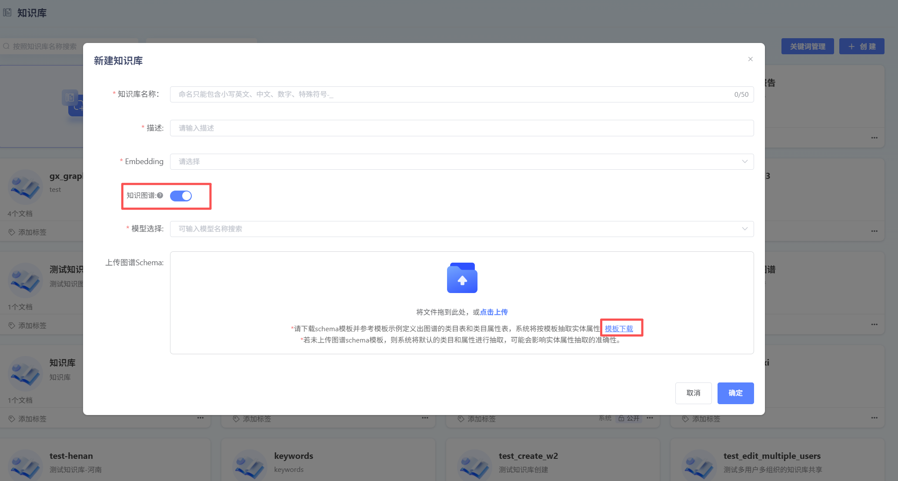
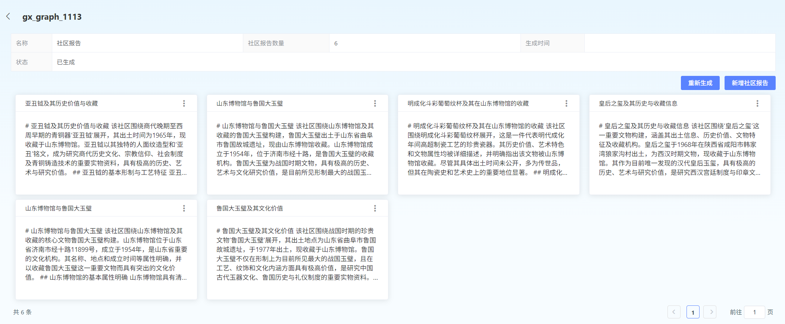
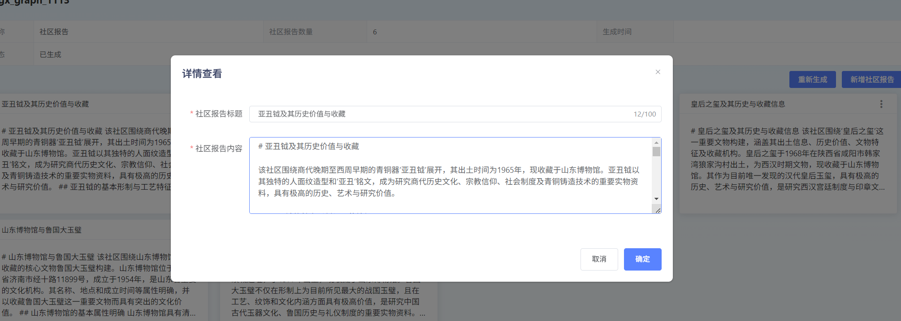
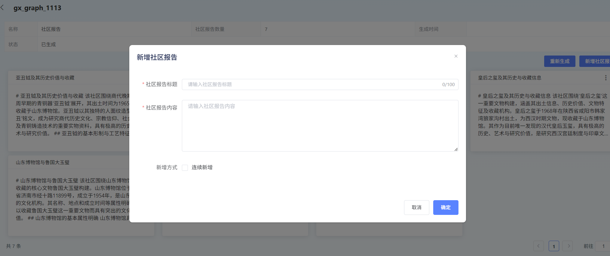

# Knowledge 图谱

### 1. 什么 YesKnowledge 图谱?

Knowledge 图谱本质上 Yes 一个**语义 Network**,

它用图 形式来 Description 现实世界 Concept、Entity 及其相互关系.

它由以下核心 Element 构成:

- **Node**:

代 Table 现实世界 “Entity”(如:

人物、Company、产品)or“Concept”(如:

国家、Industry).

- **边**:

代 TableNode 之间 “关系”(如:

[张三]

- `就职于`->

[阿里巴巴]).

- **Attributes**:

DescriptionNodeor 边 FeaturesInformation(如:

[张三]

Node 有 Attributes

`Year 龄:

30`,

`Position:

Algorithm 工程师`).

and 传统 关系型 DataLibrary(Table 格)不同,

Knowledge 图谱 Structure 更灵活,

更擅长 ProcessComplex、多跳 AssociateQueryand 推理.

### 2. for 什么 Agent 需要 Knowledge 图谱?

Agent(如聊天 Machine 人、Intelligence 助手)仅 Dependency 大语言 ModelHour,

可能会遇 to 以下 Problem:

- **事实幻觉**:

Generate 看似合理 butand 事实不符 Information.

- **Knowledge 滞后**:

None 法 GetTrainingDataDeadlineDate 之后 新 Knowledge.

- **缺乏 Depth 推理**:

难以回答需要跨多个 EntityPerform ComplexAssociateAnalysis Problem.

Knowledge 图谱 Can Provide: for Agent

- **事实依据**:

作 forStructure 化 “事实 DataLibrary”,

Provide 准确、可 Validation Information. for Agent

- **Enhance 推理**:

Support 多跳 Query,

回答“XXCompany CEO 母校 Yes 哪里?

”这 ClassesComplexProblem.

- **可 Interpretation 性**:

答案 Can 追溯 toKnowledge 图谱 具体 Path,

Enhance 了回答 可信度.

- --

### 3. 核心 ConceptParse

|

Concept

|

Interpretation

|

Example

|

|

- ---------

|

- -----------------------------------------------------------

|

- ----------------------------------------------------

|

|

- *Entity**

|

现实世界可区 Minute 独立事物.

|

`苹果 Company`、`iPhone

15`、`蒂姆·Library 克`

|

|

- *关系**

|

Connection 两个 Entity,

Description 它们之间 某种 Contact.

|

`Production`、`Yes. . . CEO`、`Publish 于`

|

|

- *Attributes**

|

Entityor 关系 FeaturesorDescription.

|

`iPhone

15`

Attributes:

`颜色:

深空黑`、`StorageCapacity:

256GB`

|

|

- *三元 Group**

|

Knowledge 图谱 BasicGroup 成 Unit,

形式 for

`(主语,

谓语,

宾语)`

or

`(Entity,

关系,

Entity/Value)`.

|

`(蒂姆·Library 克,

Yes. . . CEO,

苹果 Company)`

|

### 4. Knowledge 图谱 Use Process

#### 1)CreateKnowledge 图谱

inKnowledge

BaseCreatePhase,

可开启 Knowledge 图谱 Features,

按照 TemplateUpload 对应 图谱 Schema:

- *FeaturesInstructions: **开启此 Features 后会调用 LLM 对切片 Content 提及 三元 Group 并 inKnowledge

Base 层面构建 Knowledge 图谱.

检索 Hour 会引入图谱 Enhancechunk 间关系检索,

提升相关性召回 Effectiveness.

- *适用 Scenario: **Used for 回答 Problem chunk 切片跨多个 Fileor 同 File 不同 Chapter,

Dependencychunk 之间 throughEntity 关系 Implementation 多跳、关系 Classes 检索才能 Implementation 更全面 Context 召回.

- *Note 事项: **开启后将对非 Table 格 ClassesDocumentationinImportParse 环节调用大语言 Model 抽取三元 Group、构建 Knowledge 图谱,

会增加 Document

ParsingProcessHour 长并增加 LLMtokensResource 开销.

检索召回 Hour 会增加图谱检索召回会增加检索耗 Hour.

#### 2)ViewKnowledge 图谱

Click[Knowledge 图谱],

可 ViewKnowledge 图谱 Details,

and Knowledge 图谱 GenerateProgress.

#### 3)GenerateCommunityReport

- *CommunityReport:

- *基于 Knowledge 图谱,

throughCommunityDetectionAlgorithm,

将图谱按 Theme 划 Minutefor 多个 Community,

并 for 每个 CommunityGenerate ThemeReport(Used forDescription 该 Community 内 所有 Entity 级关系).

CommunityReportinQueryHour 作 for 一 Classes 综合性 Knowledge 参 and 检索召回.

适合 App 于综合性全局问答 ClassesScenarioUse.

Click[CommunityReport]-[Generate/重新 Generate],

User 可 ViewCommunityReportDetails,

并 Add、EditCommunityReport.

- *Hint:

- *CommunityReport 需要 inKnowledgeImageParseComplete 之后,

才能 Generate.

需要 User 手动 ClickGenerate.

CommunityReportinUploadFileorDeleteFileHour 不会自动触发构建, 如需 UpdateReport 需要 ClickGenerate/重新 Generate 构建.

重新 GenerateCommunityReport,

会 DefaultDelete 已 Generate CommunityReport.

