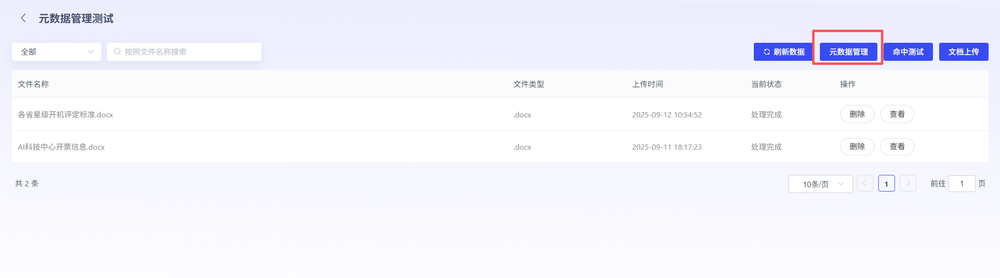
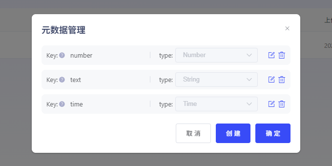
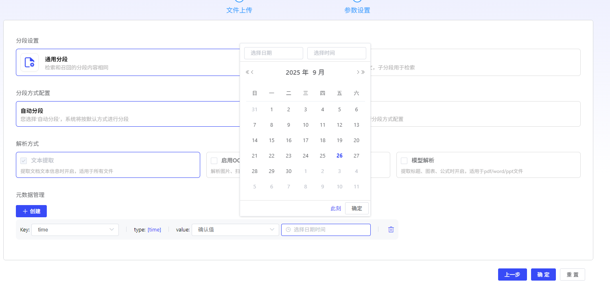
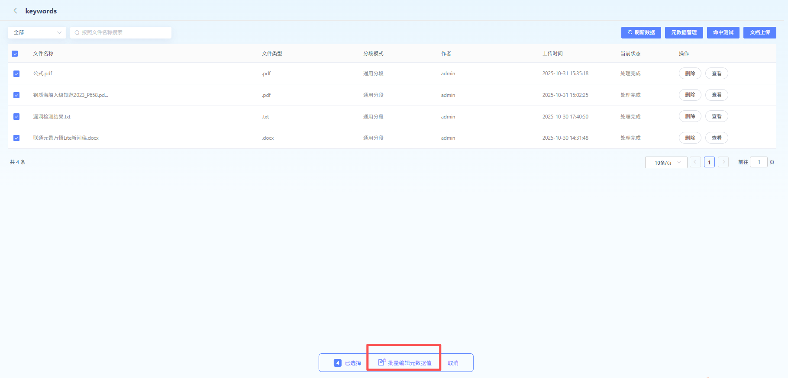
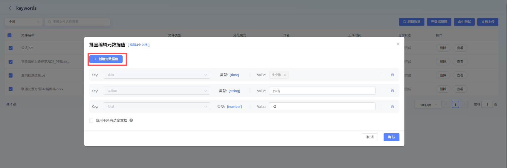

# 元 DataManagement

元 DataYesDescriptionDocumentation 关 KeyInformation “DataTag”.

它不包含 Documentation 具体 Content,

而 Yes 用来 DefinitionDocumentation Attributes,

Help 您对 DocumentationPerform Structure 化 Management.

### 元 DataManagement

- **Key:

- *元 DataFieldYes 构成 Documentation 元 Data BasicUnit,

它们 Provide 了 Standards 化 MinuteClassesandStorageWay. for DocumentationInformation

throughDefinitionandUse 不同 Field,

我们 Can System 化地捕捉 andManagementDocumentation 关 KeyInformation.

- **Type:

- *

- **Character 串**(String):

TextValue.

- **Number**(Number):

数 Value.

- **Time**(Time):

DateandTime.

### 元 Data

inFileUploadParametersSettingsInterface,

Support 对元 DataPerform Settings.

- 下拉 SelectKey, 可自动带出 type.

需先 in

- *Knowledge

Base-元 DataManagement**

CreateKey

- **Value:

- *该 Field 具体 InformationorAttributes

- value:

填写具体 Value

- regExp:

填写正则 Table 达式

typeforTime,

则元 Datavalue 只能 SelectTime

typefornumber,

则元 Datavalue 只能 InputNumber

typeforstring,

则元 Datavalue 只能 Input 文字

### 元 Data 批量 Management

User 可选具体 Documentation,

批量 Edit 元 Datavalue.

选 Documentation,

Click“批量 Edit 元 DataValue”.

Click“Create 元 DataValue”

App 于所有 Documentation:

若勾选, 则自动 for 所有选定 DocumentationCreateorEdit 元 DataValue; No 则仅对已具有对应元 DataValue DocumentationPerform Edit.