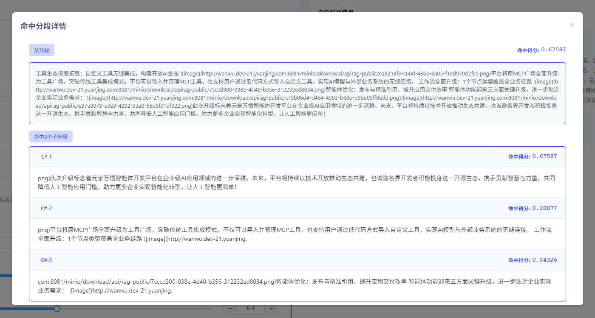

# Create Hit Testing

When users need to test whether the Knowledge Base is effective, they can use the "Hit Testing" feature for quick testing. Click the "Hit Testing" button to enter the Hit Testing interface. In the "Hit Testing section", input keywords and configure [Retrieval Method](Retrieval Config.md) and [Metadata Filtering](Metadata Filtering.md). If there are hit results, you can obtain relevant hit scores and chunk content to confirm that the knowledge chunk is effective.

- **General Chunking**

  In general chunking mode, hit prediction results will display the hit chunk content and hit scores. Higher scores indicate higher matching between question keywords and content blocks.

- **Parent-Child Chunking**

  In parent-child chunking mode, hit prediction results will display the hit chunk content and hit scores. The score in the upper right corner of the block refers to the matching score between sub-blocks and keywords. Higher scores indicate higher matching between question keywords and content blocks. Click on the chunk content to view details.

  
