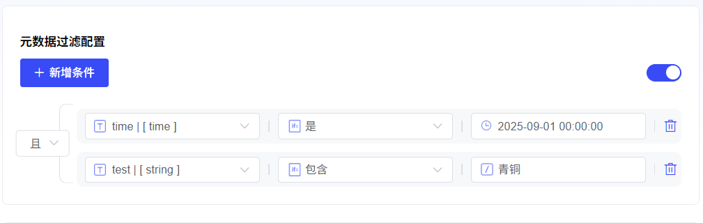

# 元 DataFilter

inHit

Testing,

- *元 DataFilter**Features,

能让你像 Use AdvancedSearch 一样,

根据 Documentation “Tag”(如

`category`、`status`、`author`

etc.

from 而大幅提升检索 Results 相关性 andAccuracy.

- *1. SelectFilterPattern**

首先,

你需要 from 以下2种 PatternSelect 一种来 DefinitionFilterRules.

- **DisablePattern**

- **Instructions**:

这 YesDefaultOptions.

Select 此 Pattern 将完全 Close 元 DataFilterFeatures,

Node 会检索所有选 Knowledge

Base,

不考虑任何元 Data.

- **适用 Scenario**:

When 你需要全面检索,

orKnowledge

BaseDocumentation 没有统一 元 DataStandardsHour.

- **手动 Pattern**

- **Instructions**:

完全由你自 DefinitionFilterRules,

自由 Group 合多个 Conditions,

Implementation 最精细 Control.

- **适用 Scenario**:

ProcessComplex 、多 Conditions 、逻辑固定 FilterDemand.

这 Yes 最常用也最强大 Pattern.

- *2. 手动 PatternConfiguration 详解**

If 你 Select 了**手动 Pattern**,

请按照以下 StepsPerform Configuration:

- *第1步:

AddFilterConditions**

1)inSelectKnowledge

Base 后,

Click**Settings**Button,

Open 元 DataFilterButton.

2)inConfiguration 框内,

Click

- *+AddConditions**.

3)In 弹出 下拉 List, ,

Select 一个元 DataField.

- **Hint**:

该 List 会 Show 你 When 前选 **Knowledge

Base 所有**元 DataField.

- 如需 Add 更多 Field,

RepeatClick

- *+AddConditions**

即可.

- *第2步:

ConfigurationFilterRules**

SelectField 后,

你需要根据该 Field **DataType**(Character 串、Number、Time),

来设定具体 FilterRules.

##### **A.

Character 串 Type**

适 Used forTextField,

如

`Tag`、`MinuteClasses`、`Status`

etc.

|

FilterConditions

|

InstructionsandExample

|

|

:---------

|

:-----------------------------------------------------------

|

|

- *Yes**

|

完全 Match.

例如

`is

"Published"`,

只 ReturnStatus**恰好 Yes**“Published” Documentation.

|

|

- *不 Yes**

|

排除 Match.

例如

`is

not

"Draft"`,

Return 所有 Status**不 Yes**“Draft” Documentation.

|

|

- *for 空**

|

Fieldfor 空.

Return**未填写**该 Field Documentation.

|

|

- *不 for 空**

|

Field 不 for 空.

Return**已填写**该 Field Documentation.

|

|

- *包含**

|

包含 Text.

例如

`contains

"Report"`,

会 Return“Monthly

Report”、“Annual

Report”etc.

|

|

- *不包含**

|

不包含 Text.

例如

`not

contains

"Secret"`,

会 Return 所有不含“Secret” Documentation.

|

|

- *StartYes**

|

以. . . 开头.

例如

`starts

with

"Doc"`,

会 Return“Doc1”、“Document”etc.

|

|

- *EndYes**

|

以. . . 结尾.

例如

`ends

with

"2024"`,

会 Return“Report

2024”、“Summary

2024”etc.

|

>

- *⚠️

Size 写敏感 Reminder**:

Character 串 MatchYes**Size 写敏感**.

`contains

"App"`

会 Match

“Apple”,

but**不会**Match

“apple”

or

“APPLE”.

##### **B.

NumberType**

适 Used for 数 ValueField,

如

`阅读量`、`Version 号`、`评 Minute`

etc.

|

FilterConditions

|

InstructionsandExample

|

|

:-----------

|

:------------------------------------------------------

|

|

- *etc.

|

etc.

例如

`=

100`,

Return 标记 for100 Documentation.

|

|

- *不 etc.

|

不 etc.

例如

`≠

5`,

Return 所有标记不 for5 Documentation.

|

|

- *大于**

|

大于.

例如

`>

100`,

Return 标记大于100 Documentation.

|

|

- *小于**

|

小于.

例如

`<

50`,

Return 标记小于50 Documentation.

|

|

- *大于 etc.

|

大于 oretc.

例如

`≥

20`,

Return 标记大于 oretc.

|

|

- *小于 etc.

|

小于 oretc.

例如

`≤

200`,

Return 标记小于 oretc.

|

|

- *for 空**

|

Fieldfor 空.

Return**未 Settings**该 NumberField Documentation.

|

|

- *不 for 空**

|

Field 不 for 空.

Return**已 Settings**该 NumberField Documentation.

|

##### **C.

TimeType**

适 Used forDateField,

如

`PublishDate`、`最后 ModifyTime`

etc.

|

FilterConditions

|

InstructionsandExample

|

|

:---------

|

:-----------------------------------------------------------

|

|

- *Yes**

|

Date 完全 Match.

例如

`is

"2024-01-01"`,

只 Return 该 Date Documentation.

|

|

- *早于**

|

早于指定 Date.

例如

`before

"2024-01-01"`,

Return2024Year1Month1Day 之前 所有 Documentation.

|

|

- *晚于**

|

晚于指定 Date.

例如

`after

"2024-01-01"`,

Return2024Year1Month1Day 之后 所有 Documentation.

|

|

- *for 空**

|

Fieldfor 空.

Return**未 Settings**该 TimeField Documentation.

|

|

- *不 for 空**

|

Field 不 for 空.

Return**已 Settings**该 TimeField Documentation.

|

- *第3步:

SettingsFilterValue**

Definition 好 Rules 后,

你需要 Provide 一个具体 **FilterValue**. for Rules

- **Character 串/Number**:

直接 Input 即可,

如

`Published`、`100`.

- **Time**:

System 会 Provides 一个**TimeSelector**,

让你直观地 SelectDate,

而 None 需手动 InputFormats.

- *第4步:

DefinitionConditions 间 逻辑关系**

When 你 Add 了**多条**FilterConditionsHour,

需要设定它们之间 关系.

- **且逻辑**

- **含义**:

Documentation**必须同 Hour 满足**所有 Conditions,

才会被检索 to.

- **Example**:

`category

is

"Report"

且

status

is

"已 Publish"`,

只会检索出“MinuteClassesforReport”**并且**“Statusfor 已 Publish” Documentation.

- **or 逻辑**

- **含义**:

Documentation**只需满足其任意一个**Conditions,

就会被检索 to.

- **Example**:

`author

is

"张三"

or

author

is

"李四"`,

会检索出所有作者 Yes“张三”**or **“李四” Documentation.

