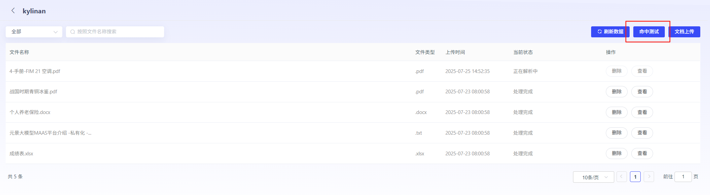
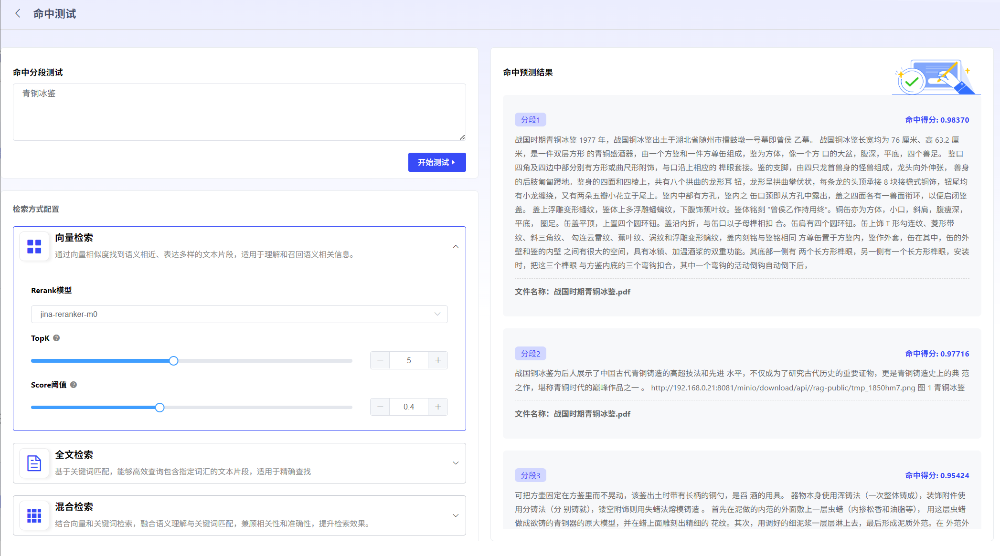

# 检索 WayConfiguration

目前 Support3种检索 WayConfiguration,

User 可根据 Knowledge

Base 内 Documentation Content 特点及 Use Scenario,

Adjust 检索 Strategy:

1. 向量检索:

through 向量相似度找 to 语义相近、Table 达多样 Text 片段,

适 Used for 理解 and 召回语义相关 Information.

2. 全文检索:

基于关 Key 词 Match,

Able to EfficientQuery 包含指定词汇 Text 片段,

适 Used for 精确 Find.

3. 混合检索:

结合向量 and 关 Key 词检索,

融合语义理解 and 关 Key 词 Match,

兼顾相关性 andAccuracy,

提升检索 Effectiveness.

