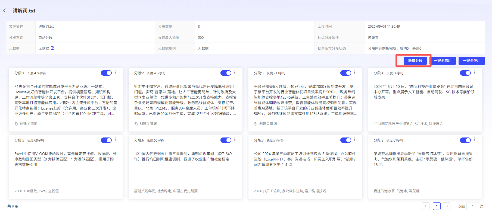
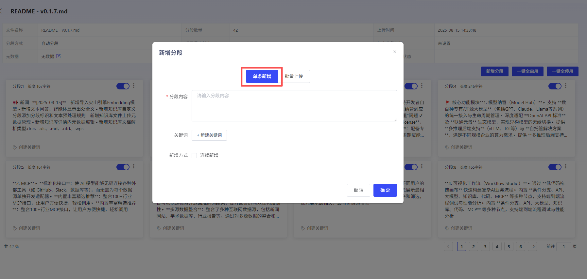
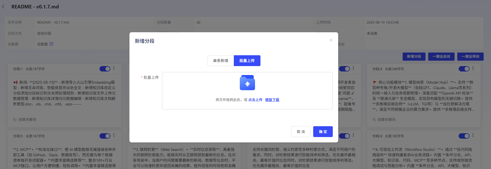
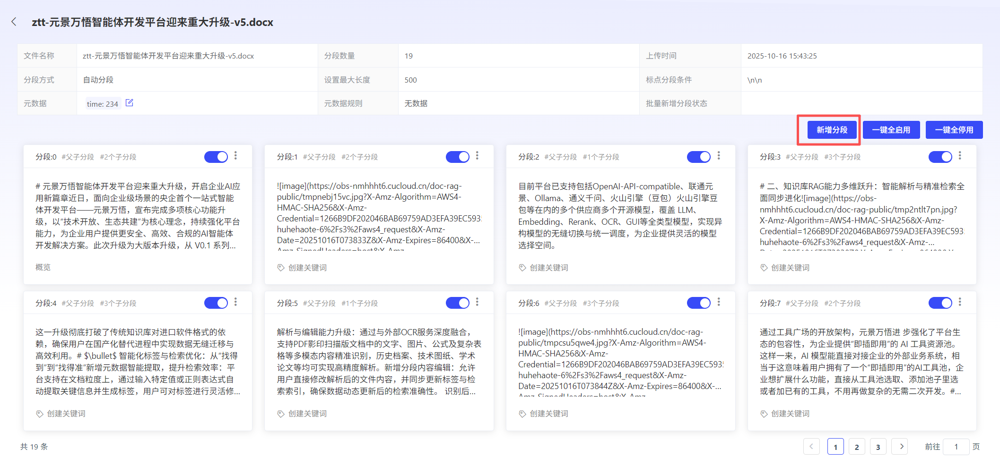
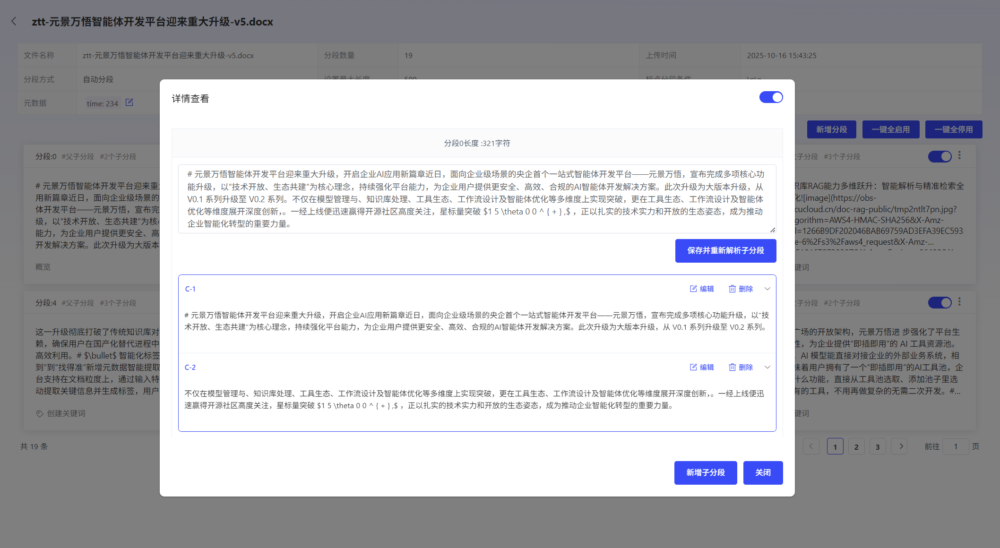

# Minute 段 ContentEdit

PlatformSupport 对 Minute 段 ContentPerform Add、Edit、Delete.

## AddMinute 段 Content

- **单条 Add:

- *PlatformSupportUserAdd 不大于“Minute 段最大 Length” Minute 段 Content.

并 SupportAdd 多个关 Key 词.

- **批量 Add:

- *User 可 Download 批量 AddTemplate,

一次性 Upload 多个 Minute 段 and 关 Key 词.

## Minute 段 ContentEdit

PlatformSupportUser 对已有 Minute 段 ContentPerform 二次 Edit,

butEdit 后 Minute 段 ContentLength,

不能大于“Minute 段最大 Length”.

- *[GeneralMinute 段]**

- *[父子 Minute 段]:

- *

- *父 Minute 段 Edit:

- *User 可 Edit 父 Minute 段 Content,

Platform 将自动重新 Parse 子 Minute 段.

- *子 Minute 段 Edit:

- *User 可 EditorAdd 子 Minute 段 Content,

but 不会 Synchronization 更改父 Minute 段 Content

## Minute 段 ContentDelete

