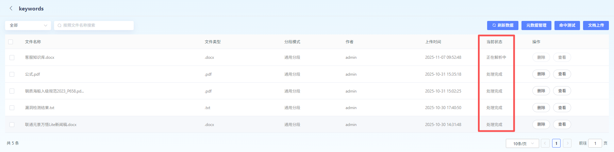

# DocumentationProcessStatus

Upload 完毕 Documentation 可 In DocumentationList, View.

DocumentationContent Parse 切 MinuteStatus 可 In When 前 StatusColumn, View.

WhenStatusfor“ProcessComplete”,

该 DocumentationKnowledge 即可 in 后续 RAGUse Knowledge

Base 生效.

