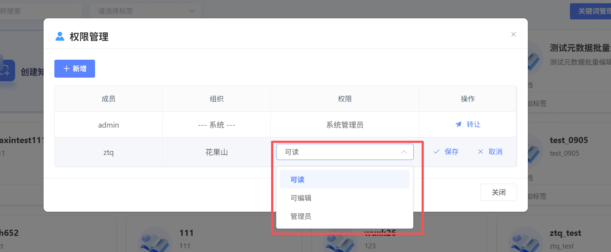

# Knowledge

BasePermission

UserCreate

Knowledge

Base 后,

可 Perform PermissionSharing.

具体 Permission 如下:

### Knowledge

BasePermission 总览

|

Permission 项

|

SystemManagement 员

|

子 Management 员

|

User-可 Edit

|

User-可读

|

|

:-------------------------------------------

|

:---------

|

:---------------

|

:----------

|

:---------

|

|

- *数量 Limitation**

|

唯一一个

|

可有多个

|

可有多个

|

可有多个

|

|

- *Delete 整个 Knowledge

Base**

|

✅

|

❌

|

❌

|

❌

|

|

- *Knowledge

BasePermissionManagement**

|

✅

|

✅

|

✅

(仅 Showcase)

|

✅

(仅 Showcase)

|

|

&nbsp;&nbsp;└

SearchMember

|

✅

|

✅

|

✅

|

✅

|

|

&nbsp;&nbsp;└

AddMember(可读/可 Edit/子 Management 员)

|

✅

|

✅

|

- |

- |

|

&nbsp;&nbsp;└

Modify 子 Management 员 Permission

|

✅

|

❌

|

- |

- |

|

&nbsp;&nbsp;└

ModifyUserPermission

|

✅

|

✅

|

- |

- |

|

&nbsp;&nbsp;└

Edit/DeleteUser

|

✅

|

✅

(仅限 CommonUser)

|

- |

- |

|

&nbsp;&nbsp;└

Edit/Delete 子 Management 员

|

✅

|

❌

|

- |

- |

|

&nbsp;&nbsp;└

TransferManagement 员身份

|

✅

|

❌

|

- |

- |

|

- *Knowledge

BaseOperationPermission**

|

|

|

|

|

|

&nbsp;&nbsp;└

RefreshData

|

✅

|

✅

|

✅

|

✅

|

|

&nbsp;&nbsp;└

批量 Edit 元 Data

|

✅

|

✅

|

✅

|

❌

|

|

&nbsp;&nbsp;└

元 DataManagement

|

✅

|

✅

|

✅

|

❌

|

|

&nbsp;&nbsp;└

Hit

Testing

|

✅

|

✅

|

✅

|

✅

|

|

&nbsp;&nbsp;└

UploadDocumentation

|

✅

|

✅

|

✅

|

❌

|

|

&nbsp;&nbsp;└

ViewDocumentation

|

✅

|

✅

|

✅

|

✅

|

|

&nbsp;&nbsp;└

DeleteDocumentation

|

✅

|

✅

|

✅

|

❌

|

|

- *DocumentationContentOperation**

|

|

|

|

|

|

&nbsp;&nbsp;└

ViewMinute 段

|

✅

|

✅

|

✅

|

✅

|

|

&nbsp;└

EditMinute 段

|

✅

|

✅

|

✅

|

❌

|

|

&nbsp;&nbsp;└

AddMinute 段

|

✅

|

✅

|

✅

|

❌

|

|

&nbsp;&nbsp;└

Edit 元 Data

|

✅

|

✅

|

✅

|

❌

|

|

&nbsp;&nbsp;└

ManagementMinute 段 Switch

|

✅

|

✅

|

✅

|

❌

|

|

&nbsp;&nbsp;└

Create 关 Key 词

|

✅

|

✅

|

✅

|

❌

|

### PermissionOperation

Click**“Permission”**,

可 Add、EditUserPermission.

- *1. AddUserPermission:

- *

Click**“Add”**Button,

Perform UserandPermissionConfiguration

[SelectUser]:

SystemManagement 员同级 or 子 Organization 没有 Permission User

[ConfigurationPermission]:

可读、可 Edit、Management 员

- *2. EditUserPermission:

- *

Click**“Edit”**,

可对现有 UserPermissionPerform 更改.

ChangeComplete 后,

Click**“Save”**,

Save 新 Permission.

Click**“Delete”**,

可将该 User 剔除 Knowledge

Base.

- *3. SystemManagement 员 Transfer:

- *

一个 Knowledge

Base 有且只有一个 SystemManagement 员,

SystemManagement 员可 Perform Transfer,

Transfer 后,

原 SystemManagement 员 Permission 降级 for**“可 Edit”**.

[可选 UserRange]:

SystemManagement 员同级 or 子 Organization 所有 User

