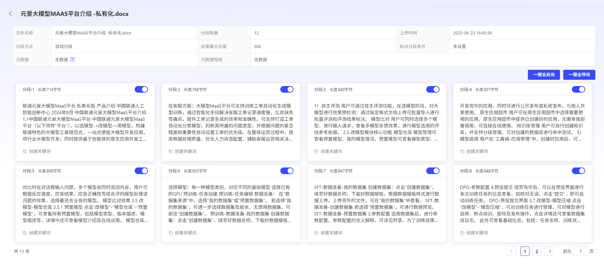
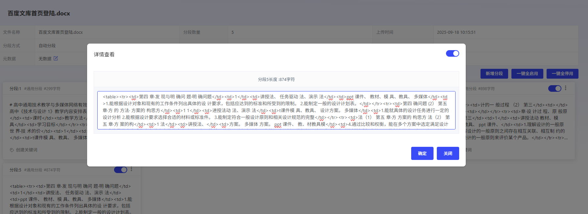
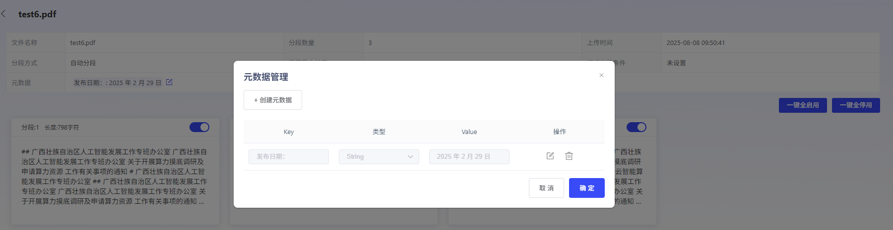

# ViewMinute 段 Results

ClickOperationColumn “View”,

即可 ViewStatusforProcessComplete DocumentationMinute 段 Results.

Support 对 Minute 段 ContentPerform 关 Key 词打 TagOperation.

In Minute 段 ResultsView, ,

Can ViewDocumentationMinute 段 Strategy,

元 DataConfigurationSituation,

Minute 段 Wayetc.

Click 每个 Minute 段 Content 卡片,

可 ViewMinute 段 Details:

- **GeneralMinute 段**

可 View 具体 Minute 段 Content,

Minute 段 Length

- **父子 Minute 段**

可 View 父 Minute 段 and 每个子 Minute 段 Content,

and 父 Minute 段 Length

可根据 UserDemand,

Click 每个 Minute 段卡片上 启停 Switch,

对单独 Minute 段 Perform StartandStop.

也可 Click 一 Key 全 Startor 一 Key 全 Deactivate,

对整个 Documentation Minute 段 ResultsPerform StartandStop.

注:

Stop Minute 段 ContentinUse RAGCapabilitiesHour 不会生效.

## 元 DataEdit

Platform 可自动根据 DocumentationContentMatch 出元 DataTag.

元 DataUsed forDescriptionDocumentation Attributes,

Can Help 您更好地 OrganizationandManagementDocumentation.

User 可对识别出来 元 DatavaluePerform Edit、AddorDelete.

