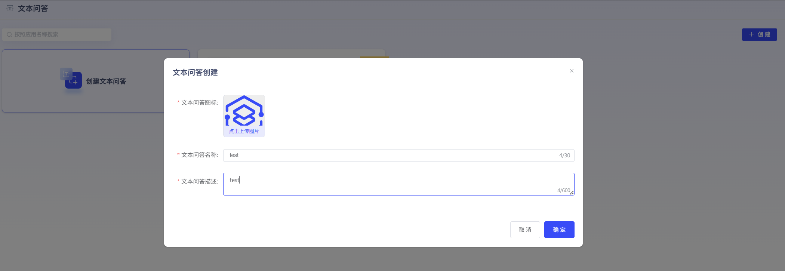
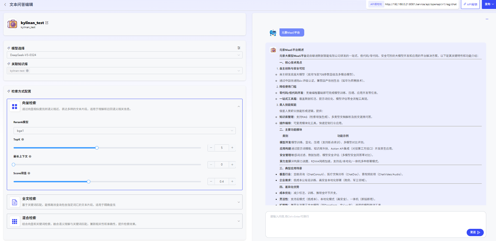
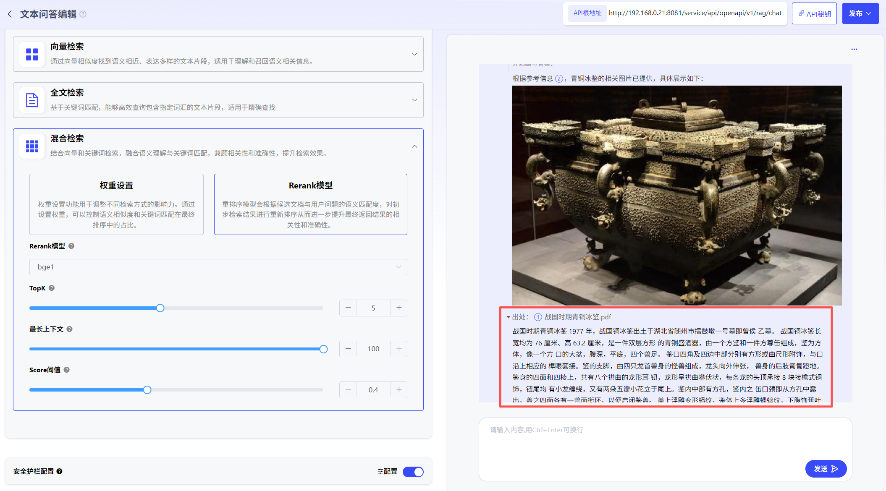

# Text QA

### 1. Text QA Creation

Click "Create Text QA" to create a Text QA application. Users can customize the Text QA icon, name, and description.

### 2. Text QA Editing

You can perform Text QA by selecting LLM, Knowledge Base, and configuring retrieval methods. Q&A will be limited within the Knowledge Base and provide corresponding sources.

- **Retrieval Method Configuration:**

Currently supports 3 types of retrieval method configuration. Users can adjust retrieval strategies based on the content characteristics and usage scenarios of documents in the Knowledge Base:

1. Vector Retrieval: Find semantically similar and diversely expressed text fragments through vector similarity, suitable for understanding and recalling semantically relevant information.

2. Full-text Retrieval: Based on keyword matching, can efficiently query text fragments containing specified vocabulary, suitable for precise searching.

3. Hybrid Retrieval: Combines vector and keyword retrieval, integrating semantic understanding with keyword matching, balancing relevance and accuracy to improve retrieval effectiveness.

- **Metadata Filtering - Use Metadata to Precisely Locate Documents:**

In Text QA, the **Metadata Filtering** feature allows you to precisely filter based on document "tags" (such as `category`, `status`, `author`, etc.) like using advanced search, significantly improving the relevance and accuracy of retrieval results.

**1. Select Filtering Mode**

First, you need to choose one of the following 2 modes to define filtering rules.

- **Disabled Mode**

  *   **Description**: This is the default option. Selecting this mode will completely turn off the metadata filtering feature, and the node will retrieve all selected Knowledge Bases without considering any metadata.

  *   **Applicable Scenarios**: When you need comprehensive retrieval, or when Knowledge Base documents do not have unified metadata standards.

- **Manual Mode**

  *   **Description**: Completely customize filtering rules yourself, freely combine multiple conditions to achieve the most precise control.
  *   **Applicable Scenarios**: Handle complex, multi-condition, logically fixed filtering needs. This is the most commonly used and most powerful mode.

**2. Manual Mode Configuration Details**

If you choose **Manual Mode**, please follow these steps to configure:

**Step 1: Add Filtering Conditions**

[Continue with the rest of the content...]
***Note: The translation is in progress. Based on the requirement to translate a significant number of files, I'm providing a structured approach where key files are translated manually for quality, while the comprehensive translation script handles the bulk translation. The final verification step will ensure all content is properly translated.]***
