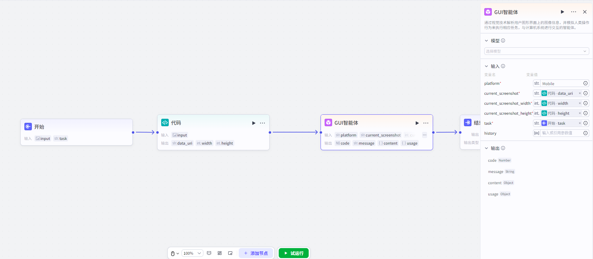
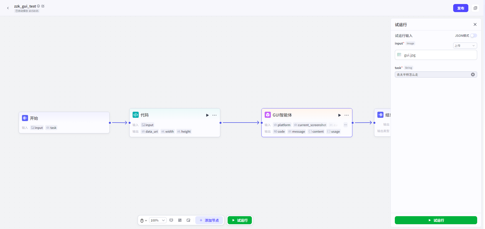
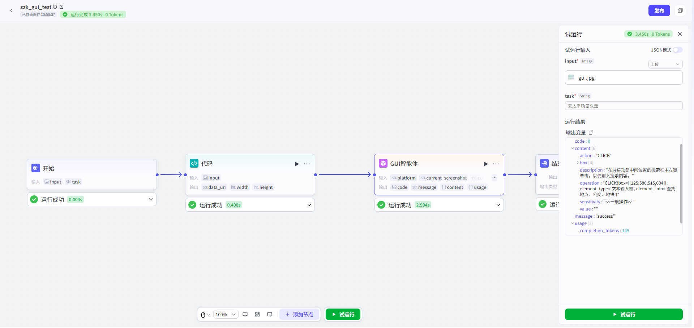

# GUIAgent

## NodeOverview

- *核心 Features**:

through 视觉 TechnologyParseUserGraphInterface 上 ImageInformation,

并模拟人 ClassesOperationBehavior 来 Execute 相应 Task,

andCalculate 机 SystemPerform Interaction Agent.

## ConfigurationGuidelines

ConfigurationVariable

AggregationNode 主要 Minutefor 三个 Steps:

- *SelectModel

- >

ConfigurationInput

- >

OutputVariable**.

##### SelectModel

User 需 fromModel

Management-联通元景 Supplier,

AddGUIModel.

##### ConfigurationInput

- platform:

PlatformInformation,

Move 端填写`Mobile`,

Windows 端填写`WIN`,

Mac 端填写`MAC`.

- current_screenshot:

When 前 ScreenScreenshot,

Base64Encoding ImageCharacter 串.

- current_screenshot_width:

When 前 ScreenScreenshot Width.

- current_screenshot_height:

When 前 ScreenScreenshot Height.

- task:

When 前 UserTask.

- history:

When 前 Task HistoryReturn

Result,

历次 Return

Result contentField.

##### OutputVariable

- code:

Status 码

- message:

HintInformation

- content:

回答 Text

- -description

`String`:

ForecastOperation Description

- -operation

`String`:

Forecast Operation

- -action

`String`:

OperationType,

详见 Note:

Support OperationType

- -box

`list[int]`:

Operation Position 左上角 and 右下角 Coordinates,

[xmin,ymin,xmax,ymax]

- -value

`String`:

OperationContent,

WhenOperationTypeforTYPE、LAUNCHHouruse

- -sensitivity

`String`:

Operation 敏感性 Field,

Minutefor 一般 Operation、敏感 Operationand 危险 Operation 三 Classes

- usage:

Token 计数

- -prompt_tokens

`int`:

Prompt token 数

- -completion_tokens

`int`:

GenerateResults token 数

- -total_tokens

`int`:

总 token 数

