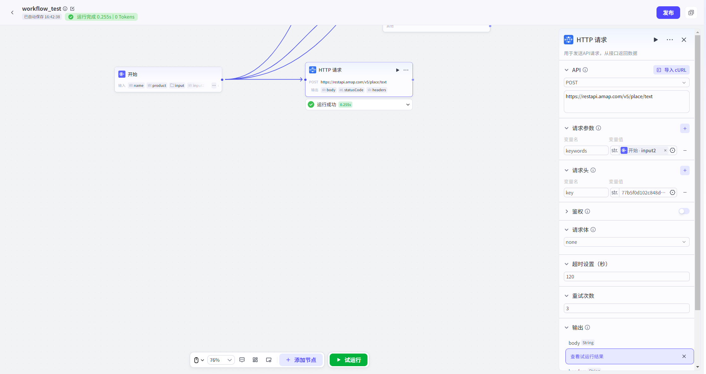

# HTTP

Request

## NodeOverview

核心 Features:

Able to and 任何基于 HTTPAgreement ServicePerform 对话、SwapData.

## ConfigurationGuidelines

##### 1.

RequestMethod

Definition 您希望对 GoalResourceExecute OperationType.

|

Method

|

Description

|

典型 AppScenario

|

|

:---------

|

:-----------------------------------------------------------

|

:---------------------------------------------------

|

|

- *GET**

|

fromService 器 Get 指定 Resource.

|

QueryUserInformation、Get 天气 Data、读取 ArticleList.

|

|

- *POST**

|

向 Service 器 SubmitData,

以 Create 新 Resource.

|

SubmitTable 单、Upload 新 File、Create 新 Order.

|

|

- *PUT**

|

向 Service 器 Upload 完整 Resource,

Used for**全量 Update**已存 inResourceor**Create**Resource(If 不存 in).

|

UpdateUserAll 资料、Replace 整个 FileContent.

|

|

- *PATCH**

|

对 ResourcePerform **部 MinuteModify**.

|

仅 UpdateUser 昵称、ModifyArticle Title.

|

|

- *DELETE**

|

RequestService 器 Delete 指定 Resource.

|

DeleteUser、RemoveOrder、CleanFile.

|

|

- *HEAD**

|

and

GET

Classes 似,

butService 器**仅 ReturnResponse 头**,

不 ReturnResource 主体.

|

InspectionResourceYesNo 存 in、GetResource 元 Data(如 Size、Type).

|

>

- *Hint**:

inConfigurationRequest

URL

Hour,

您 Can throughInput

`{{`

来唤出并 Use Workflow Variable,

Implementation 动态 Parameters 化.

##### 2.

Request

URL

Goal

API

完整

URL.

例如:

`https://api.example.com/v1/users/{{user_id}}`.

##### 3.

RequestParameters

附加 in

URL

末尾 KeyValue 对(Query

String),

Used for 向 Service 器传递 Filter、SortorPaginationetc.

- **Example**:

in

URL

`https://api.example.com/search?keyword=workflow&page=1`

,

`keyword=workflow`

and

`page=1`

即 forRequestParameters.

##### 4.

Request

Header

包含 Request 元 Data,

Used for 向 Service 器传递关于 Client、RequestContentor 期望 ResponseFormats 附加 Information.

- **常见 Example**:

- `Content-Type`:

StatementRequest

Body DataFormats(如

`application/json`).

- `Accept`:

告知 Service 器 Client 希望 Receive ResponseFormats(如

`application/json`).

- `User-Agent`:

标识 Client AppType、OperationSystemandSoftwareVersion.

##### 5.

鉴权

for 确保 RequestSecurity,

防止未 AuthorizationAccess,

本 NodeSupport 多种鉴权 Way.

- **Bearer

Token**:

- **Instructions**:

一种常用 TokenAuthenticationWay,

常 Used for

OAuth

2.0

Agreement.

- **Configuration**:

Input 您

Token

Value.

System 会自动将其 AddtoRequest

Header

`Authorization`

Field,

Formatsfor

`Authorization:

Bearer

<您 Token>`.

- **自 Definition 鉴权**:

- **Instructions**:

Provides 更灵活 AuthenticationConfiguration,

以满足不同

API

自 DefinitionDemand.

- **Configuration**:

- **Key**:

Authentication Key 名(如

`X-API-KEY`).

- **Value**:

Authentication KeyValue.

- **Add

To**:

SelectAuthenticationInformation AddPosition.

- **Header**:

AddtoRequest

Header(Recommend).

- **Query**:

Addto

URL

QueryParameters.

##### 6.

Request

Body

- 仅 in

`POST`,

`PUT`,

`PATCH`

etc.

包含要 Send 给 Service 器 Data.

您 Can 根据

API

RequirementsSelect 合适 Formats:

- **JSON**:

SendStructure 化

JSON

Data,

最常用

RESTful

API

Formats.

- **form-data**:

Used forUploadFile,

orSend 包含二进制 Data ComplexTable 单.

- **x-www-form-urlencoded**:

Used forSendSimple KeyValue 对 Table 单 Data.

- **raw

(Text/XML/HTML)**:

Send 纯 Text、XML

or

HTML

etc.

##### 7.

超 HourSettings

- SettingsRequest 最大 etc.

若 Service 器 in 指定 Time 内未 Response,

Request 将被判定 forFailed,

以 Avoidance 长 Time 阻塞 Workflow.

##### 8.

重试次数

- SettingsRequestFailed 后 自动重试次数.

through 自动重试 Mechanism,

Can 有效应对 Network 抖动 orService 器临 HourFailure,

提高 Request 最终 Success 率.

- *9.Output**

- OutputVariableIncluding Response

Body、Status 码 andResponse 头.

- *10. Exception 忽略**

- Support**Exception 忽略**Features.

开启此 Features 后,

If 试 OperationWorkflowHour 此 NodeOperationFailed,

Workflow 不会断,

而 YesContinueOperation 后续下游 Node.

If 下游 NodeReference 了此 Node OutputContent,

则 Use 此 Node 预先 Configuration DefaultOutputContent.

## 典型 AppScenario

HTTP

RequestNodeYesWorkflowImplementation 外部 Interaction **万能钥匙**,

常见于以下四大 ClassesScenario:

|

ScenarioClasses 别

|

Description

|

典型 Case

|

|

:-----------

|

:------------------------------------------------------

|

:------------------------------------------------------

|

|

- *DataGet**

|

from 外部 APIPullInformation,

Provide Decision 依据 or 丰富 ReplyContent. for Workflow

|

Query 实 Hour 天气、GetUserIn CRM, 资料、抓取最新 News 头条.

|

|

- *DataSubmit**

|

将 Workflow 产生 Data,

Sendto 外部 SystemPerform StorageorProcess.

|

将 UserFeedbackSubmitto 内部工单 System、将 Table 单 Data 写入 DataLibrary.

|

|

- *DataUpdate**

|

Modify 外部 System 已存 in Data,

Implementation 双向 Synchronization.

|

In CRM, UpdateCustomer ContactWay、ModifyOrder DeliveryAddress.

|

|

- *DataDelete**

|

根据业务逻辑,

Request 外部 SystemDelete 指定 Data.

|

Delete 一个过期 Promotion 券、Unregister 一个 TestAccount.

|

