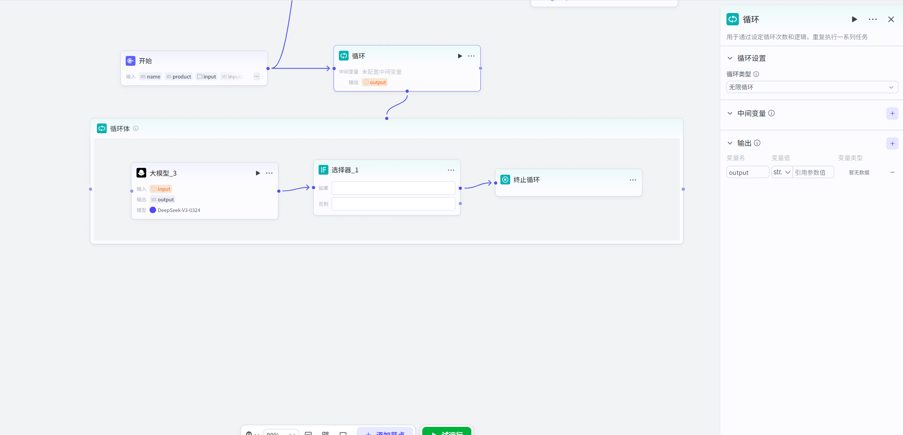

# Loop

## NodeOverview

核心 Features:

In Workflow, Create 一个 Automation 流水线”,

对一 GroupDataor 一项 TaskPerform **Repeat、批量** Process,

直 toComplete 所有 Projector 满足特定 Conditions.

## ConfigurationGuidelines

#### LoopConfiguration

##### 1. LoopSettings

LoopNodeProvides 了三种 Pattern,

以适应不同 业务 Demand.

ConfigurationNodeHour,

首先要 Select 正确 LoopType.

##### 1. 1. Use 数 GroupLoop(最常用)

​

这 Yes 最常见、最直观 LoopPattern,

Classes 似于编程

`for`

Loop.

它会遍历一个已知 List(数 Group),

forList **每一个 Element**都 Execute 一次 Loop 体内 Task.

- **何 HourUse **:

When 你有一个明确 、待 Process DataCollectionHour.

例如,

一个包含多个 UserID List、一个包含多段 ArticleContent 数 Group.

- **如何 Configuration**:

- **Loop 数 Group**:

指定一个上游 NodeOutput **数 GroupType**Variable.

Loop 次数将自动 etc.

- **ConceptVariable**:

- `item`:

代 Table 数 Group**When 前正 inProcess** 那个 Element.

例如,

数 GroupYes

`["张三",

"李四"]`,

First 次 LoopHour

`item`

Yes

"张三",

Second 次 Yes

"李四".

- `index`:

代 TableWhen 前 Yes**第几次**Loop,

from

`0`

Start 计数.

Can 用来给 Results 编号 orPerform 计数.

>

- *Example**:

In 长文 SummaryScenario, ,

将 Article 各个 ParagraphGroup 成一个数 Group

`["Paragraph1Content",

"Paragraph2Content",

...]`.

inLoop 体内,

LLMNode Hint 词 Can 这样写:

请 Summary 以下这段文字:

`{item}`.

这样,

Loop 就会依次 Summary 每一个 Paragraph.

##### 1. 2. 指定 Loop 次数

​

这 Yes 一种更 Simple LoopPattern,

When 你只需要 RepeatExecute 某个 Task**固定次数**HourUse.

- **何 HourUse **:

Task 本身不 Dependency 于外部 Data,

只 Yes 需要 SimpleRepeat.

例如,

重试一个 Operation3次,

or Generate10条随机 创意想法.

- **如何 Configuration**:

- **Loop 次数**:

直接 Input 一个1to1000之间 Number,

orReference 上游 NodeOutput **数 ValueType**Variable.

##### 1. 3. None 限 Loop

​

这 Yes 一种 AdvancedPattern,

Loop 会一直 Execute,

直 to 你主动告诉它 Stop”.

它 Classes 似于编程

`while`

Loop.

- **何 HourUse **:

None 法预先 OKLoop 次数,

需要根据**每次 Loop ExecuteResults**来动态决定 YesNoContinue.

例如,

轮询某个 API 直 toGettoData,

orImplementation 一个需要 UserInteraction 才能 Exit 游戏.

- **如何 Configuration**:

- **核心 Yes 终止 Conditions**:

None 限 Loop**必须**and**终止 LoopNode**配合 Use.

- **Workflow 程**:

1.

inLoop 体内 Execute 你 核心逻辑(如调用 API、询问 User).

2.

Use **SelectorNode**来 JudgmentYesNo 满足终止 Conditions(例如,

APIReturn 了 Data、UserInput 了 ExitInstruction).

3.

If 满足 Conditions,

则 Workflow 流向**终止 LoopNode**,

Loop 立即 End.

4.

If 不满足 Conditions,

则 Workflow 流向 Loop 体 出口,

自动 Start 下一次 Loop.

>

- *Example**:

批量 ProcessDataHour,

调用一个 API.

IfAPIReturnSuccess,

则 ContinueProcess 下一个;

IfAPIReturnError

Code(`error_code`不 for 空),

则 throughConditionsJudgmentNode 将 Process 引向**终止 LoopNode**,

Stop 整个 Loop,

Avoidance 持续报错.

- --

##### 2. 间 Variable:

inLoop 间传递 Information

这 Yes 一个非常强大 Features,

它让你 Can in**不同轮次 Loop 之间 Sharingand 累积 Data**.

- **如何 Configuration**:

1.

In LoopNode Settings, ,

Definition 一个**间 Variable**(如

`last_paragraph`),

并 for 其 Settings 一个初始 Value(如空 Character 串

`""`).

2.

inLoop 体 末尾,

Add 一个**SettingsVariableNode**.

3.

In 该 Node, ,

将 Loop 体 OutputResults(如 LLMGenerate 新 Paragraph)赋 Value 给这个间 Variable.

4.

in 下一次 LoopStartHour,

这个间 Variable 就会携带上一次 Loop Value,

供你 Use.

>

- *Example(长文 Generate)**:

>

>

1.

- *LoopNode**:

Settings 间 Variable

`last_paragraph`,

初始 Valuefor

`""`.

>

2.

- *Loop 体内 LLMNode**:

Hint 词 Designfor:

这 Yes 上一段 Content:

`{last_paragraph}`.

现 in 请根据 When 前 Theme

`{item}`

Generate 下一段.

>

3.

- *Loop 体内 SettingsVariableNode**:

将 LLMNode Output

`output`

赋 Value 给

`last_paragraph`.

>

这样,

每一段 Generate 都会 Reference 前一段,

Article 连贯性大大 Enhance.

##### 3. OutputSettings:

如何汇总 Results

LoopEnd 后,

你 Can 决定将什么 Data 传递给下游 Node.

- **Options1:

Loop 体 ExecuteResultsCollection**(Default).

这 Yes 最常用 Way.

它会将**每一次 Loop** 最终 OutputResults,

按顺序收集起来,

Group 成一个新 **数 Group**,

作 for 整个 LoopNode Output.

例如,

Loop 了5次,

每次 Output 一个 Character 串,

最终 LoopNode 会 Output 一个包含这5个 Character 串 数 Group.

- **Options2:

LoopVariable 取 Value**.

If 你 Use 了间 Variable,

Can Select 将 Loop**EndHour**该间 Variable 最终 Value 作 forOutput.

这 In 需要累积 CalculateResults(如求 and、拼接) Scenario, 非常有用.

#### Loop 体 Configuration

- **什么 YesLoop 体**:

CreateLoopNode 后,

会自动 Generate 一个 and 之 Associate Loop 体画布.

这里 YesOrchestrationLoop 逻辑 Place,

所有需要 In 每次 Loop, RepeatExecute Node,

都应 Dropin 此画布内.

- **如何 Operation**:

必须**选 Loop 体画布**,

才能向其 Addor 拖入 Node.

Loop 体外 NodeNone 法移入,

Loop 体内 Node 也 None 法移出.

- **特殊 Node**:

- *SettingsVariableNode**、**ContinueLoopNode**、**终止 LoopNode**YesLoop 体 专属 Node,

只能 inLoop 体内部 Use.

## 典型 AppScenario

LoopNodeYes 构建 Complex、强大 Workflow 关 Key.

以下 Yes 一些典型 Use

Case,

Help 你 Fast 理解其 Value:

|

ScenarioClasses 别

|

具体 Case

|

Implementation 思路

|

|

:-----------------

|

:----------------

|

:-----------------------------------------------------------

|

|

- *Content 创作 andProcess**

|

- *长文 Generate/Summary**

|

将 Article 大纲 orMinute 段 Content 作 for 数 GroupInputLoop 体,

每次 LoopProcess 一个 Paragraph(如 Generate、Summary、润色),

最后将所有 Paragraph 拼接成完整 Article.

可 Implementation 流式 Output,

让 User 实 Hour 看 toProgress.

|

|

|

- *批量文案改写**

|

将一 Group 待改写 Advertisement 语放入数 Group,

Loop 调用 LLMNode,

for 每一条 Advertisement 语 Generate3个不同风格 Version.

|

|

- *DataProcessandAnalysis**

|

- *批量 DataQuery**

|

将一 GroupUserID 作 for 数 Group,

Loop 调用 APIPlugin,

Query 每个 User 详细 Information,

并将所有 Results 汇总成一个 List.

|

|

|

- *QuestionnaireSurvey 评 Minute**

|

将多个产品 Name 作 for 数 Group,

Loop 向 User 提问,

收集每个产品 满意度评 Minute,

并 Calculate 出最终 NPS 得 Minute.

|

|

- *Interaction 式 App**

|

- *Enhance 式 Search**

|

(None 限 Loop)先 Perform 一次初步 Search,

然后询问 UserYesNo 满意.

IfUser 不满意,

结合其 FeedbackPerform 二次 Search,

Loop 此 Procedure,

直 toUser 找 to 满意答案.

|

|

|

- *回合制游戏**

|

(None 限 Loop)In 一个游戏 Loop, ,

Process 玩家 Row 动、Calculate 敌人反应、Judgment 胜负 Conditions.

只要游戏未 End,

就持续 Perform 下一回合.

|