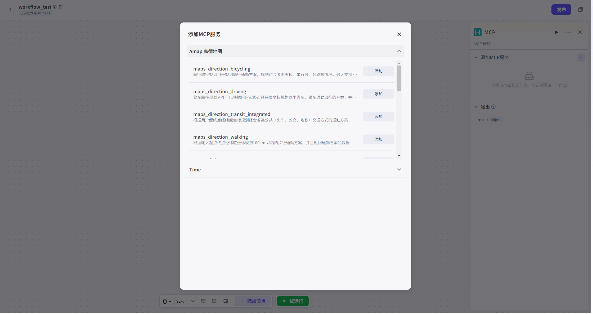

# MCP

调用 MCP

server Capabilities.

可 Add 已 PublishinMCP

Square MCP

server,

并 Associate 对应 InterfaceGenerateResults.

具体 AddMCP Way 详见[MCPImportWay](. . /3. Tools 广场. md)

本 NodeSupportUserSelect 一个已 Import 自 DefinitionMCPTools 一个子 Tools.

InputParameters:

Select 对应 MCPTools 后,

可 Edit 本 Node InputField,

InputField Parameters 由 MCP

server 决定,

不可自 RowModify.

ParametersType 可选 Character 串 or 直接 ReferenceStartNodeInputParameters、OtherNode OutputParameters.

OutputParameters:

OutputParameters 及 ParametersType 由 MCP

server 决定,

不可自 RowModify.

