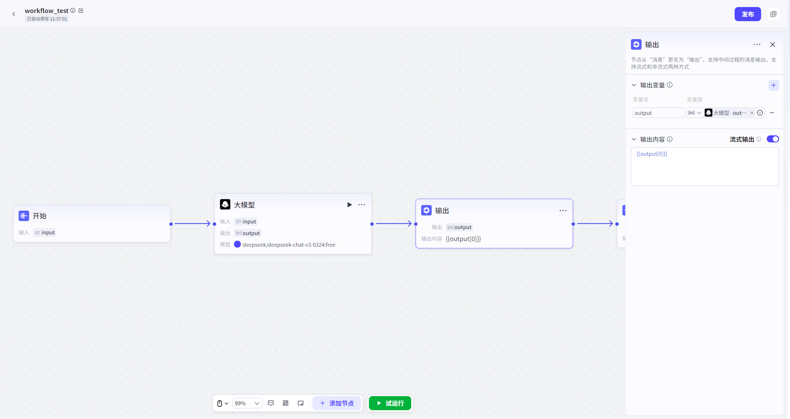

# Output

## NodeOverview

- *核心 Features**:

In WorkflowExecuteProcedure, ,

主动、即 Hour 地向 UserSendFeedbackMessage,

打破“黑盒 etc.

提升对话 Interaction 感 andUserExperience.

## ConfigurationGuidelines

ConfigurationOutputNode 主要 Minutefor 两个核心 Steps:

- *准备 OutputVariable

- >

撰写 OutputContent**.

##### 1. 准备 OutputVariable

OutputVariable 让你 Can In Message, 动态 InsertWorkflow 实 HourData,

让 FeedbackContent 更加 PersonalizationandInformation 丰富.

- **如何 Operation**:

1.

in“**OutputVariable**”Configuration 区,

Click“**+**”.

2.

- *SettingsParameters 名**:

forVariable 起一个有意义 名字(例如

`current_step`,

`estimated_time`).

3.

- *SettingsParametersValue**:

forVariable 赋 Value.

你 Can Select:

- **ReferenceVariable**:

from 上游 Node OutputSelect,

这 Yes 最常用 Way.

例如,

ReferenceLLMNode OutputContent.

- **固定 Value**:

直接 Input 一个 Constant,

如一段固定 Hint 语.

##### 2. 撰写 OutputContent

这 YesUser 最终看 to FeedbackMessage,

YesNode 核心产出.

- **如何 Operation**:

1.

- *固定 Value:

- *In “**OutputContent**”Text 框, ,

Input 你希望 Send 给 User Message.

2.

- *动态 Reference**:

In Text, ,

use

`{{Variable 名}}`

语法,

Reference 你 In 上一步, Definition Variable.

- **Example**:

If 你 Definition 了一个 Variable

`status`,

Valuefor“正 inGenerate 图 Table”,

那么 OutputContentCan 写 for:

“When 前 Status:

{{status}},

请稍候.

”

- **AdvancedFeatures:

流式 Output**

- 开启 Hour,

ReplyContent 大语言 Model GenerateContent 将会逐字流式 Output;

CloseHour,

ReplyContent 将 AllGenerate 后一次性 Output.

- **提升实 Hour 感**:

对于较长 Text,

流式 Output 能营造出一种“正 in 思考 andGenerate” 生动感,

让对话更自然.

- **即 HourFeedback**:

User 能立刻看 toContentStart 出现,

心理上感觉 Response 更快,

减少了 etc.

- **DefaultBehavior**:

NodeDefaultfor**非流式 Output**,

即 etc.

一次性完整 Show.

##### Note:

1.

- *NoteExecute 顺序**:

When 一个 Workflow 包含**多个**开启了流式 Output OutputNodeHour,

Message 会严格按照 Workflow **Execute 顺序**依次 Send.

请合理 PlanningNodePosition,

确保 Feedback 逻辑顺序符合 User 预期.

2.

- *区 Minute“OutputNode”and“EndNode”**:

- **OutputNode**:

Used for**Procedure 、临 Hour 、非最终** Feedback.

一个 WorkflowCan 有多个.

- **EndNode**:

Used for**最终 、决定性 **ResultsOutput.

一个 Workflow 有且仅有一个(in 每条 ExecutePath 上).

- **不要用 OutputNodeSend 最终 Results**,

这会破坏 Workflow Structure,

并可能导致下游 NodeNone 法正确 Get 最终 Data.

## 典型 AppScenario

- **长 TaskProcess**

- **Process**:

UserRequest“Summary 这篇长 Documentation”

- >

WorkflowStartProcess(耗 Hour 较长).

- **Use OutputNode**:

inWorkflowStartProcessDocumentation 后,

立即 Insert 一个 OutputNode,

SendMessage:

“正 infor 您阅读 andSummaryDocumentation,

请稍候片刻. . . ”.

- **Effectiveness**:

User 收 to 即 HourFeedback,

愿意耐心 etc.