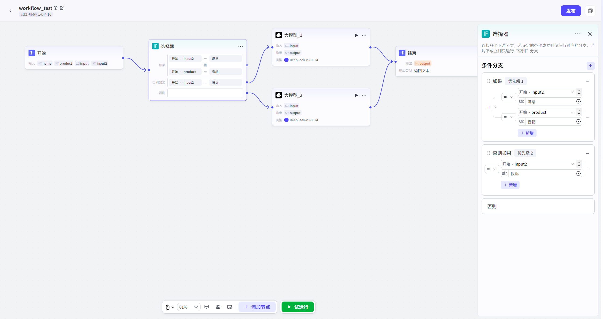

# Selector

SelectorNodeUsed forDesignWorkflow 内 Minute 支 Process,

Can Connection 多个下游 Node.

When 向该 NodeInputParametersHour,

Node 会 from 上 to 下依次 JudgmentYesNo 符合 Conditions,

若设定 Conditions 成立则 Operation 对应 ConditionsMinute 支,

若均不成立则 Operation“No 则”Minute 支.

可 through 拖拽 Minute 支 ConditionsConfigurationPanel 来设定 Minute 支 Conditions Priority.

In 每个 Minute 支 Conditions, ,

SupportSelectJudgment 关系(且/or),

and 同 HourAdd 多个 Conditions.

- *IF

Conditions:

- *SelectVariable,

SettingsConditionsand 满足 Conditions Value;

IF

ConditionsJudgmentfor

True

,

Execute

IF

Path;

IF

ConditionsJudgmentfor

False

,

Execute

ELSE

Path;

ELIF

ConditionsJudgmentfor

True

,

Execute

ELIF

Path;

ELIF

ConditionsJudgmentfor

False

,

ContinueJudgment 下一个

ELIF

PathorExecute 最后

ELSE

Path;

- *SupportSettings 以下 ConditionsType:

- *

- etc.

- 不 etc.

- Length 大于

- Length 大于 etc.

- Length 小于

- Length 小于 etc.

- 包含

- 不包含

- for 空

- 不 for 空

