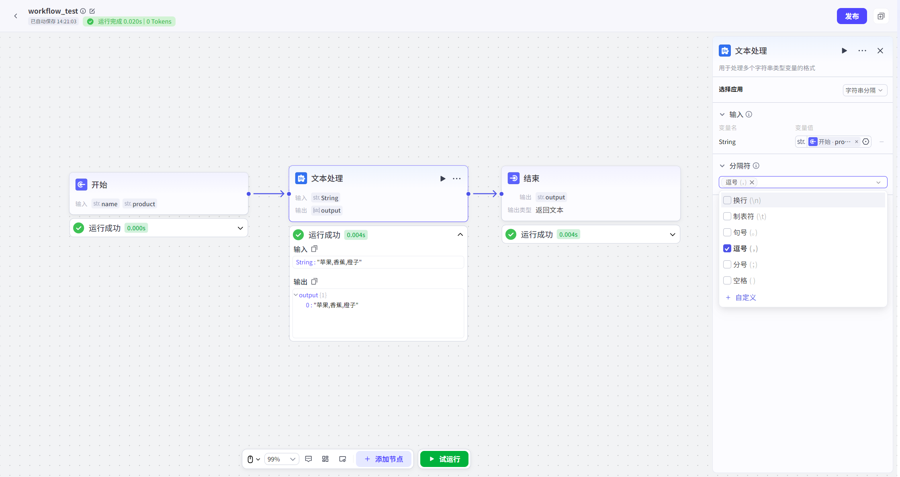
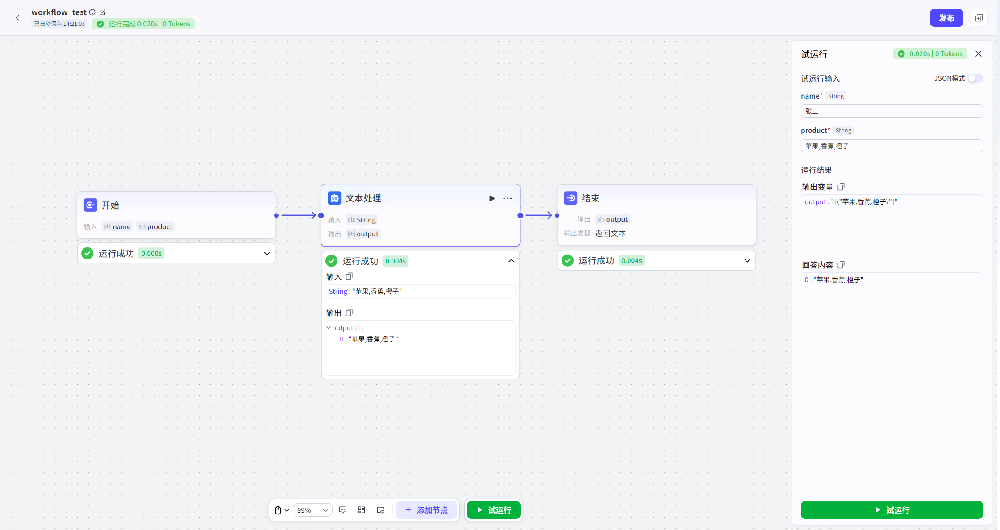

# Text

Processing

## NodeOverview

- *核心 Features**:

In Workflow, 扮演“Text 工匠” Role,

Specialized 对 Character 串 DataPerform Efficient、灵活 加工、重 GroupandFormats 化,

以满足下游 Node 特定 InputRequirements.

## ConfigurationGuidelines

Text

ProcessingNode Configuration 非常直观,

核心 in 于 Select“ProcessWay”并 Definition 相应 Rules.

##### 1. SelectApp

inNodeConfiguration 区,

首先要 from 两种核心 PatternSelect 一种:

- **Character 串拼接**:

将多个 Input 源 Merger 成一个单一 Character 串.

- **Character 串 Minute 隔**:

将一个单一 Input 源拆 Minute 成一个 Character 串数 Group.

##### 2. 根据 PatternPerform Configuration

###### **A.

Pattern 一:

Character 串拼接**

此 Pattern GoalYes“**合成**”.

- **如何 Operation**:

1.

in“**Input**”Area,

Add 所有你希望参 and 拼接 Variable.

2.

In “**拼接 Template**”Text 框, ,

Definition 最终 OutputFormats.

- **核心语法**:

- **ReferenceVariable**:

use

`{{Variable 名}}`

语法,

将你 in“Input”AreaDefinition VariableInserttoTemplate 任意 Position.

- **混合固定 Text**:

你 Can inVariable 前后 or 之间 Add 任意 固定 Text、标点符号、换 Row 符 etc.

- **Example**:

- **InputVariable**:

`user_name`

(Valuefor

"张三"),

`product_name`

(Valuefor

"Intelligence 音箱")

- **拼接 Template**:

尊敬 {{user_name}},

您购买 “{{product_name}}”已发货.

- **最终 Output**:

尊敬 张三,

您购买 “Intelligence 音箱”已发货.

###### **B.

Pattern 二:

Character 串 Minute 隔**

此 Pattern GoalYes“**拆解**”.

- **如何 Operation**:

1.

in“**Input**”Area,

Add 一个待 Process Character 串 Variable.

2.

In “**Minute 隔符**”Configuration 项, ,

指定 Used for 切 MinuteCharacter 串 “Flag”.

- **核心 Configuration**:

- **InputVariable**:

Select 一个上游 NodeOutput 、包含待 Minute 隔 Content Character 串 Variable.

- **Minute 隔符**:

Can Yes 一个 or 多个 Character.

PlatformProvides Minute 隔符 Including:

- 逗号

(,)

- 换 Row(\n)

- 制 Table 符(\t)

- 句号(.

)

- Minute 号(;

)

- 空格(

)

- 自 Definition

- **Example**:

- **InputVariable**:

`tags`

(Valuefor

"苹果, 香蕉, 橙子")

- **Minute 隔符**:

`,`

(一个英文逗号)

- **最终 Output**:

一个 Character 串数 Group

`["苹果",

"香蕉",

"橙子"]`.

##### 3. DefinitionOutput

None 论 Select 哪种 Pattern,

最终都需要 DefinitionNode Output.

- **Output**:

`output`

- **DataType**:

- **拼接 Pattern**:

Outputfor

`String`

(Character 串).

- **Minute 隔 Pattern**:

Outputfor

`Array`

(Character 串数 Group).

- **如何 Use **:

这个 OutputResultsCan 被 Workflow 任何下游 NodeReference,

例如作 forLLMNode Input、作 forLoopNode 遍历 Objects,

or 作 forCodeNode ProcessData.

## 典型 AppScenario

- **Scenario 一:

动态 Hint 词构建**

- **Demand**:

根据多轮对话,

提取关 KeyInformation(如 UserLike 绘画风格、画面主体、色彩 Requirements),

然后拼接成一个完整 文生图 Hint 词.

- **Implementation**:

1.

上游 Nodethrough“Knowledge

Base 检索”or“CodeNode”提取出

`style`

(风格)、`subject`

(主体)、`color`

(色彩)

三个 Variable.

2.

Use Text

ProcessingNode “**拼接**”Features,

将它们 and 固定 TextGroup 合:

`一幅{{style}}风格 画,

主体 Yes{{subject}},

主要色调 for{{color}},

高清,

细节丰富.

`

3.

Output 完整 Hint 词可直接传递给“文生图”LLM.

- **Scenario 二:

Content 二次 Summary**

- **Demand**:

一个长 Documentation 被 Minute 成了多个部 Minute,

并由 LLMNodeMinute 别 Generate 了 Abstract.

现 in 需要将这些子 AbstractMerger 成一段总 Abstract.

- **Implementation**:

1.

上游 “Batch

ProcessingNode”or“LoopNode”Output 了一个包含所有子 Abstract 数 Group

`summary_list`.

2.

Use Text

ProcessingNode “**Minute 隔**”Features(IfResultsYes 一个长 Character 串)or 直接 Process 数 Group,

将所有 Abstract 用换 Row 符 or 特定 Minute 隔符 Connection 成一个长 Text.

3.

将这个长 Text 再传递给一个 LLMNode,

Perform 最终 “总 Abstract”Generate.

- **Scenario 三:

Formats 化 Output**

- **Demand**:

需要将 UserInformation(Name、Phone、Email)Formats 化 for 一个 Standards CSVRoworJSONCharacter 串.

- **Implementation**:

1.

Get 上游 NodeOutput

`name`,

`phone`,

`email`

Variable.

2.

Use Text

ProcessingNode “**拼接**”Features,

构建 CSVFormats:

`"{{name}}","{{phone}}","{{email}}"`.

3.

Output Results 可直接写入 Fileor 传递给 OtherSystem.