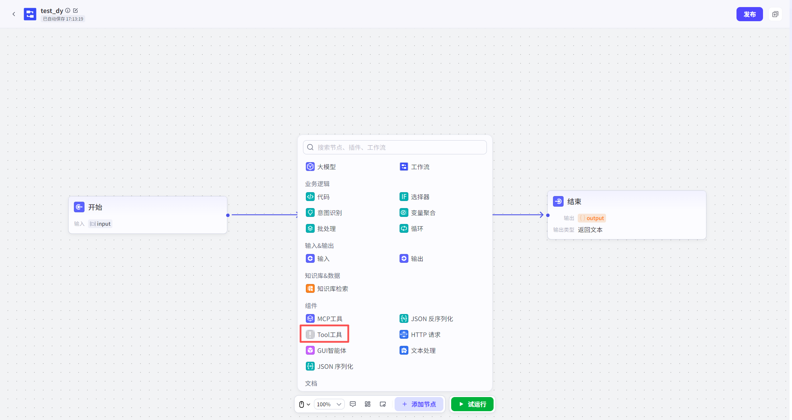

# Tools

调用 Tools(内置 Tools、自 DefinitionTools) Capabilities.

本 NodeSupportUserSelect 一个 Tools 一个子 Tools.

InputParameters:

Select 对应 Tools 后,

可 Edit 本 Node InputField,

InputField Parameters 由 Tools 决定,

不可自 RowModify.

ParametersType 可选 Character 串 or 直接 ReferenceStartNodeInputParameters、OtherNode OutputParameters.

OutputParameters:

OutputParameters 及 ParametersType 由 Tools 决定,

不可自 RowModify.

