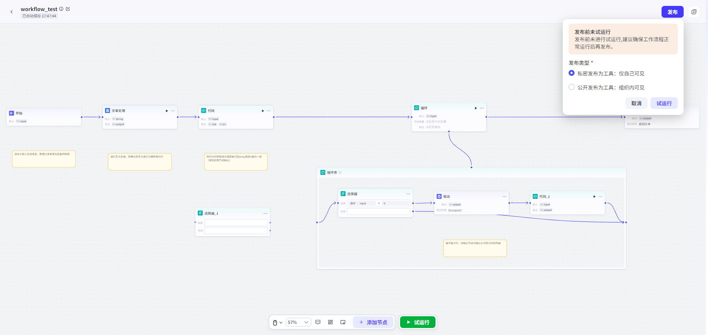
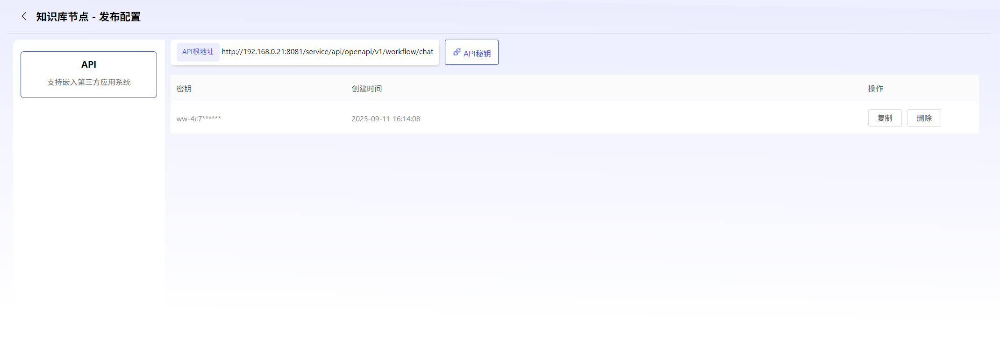

# Workflow

### 1. WorkflowCreate

Click“CreateWorkflow”即可进入 WorkflowCreateInterface.

Users can custom 设定 WorkflowName、WorkflowDescriptionDescription.

Platform 内置了 StandardsWorkflowExample,

User 也可直接 CopyUse.

### 2. WorkflowEdit

PlatformProvidesMCP、Intent

Recognition、API、Code、LLM、Minute 支器、Knowledge

Base、Document

Generation、Document

Parsingetc.

### 3. WorkflowDebugandPublish

Edit 完毕 Workflow,

Click“Debug”,

OperationSuccess 后,

即可 Perform Publish.

Click“Publish”可 Perform PublishWaySelect,

User 可 Perform 私密 Publish,

也可 Perform 公开 Publish.

PublishComplete Workflow 可作 forTools,

被 Agent 调用.

SupportPublishforAPI.

- *私密 Publish:

- *Publish 后仅对自己可见.

- *公开 Publish:

- *Publish 后可对 AllUserPerform Sharing.

已 Publish Workflow 也可 CancelPublish 后,

重新 Perform Edit.

并可 Perform PublishConfiguration,

CreateOpenAPI.

### 4. WorkflowImportExport

SupportWorkflowImportExport.

