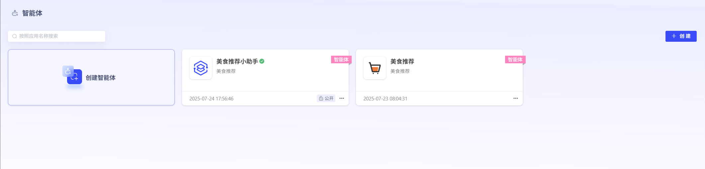

# Agent

### 1. Create Agent

Click "Create Agent" to create an agent.

Users can customize the Agent icon, Agent name, and Agent description.

### 2. Edit Agent

Agents can use the following categories to perform application features and code development:

- **Select Model Service**:

  - Users can select platform-managed models to create agents.

- **Opening Greeting**:

  - Used to edit the opening greeting

- **Recommended Questions**:

  - Can set guided questions

- **System Prompt Words**:

  - Fill in application feature description, application process description, and requirements for generating results.

- **Insert Prompt Words**:

  - Users can select built-in or custom-defined prompt words for convenient insertion of existing agents.
  
  - Can also click "All" to view the prompt word template library and insert prompt words.

- **Submit to Prompt Word Template Library**:

  - Users can add debugged prompt words to the resource library-prompt word template library.
  
  - Set prompt word icon, name, description, and content.

- **Prompt Word Optimization**:

  - Users can select LLM to optimize prompt words.
  
  - Optimized prompt words can replace original prompt words.

- **Web Search**:

  - By configuring web search URL and key, you can enable "Bocha" web search to assist in Q&A.

- **Tools**:

  - Users can add associated published MCPs, workflows, or custom-defined tools.
  
  - Users can click "Add", select "MCP", "Custom" or "Workflow" to add published tools.

- **Knowledge Base**:

  - Users can upload documents for LLM to perform knowledge base external storage.
  
  - After external storage of the knowledge base, can interact with LLM documentation content.
  
  - Support users to perform retrieval configuration and metadata filter configuration for knowledge bases:

- **Retrieval Configuration**:

  - Click "Configuration" to configure the retrieval method.
  
  - Knowledge bases need to be added in advance in "Workspace" - "Knowledge Base".
  
  - Currently supports 3 types of retrieval method configuration. Users can adjust retrieval strategies based on the content characteristics and usage scenarios of documents in the knowledge base:

  1. **Vector Retrieval**: Find text fragments with similar meanings and diverse expressions through vector similarity, suitable for understanding and recalling semantically related information.

  2. **Full-text Retrieval**: Based on keyword matching, can efficiently query text fragments containing specified vocabulary, suitable for precise searching.

  3. **Hybrid Retrieval**: Combines vector and keyword retrieval, integrating semantic understanding with keyword matching, balancing relevance and accuracy to improve retrieval effectiveness.

- **Metadata Filtering - Use Metadata Filtering to Precisely Locate Documents**:

  - In agents, the **metadata filtering** feature allows you to precisely filter based on document "tags" (such as `category`, `status`, `author`, etc.) like using advanced search, significantly improving the relevance and accuracy of retrieval results.

  - **1. Select Filter Mode**
    
    First, you need to choose one of the following 2 modes to define filtering rules.

    - **Disabled Mode**
    
      - **Instructions**: This is the default option. Selecting this mode will completely turn off the metadata filtering feature, and the node will retrieve all selected knowledge bases without considering any metadata.
      
      - **Applicable Scenarios**: When you need comprehensive retrieval, or when knowledge base documents do not have unified metadata standards.

    - **Manual Mode**
    
      - **Instructions**: Completely customize filtering rules yourself, freely combine multiple conditions to achieve the most precise control.
      
      - **Applicable Scenarios**: Handle complex, multi-condition, logically fixed filtering needs. This is the most commonly used and most powerful mode.

  - **2. Manual Mode Configuration Details**
    
    If you choose **Manual Mode**, please follow these steps to configure:

    - **Step 1: Add Filter Conditions**
      
      1) After selecting the knowledge base, click the **Settings** button to open the metadata filtering button.
      
      2) In the configuration box, click **+ Add Conditions**.
      
      3) In the pop-up dropdown list, select a metadata field.
      
      - **Tip**: This list will show all metadata fields of the currently selected **Knowledge Base**.
      
      - If you need to add more fields, repeat clicking **+ Add Conditions**.

    - **Step 2: Configure Filter Rules**
      
      After selecting a field, you need to set specific filter rules based on the field's **data type** (string, number, time).

      - **A. String Type**
        
        Suitable for text fields, such as `Tag`, `Category`, `Status`, etc.

        | Filter Conditions | Instructions and Examples |
        |:------------------|:---------------------------|
        | **is**            | Exact match. For example `is "Published"`, only returns documents with status **exactly equal to** "Published". |
        | **is not**        | Exclude match. For example `is not "Draft"`, returns all documents with status **not equal to** "Draft". |
        | **is empty**      | Field is empty. Returns documents that **have not filled in** this field. |
        | **is not empty**  | Field is not empty. Returns documents that **have filled in** this field. |
        | **contains**      | Contains text. For example `contains "Report"`, will return "Monthly Report", "Annual Report", etc. |
        | **does not contain** | Does not contain text. For example `does not contain "Secret"`, will return all documents without "Secret". |
        | **starts with**   | Starts with... For example `starts with "Doc"`, will return "Doc1", "Document", etc. |
        | **ends with**     | Ends with... For example `ends with "2024"`, will return "Report 2024", "Summary 2024", etc. |

        > ⚠️ **Case Sensitivity Reminder**: String matching is **case sensitive**. `contains "App"` will match "Apple", but **will not** match "apple" or "APPLE".

      - **B. Number Type**
        
        Suitable for numeric fields, such as `Reading Count`, `Version Number`, `Rating`, etc.

        | Filter Conditions | Instructions and Examples |
        |:------------------|:---------------------------|
        | **equals**        | Equal to. For example `= 100`, returns documents marked as 100. |
        | **not equal**     | Not equal to. For example `≠ 5`, returns all documents marked as not 5. |
        | **greater than**  | Greater than. For example `> 100`, returns documents marked greater than 100. |
        | **less than**     | Less than. For example `< 50`, returns documents marked less than 50. |
        | **greater than or equal to** | Greater than or equal to. For example `≥ 20`, returns documents marked greater than or equal to 20. |
        | **less than or equal to** | Less than or equal to. For example `≤ 200`, returns documents marked less than or equal to 200. |
        | **is empty**      | Field is empty. Returns documents that **have not set** this numeric field. |
        | **is not empty**  | Field is not empty. Returns documents that **have set** this numeric field. |

      - **C. Time Type**
        
        Suitable for date fields, such as `Publish Date`, `Last Modified Time`, etc.

        | Filter Conditions | Instructions and Examples |
        |:------------------|:---------------------------|
        | **is**            | Date exact match. For example `is "2024-01-01"`, only returns documents on that date. |
        | **before**        | Earlier than specified date. For example `before "2024-01-01"`, returns all documents before January 1, 2024. |
        | **after**         | Later than specified date. For example `after "2024-01-01"`, returns all documents after January 1, 2024. |
        | **is empty**      | Field is empty. Returns documents that **have not set** this time field. |
        | **is not empty**  | Field is not empty. Returns documents that **have set** this time field. |

    - **Step 3: Set Filter Value**
      
      After defining rules, you need to provide a specific **filter value**.
      
      - **String/Number**: Input directly, such as `Published`, `100`.
      
      - **Time**: The system will provide a **time selector** for you to intuitively select dates without manual format input.

    - **Step 4: Define Logical Relationships Between Conditions**
      
      When you add **multiple** filter conditions, you need to set the relationship between them.

      - **AND Logic**
      
        - **Meaning**: Documents **must satisfy all conditions simultaneously** to be retrieved.
        
        - **Example**: `category is "Report" AND status is "Published"`, will only retrieve documents with **both** "Category is Report" **and** "Status is Published".

      - **OR Logic**
      
        - **Meaning**: Documents **only need to satisfy any one of the conditions** to be retrieved.
        
        - **Example**: `author is "Zhang San" OR author is "Li Si"`, will retrieve all documents with author equal to "Zhang San" **or** "Li Si".

- **Safety Guardrails Configuration**:

  - Enable the safety guardrails switch, users can associate created sensitive word tables to control application feedback content security.

- **Vision**:

  - When users select the "Image-Text Q&A" type model, they can perform **"Vision"** module editing.
  
  - Configure image upload quantity limits to control how many image files users can upload at most during image-text Q&A.

### 3. Publish Agent Application

Click "Publish Configuration" to enter the configuration page. The platform supports 2 types of agent publish configurations:

- **Web URL**

  The platform supports publishing agents as URLs, convenient for external users to access.
  
  Supports configuring the following content:

  - Application Name (Required)
  - Expiration Time: If not filled, defaults to no expiration time, permanently valid
  - Copyright
  - Privacy Agreement
  - Disclaimer Statement

After copying the URL to a browser, you can perform application Q&A.

- **API**

  The platform has encapsulated APIs for applications. You can click "API Key" to generate an application-specific API Key authorization for users to call.

Supports agent copying.

Published agents can also be unpublished and then re-edited.

