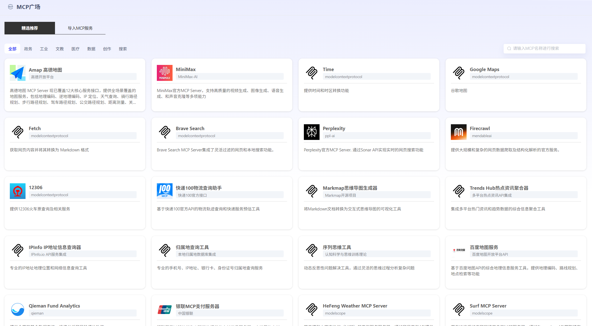
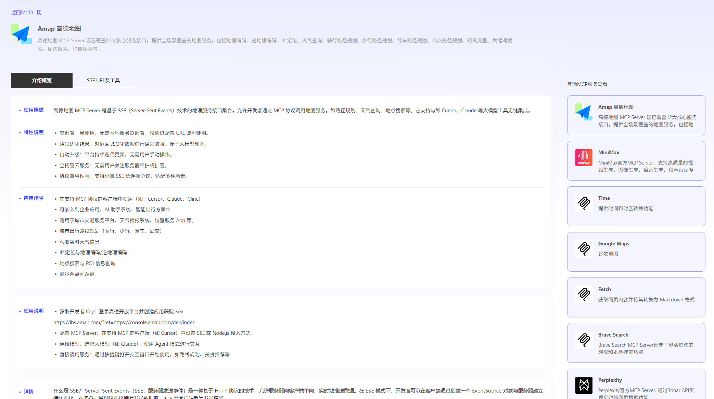

# MCP Square

The platform provides selected MCP servers. Users can click "Import MCP Service" and replace the URL with their own link in the editing interface for use.

You can uniformly view the selected recommended imported MCP servers in the "Import MCP Service" module.

