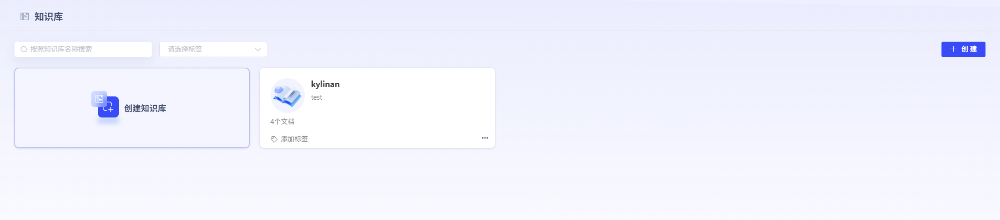
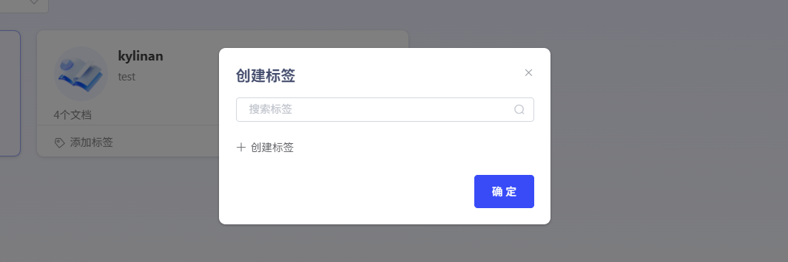
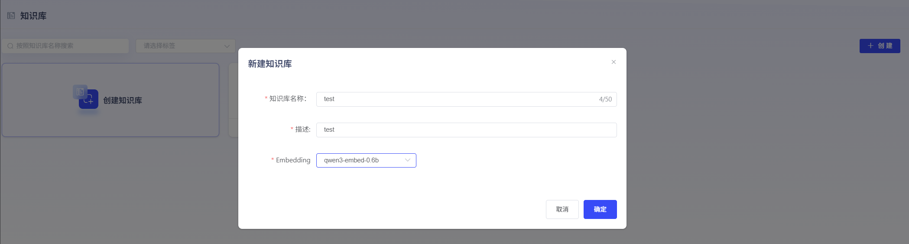
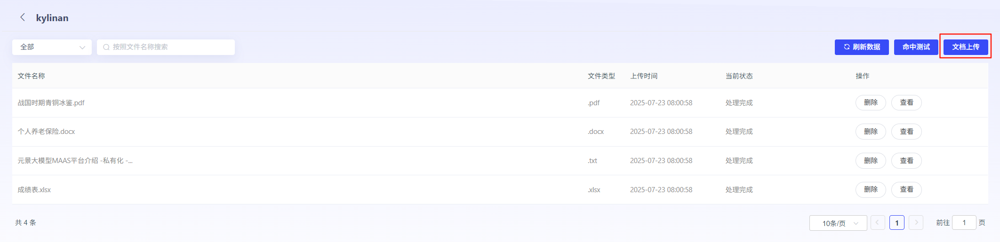
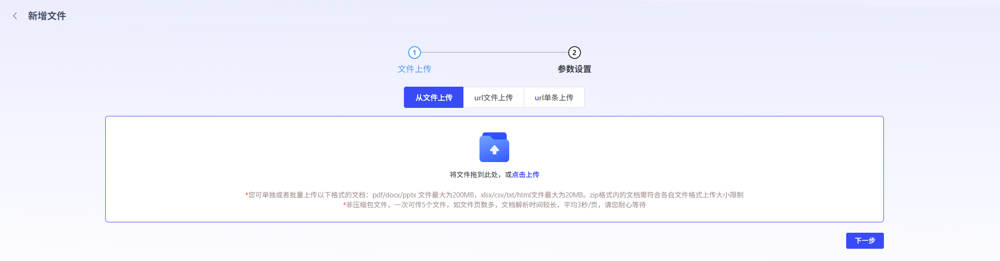
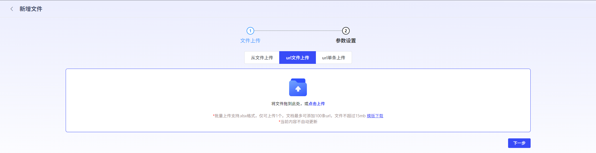
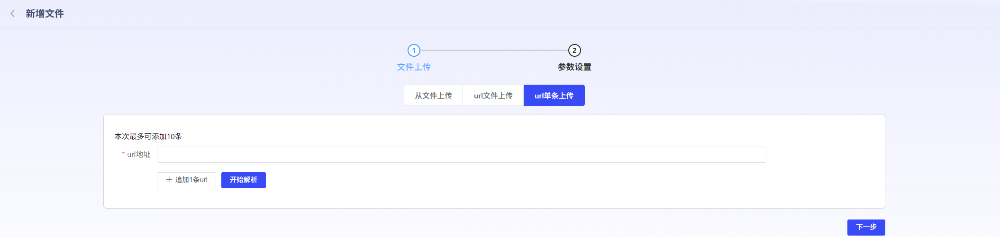

# Create Knowledge Base

## 新建Knowledge Base

若User要使用RAGFeatures，需要先Create Knowledge Base，关联Embedding模型。其中Embedding模型，需提前在Model Management模块Upload。User也可进行标签Settings，方便进行Knowledge Base筛选分类。（已创建但未填写内容的标签，可通过Backspace键快捷Delete）

## FileUpload

平台支持UserUpload本地File或者从urlUpload。

