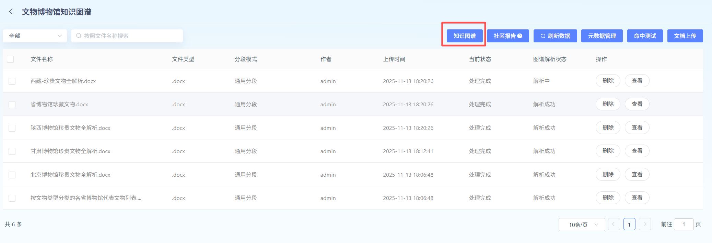
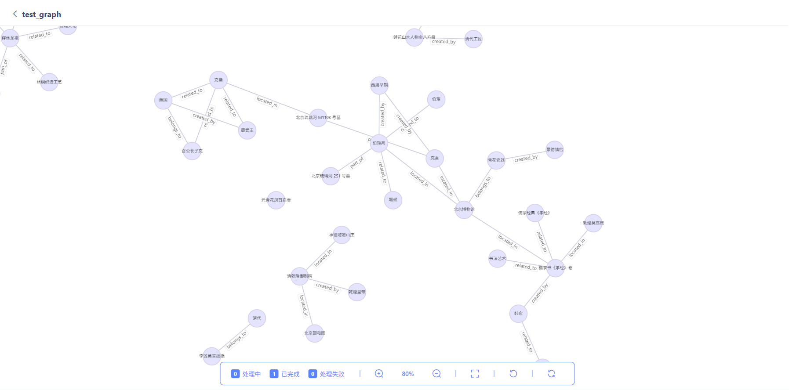
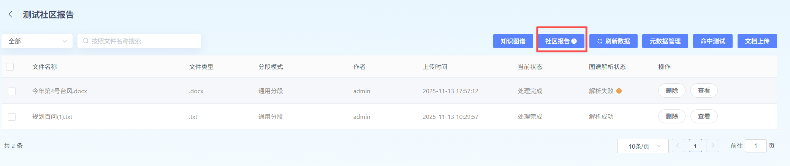

# 知识图谱

### 1、什么Yes知识图谱？

知识图谱本质上Yes一个**语义网络**，它用图的形式来Description现实世界中的概念、实体及其相互关系。它由以下核心元素构成：
*   **节点**：代表现实世界中的“实体”（如：人物、公司、产品）或“概念”（如：国家、行业）。
*   **边**：代表节点之间的“关系”（如：[张三] -`就职于`-> [阿里巴巴]）。
*   **属性**：Description节点或边的特征信息（如：[张三] 节点有属性 `年龄: 30`，`职位: 算法工程师`）。
与传统的关系型Data库（表格）不同，知识图谱的结构更灵活，更擅长处理复杂、多跳的关联Query和推理。
### 2、为什么Agent需要知识图谱？
Agent（如聊天机器人、智能助手）仅依赖大语言模型时，可能会遇到以下问题：
*   **事实幻觉**：生成看似合理但与事实不符的信息。
*   **知识滞后**：None法获取训练Data截止日期之后的新知识。
*   **缺乏深度推理**：难以回答需要跨多个实体进行复杂关联分析的问题。

知识图谱可以为Agent提供：

*   **事实依据**：作为结构化的“事实Data库”，为Agent提供准确、可验证的信息。
*   **增强推理**：支持多跳Query，回答“XX公司的CEO的母校Yes哪里？”这类复杂问题。
*   **可解释性**：答案可以追溯到知识图谱中的具体路径，增强了回答的可信度。

---
### 3、核心概念解析
| 概念       | 解释                                                         | Example                                                  |
| ---------- | ------------------------------------------------------------ | ----------------------------------------------------- |
| **实体**   | 现实世界中可区分的独立事物。                                 | `苹果公司`、`iPhone 15`、`蒂姆·库克`                  |
| **关系**   | 连接两个实体，Description它们之间的某种联系。                       | `生产`、`Yes...的CEO`、`Publish于`                        |
| **属性**   | 实体或关系的特征或Description。                                     | `iPhone 15` 的属性：`颜色: 深空黑`、`存储容量: 256GB` |
| **三元组** | 知识图谱的基本组成单元，形式为 `(主语, 谓语, 宾语)` 或 `(实体, 关系, 实体/值)`。 | `(蒂姆·库克, Yes...的CEO, 苹果公司)`                   |
### 4、知识图谱使用流程

#### 1）创建知识图谱

在Knowledge Base创建阶段，可开启知识图谱Features，按照模板Upload对应的图谱Schema：

**Features说明:**开启此Features后会调用LLM对切片内容提及的三元组并在Knowledge Base层面构建知识图谱。检索时会引入图谱增强chunk间关系检索，提升相关性召回效果。

**适用场景:**用于回答问题的chunk切片跨多个File或同File的不同章节，依赖chunk之间通过实体关系实现多跳、关系类检索才能实现更全面的上下文召回。

**Note事项:**开启后将对非表格类文档在Import解析环节调用大语言模型抽取三元组、构建知识图谱，会增加Document Parsing处理时长并增加LLMtokens资源开销。检索召回时会增加图谱检索召回会增加检索耗时。

#### 2）查看知识图谱

点击【知识图谱】，可查看知识图谱Details，以及知识图谱生成进度。

#### 3）生成社区报告

**社区报告：**基于知识图谱，通过社区检测算法，将图谱按主题划分为多个社区，并为每个社区生成的主题报告（用于Description该社区内的所有实体级关系）。社区报告在Query时作为一类综合性知识参与检索召回。适合App于综合性全局问答类场景使用。

点击【社区报告】-【生成/重新生成】，User可查看社区报告Details，并Add、Edit社区报告。

**提示：**社区报告需要在知识Image解析完成之后，才能生成。需要User手动点击生成。社区报告在UploadFile或DeleteFile时不会自动触发构建,如需更新报告需要点击生成/重新生成构建。重新生成社区报告，会默认Delete已生成的社区报告。

