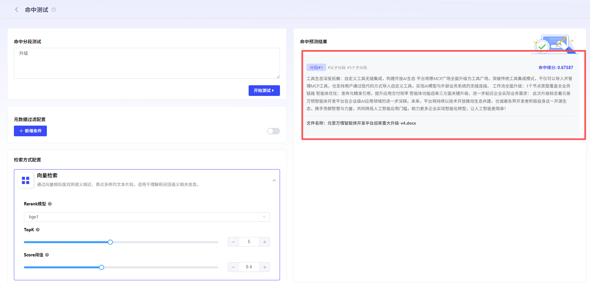

# 创建Hit Testing

当User需要测试Knowledge BaseYesNo生效时，可使用“Hit Testing”Features快速测试。 点击“Hit Testing”按钮，进入Hit Testing界面。在“Hit Testing分段”中Input关键词并Configuration[检索方式](检索方式Configuration.md)、[元Data过滤](元Data过滤.md)。如命中结果，即可获得相关命中得分，及分段内容，Confirm该知识分段已生效。

- **通用分段**

  在通用分段模式下，命中预测结果会显示命中的分段内容与命中得分。得分越高，说明问题关键词与内容块的的匹配度越高。

- **父子分段**

  在父子分段模式下，命中预测结果会显示命中的分段内容与命中得分。区块右上角的得分指的Yes子区块与关键词之间的匹配得分。得分越高，说明问题关键词与内容块的的匹配度越高。点击分段内容，可查看Details。

  