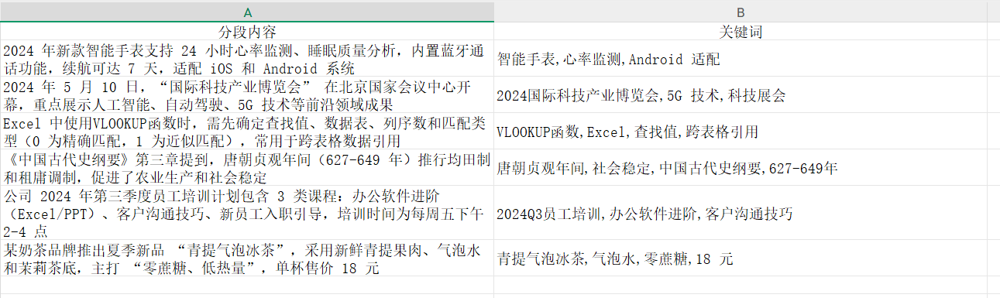
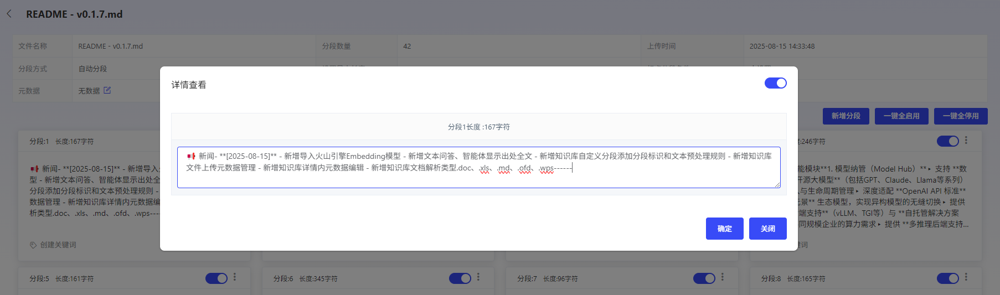
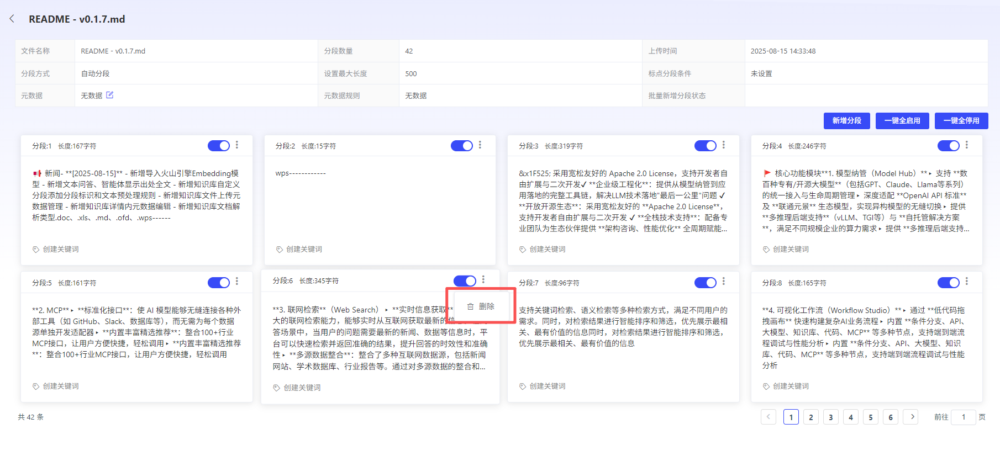

# 分段内容Edit

平台支持对分段内容进行Add、Edit、Delete。

## Add分段内容

- **单条Add：**平台支持UserAdd不大于“分段最大长度”的分段内容。并支持Add多个关键词。
- **批量Add：**User可Download批量Add模板，一次性Upload多个分段和关键词。

## 分段内容Edit

平台支持User对已有的分段内容进行二次Edit，但Edit后的分段内容长度，不能大于“分段最大长度”。

**【通用分段】**

**【父子分段】：**

**父分段Edit：**User可Edit父分段内容，平台将自动重新解析子分段。

**子分段Edit：**User可Edit或Add子分段内容，但不会同步更改父分段内容

## 分段内容Delete

