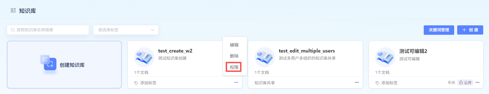
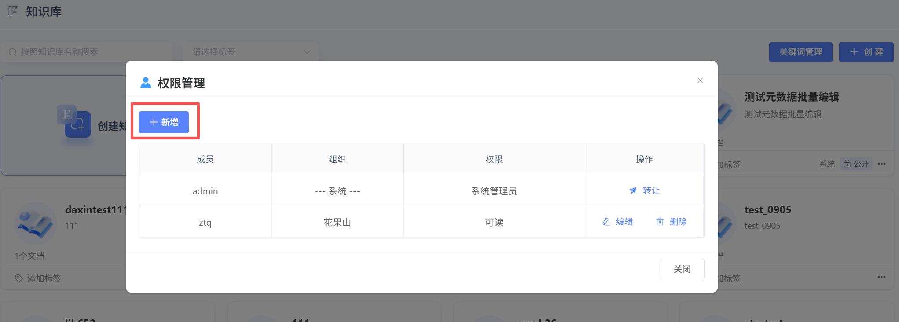
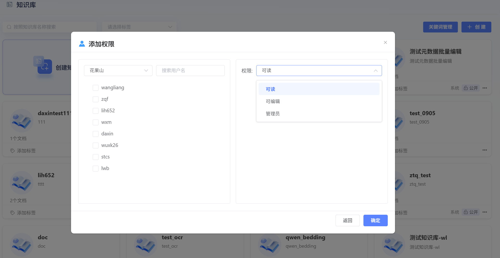
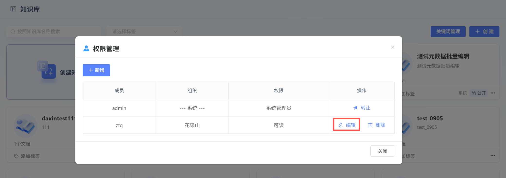
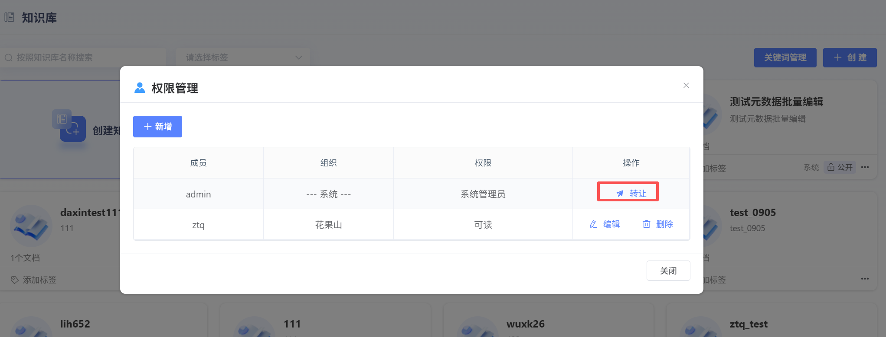
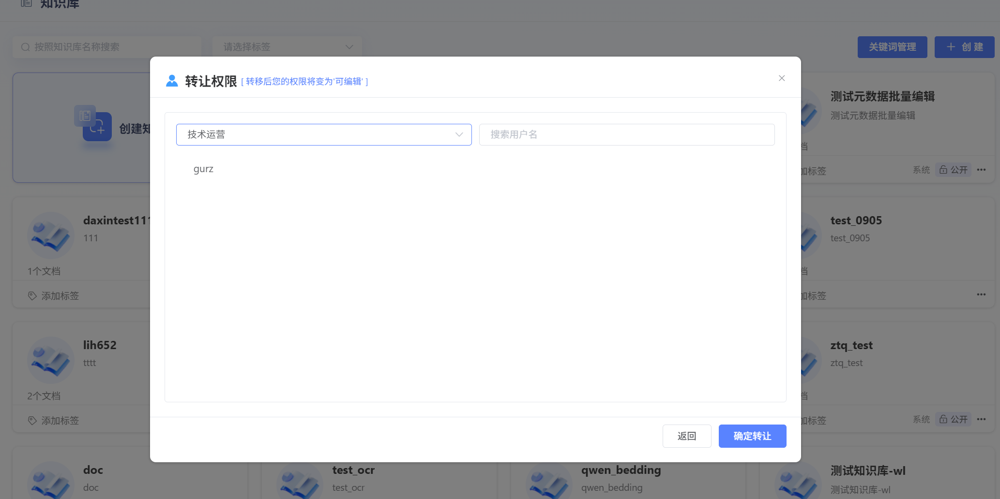

# Knowledge BasePermission

UserCreate Knowledge Base后，可进行Permission共享。具体Permission如下：

### Knowledge BasePermission总览
| Permission项                                       | 系统管理员 | 子管理员         | User-可Edit | User-可读  |
| :------------------------------------------- | :--------- | :--------------- | :---------- | :--------- |
| **数量限制**                                 | 唯一一个   | 可有多个         | 可有多个    | 可有多个   |
| **Delete整个Knowledge Base**                           | ✅          | ❌                | ❌           | ❌          |
| **Knowledge BasePermission管理**                           | ✅          | ✅                | ✅ (仅展示)  | ✅ (仅展示) |
| &nbsp;&nbsp;└ 搜索成员                       | ✅          | ✅                | ✅           | ✅          |
| &nbsp;&nbsp;└ Add成员(可读/可Edit/子管理员) | ✅          | ✅                | -           | -          |
| &nbsp;&nbsp;└ 修改子管理员Permission               | ✅          | ❌                | -           | -          |
| &nbsp;&nbsp;└ 修改UserPermission                   | ✅          | ✅                | -           | -          |
| &nbsp;&nbsp;└ Edit/DeleteUser                  | ✅          | ✅ (仅限普通User) | -           | -          |
| &nbsp;&nbsp;└ Edit/Delete子管理员              | ✅          | ❌                | -           | -          |
| &nbsp;&nbsp;└ 转让管理员身份                 | ✅          | ❌                | -           | -          |
| **Knowledge BaseOperationPermission**                           |            |                  |             |            |
| &nbsp;&nbsp;└ RefreshData                       | ✅          | ✅                | ✅           | ✅          |
| &nbsp;&nbsp;└ 批量Edit元Data                 | ✅          | ✅                | ✅           | ❌          |
| &nbsp;&nbsp;└ 元Data管理                     | ✅          | ✅                | ✅           | ❌          |
| &nbsp;&nbsp;└ Hit Testing                       | ✅          | ✅                | ✅           | ✅          |
| &nbsp;&nbsp;└ Upload文档                       | ✅          | ✅                | ✅           | ❌          |
| &nbsp;&nbsp;└ 查看文档                       | ✅          | ✅                | ✅           | ✅          |
| &nbsp;&nbsp;└ Delete文档                       | ✅          | ✅                | ✅           | ❌          |
| **文档内容Operation**                             |            |                  |             |            |
| &nbsp;&nbsp;└ 查看分段                       | ✅          | ✅                | ✅           | ✅          |
| &nbsp;└ Edit分段                             | ✅          | ✅                | ✅           | ❌          |
| &nbsp;&nbsp;└ Add分段                       | ✅          | ✅                | ✅           | ❌          |
| &nbsp;&nbsp;└ Edit元Data                     | ✅          | ✅                | ✅           | ❌          |
| &nbsp;&nbsp;└ 管理分段开关                   | ✅          | ✅                | ✅           | ❌          |
| &nbsp;&nbsp;└ 创建关键词                     | ✅          | ✅                | ✅           | ❌          |

### PermissionOperation

点击**“Permission”**，可Add、EditUserPermission。

**1、AddUserPermission：**

点击**“Add”**按钮，进行User和PermissionConfiguration

【选择User】：系统管理员同级或子Organization中没有Permission的User

【ConfigurationPermission】：可读、可Edit、管理员

**2、EditUserPermission：**

点击**“Edit”**，可对现有UserPermission进行更改。变更完成后，点击**“Save”**，Save新Permission。

点击**“Delete”**，可将该User剔除Knowledge Base。

**3、系统管理员转让：**

一个Knowledge Base有且只有一个系统管理员，系统管理员可进行转让，转让后，原系统管理员的Permission降级为**“可Edit”**。

【可选User范围】：系统管理员同级或子Organization中的所有User

