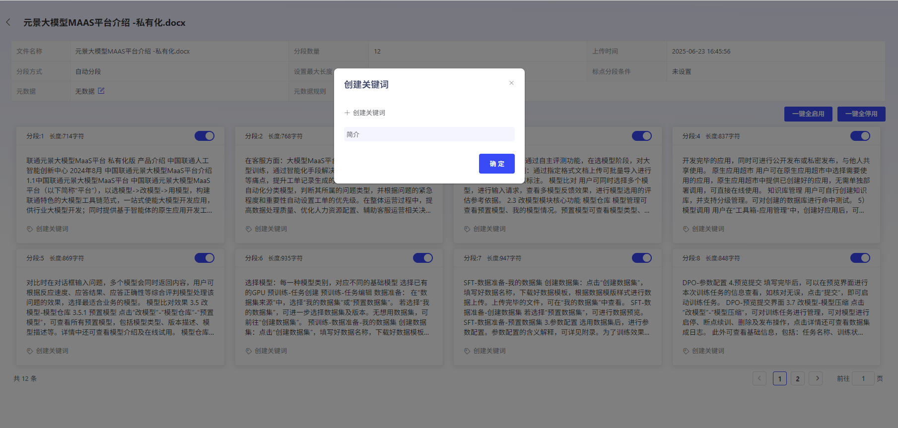
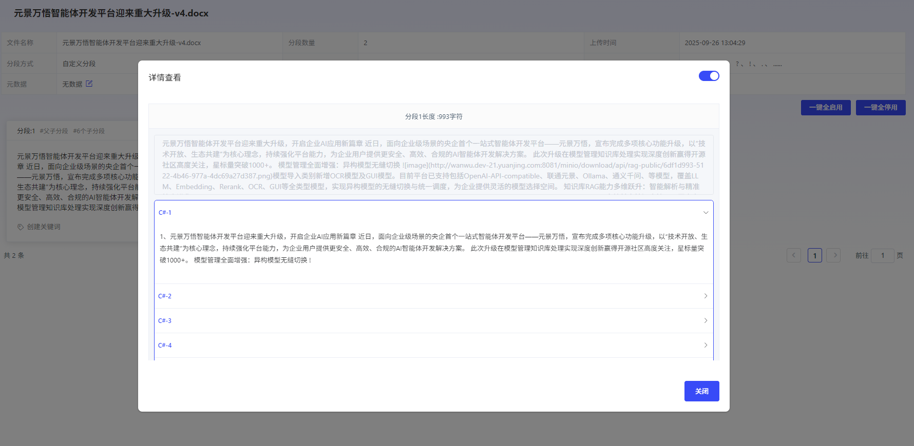
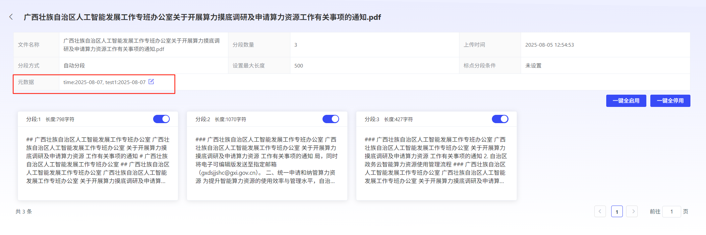

# 查看分段结果

点击Operation列的“查看”，即可查看Status为处理完成的文档分段结果。支持对分段内容进行关键词打标签Operation。在分段结果查看中，可以查看文档分段策略，元DataConfiguration情况，分段方式等信息。

点击每个分段内容卡片，可查看分段Details：

- **通用分段**

  可查看具体分段内容，分段长度

  

- **父子分段**

  可查看父分段和每个子分段内容，以及父分段长度

可根据User需求，点击每个分段卡片上的启停开关，对单独分段进行启动和停止。也可点击一键全启动或一键全停用，对整个文档的分段结果进行启动和停止。 

注：停止的分段内容在使用RAG能力时不会生效。 

## 元DataEdit

平台可自动根据文档内容匹配出元Data标签。元Data用于Description文档的属性，可以帮助您更好地Organization和管理文档。User可对识别出来的元Datavalue进行Edit、Add或Delete。

