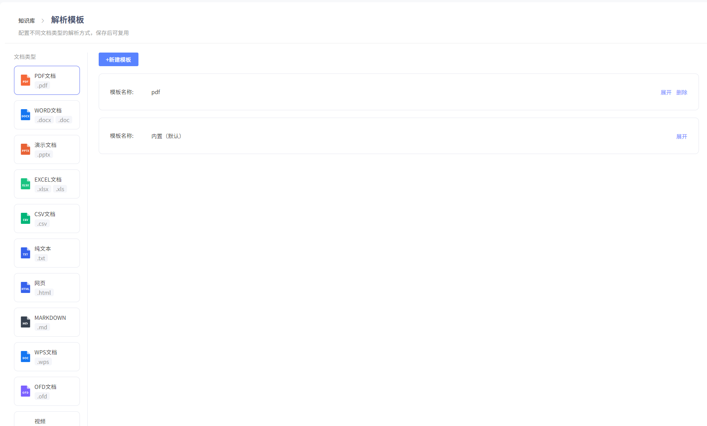
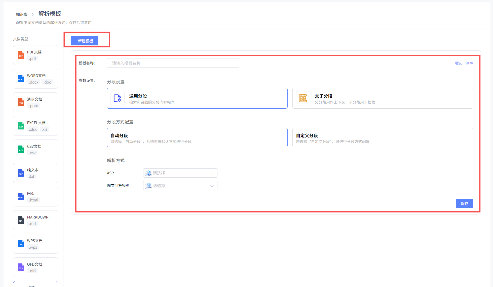
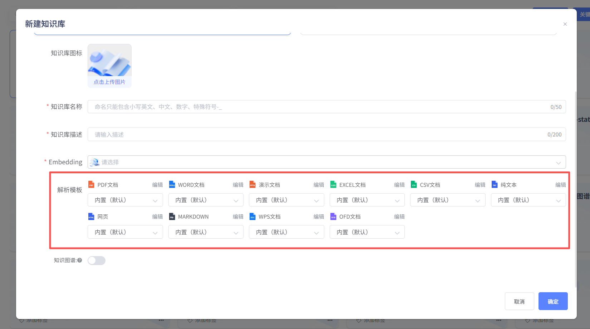
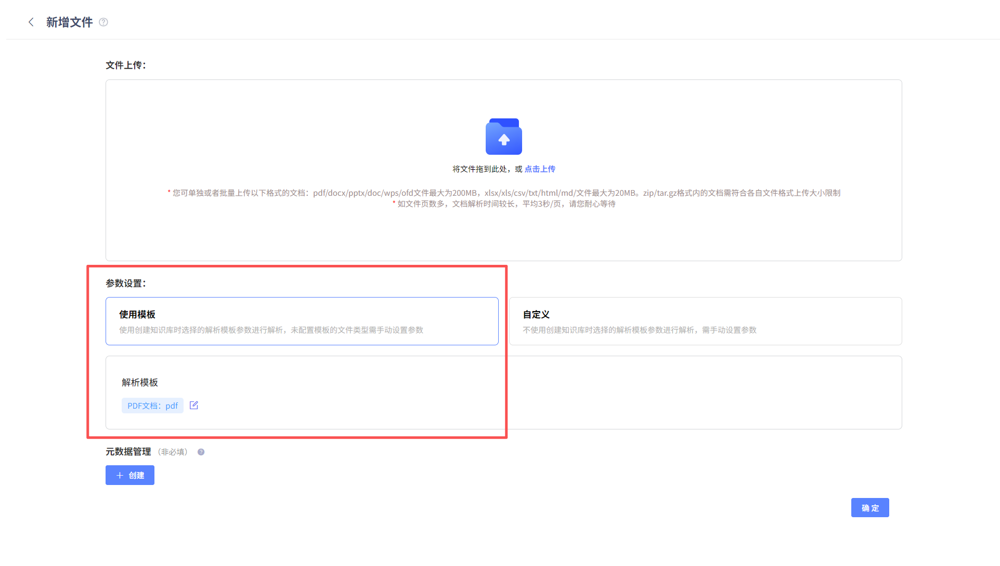
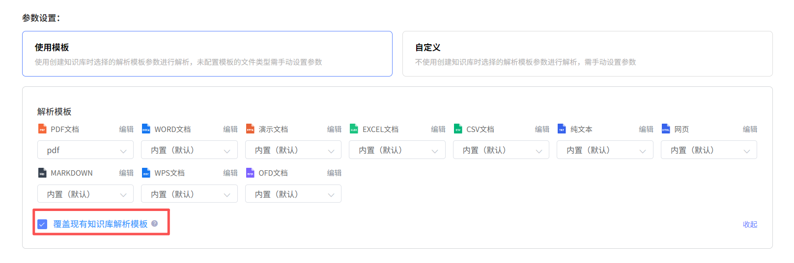

# 解析模板

支持用户针对不同类型的文件，提前配置知识库解析模板。

## 1、配置解析模板

除视频、音频、图片类型外的其他类型文件，已内置默认解析模板，用户可直接使用。点击“新建模板”，可按需配置用户自定义模板。

## 2、使用解析模板

新建知识库时，可下拉选择模板。当上传对应类型文件时，自动启用模板配置进行解析。也可通过文件上传界面更改解析模板，或不使用模板解析。

上传文件时，可选择使用模板或自定义解析方式。

界面展示用户已配置的非内置模板，如需更换模板或添加自定模板，可点击编辑按钮，修改现有模板或新增模板。

