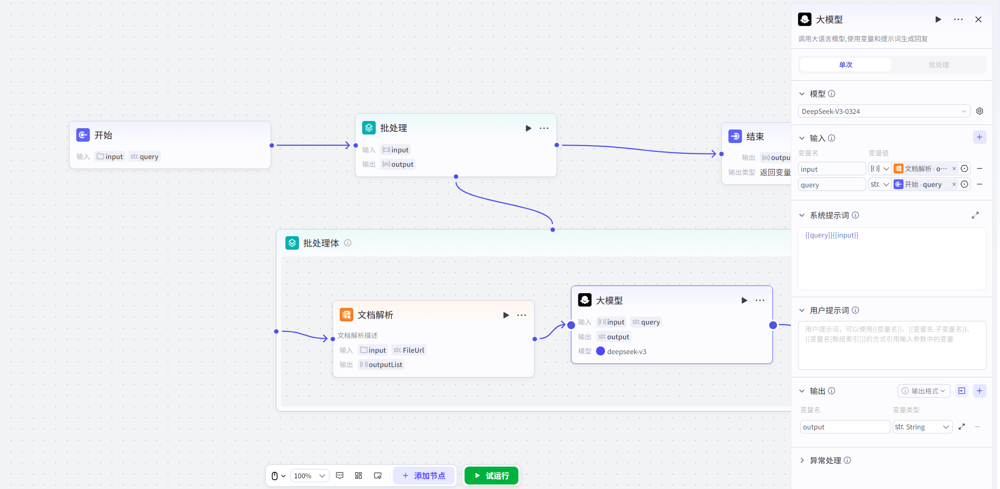

# Batch Processing

## 节点概述
**核心Features**：将一个任务在给定的Data集上**大规模、高效率地重复执行**，将顺序执行的串行任务，转化为可并行处理的批量任务，极大提升Workflow在Data处理场景下的性能。

## Configuration指南
ConfigurationBatch Processing节点主要分为四个核心Steps：**准备Input -> 设计Batch Processing体 -> SettingsBatch Processing策略 -> 定义Output**。
##### 1、准备Input参数
* **核心规则**：Batch Processing节点**必须且只能**引用上游节点的 `Array` (数组) Type的Output作为Input。

*   **如何Operation**：
    1.  在“**Input**”Configuration区，添加一个参数。
    2.  在“**变量值**”中，选择引用变量，从上游节点中选择一个数组Type的Output。
    
    
##### 2、设计Batch Processing体
*   **如何Operation**：
    1.  在Batch Processing节点上，你会看到一个名为“**Batch Processing体**”的子画布入口。**点击进入**。
    2.  在这个新画布中，通过“拖、拉、拽”的方式，添加你希望为每个数组元素重复执行的节点（例如，HTTP Request、Code节点、LLM节点等）。
    3.  像在主Workflow中一样，用连接线将这些节点按逻辑顺序连接起来，形成一个完整的“微型Workflow”。
> **重要限制**：
> *   **节点隔离**：不能将Batch Processing体外部的节点拖入Batch Processing体内，反之亦然。这保证了Batch Processing体的逻辑独立性和封装性。
> *   **禁止嵌套**：Batch Processing体内**不能**再添加另一个Batch Processing节点或Loop节点，以避免逻辑复杂化和潜在的死Loop风险。

##### 3、SettingsBatch Processing策略

*   **并行运行数量**
    *   控制**每一批**同时运行的任务数量。
    *   **Default Value**：`10`。
    *   **如何Settings**：
        *   **固定值**：直接Input一个数字（如 `5`）。
        *   **动态引用**：引用上游节点的数值型Output。
    *   **系统限制**：为了系统稳定，你Settings的值如果大于10，会被强制设为10；如果小于1，会被强制设为1。
    *   **场景建议**：
        *   **高并发，追求速度**：保持Default Value `10`。
        *   **需要严格串行**：如果任务之间有严格的先后依赖，请将此值Settings为 `1`。
*   **Batch Processing次数上限**
    *   控制整个Batch Processing节点**总共**能执行多少次任务。
    *   **Default Value**：`100`。
    *   **最大值**：`200`。
    *   **运行逻辑**：当累计执行次数达到此上限时，节点会**立即停止**，即使Input数组中还有未处理的元素。
    *   **Example**：Input数组长度为 `50`，并行数设为 `10`，次数上限设为 `30`。节点会执行3批（每批10个），共30次后停止，数组中剩余的20个元素将被忽略。

##### 4、定义Output参数

Batch Processing完成后，所有子任务的结果需要被收集起来。
* **核心规则**：Output参数**只能引用Batch Processing体内部**节点的Output变量。

*   **如何Operation**：
    1.  在“**Output**”Configuration区，添加一个参数（例如，命名为 `processed_results`）。
    2.  在“**变量值**”中，选择“**引用变量**”，此时变量List会显示Batch Processing体内部所有节点的Output。
    3.  选择你希望收集的Batch Processing体内部节点的Output。
    
*   **Output格式**：
    最终的Output将**自动Yes一个数组**。数组的每个元素，就YesBatch Processing体中对应那一次执行所产生的结果。数组的顺序与Input数组的元素顺序保持一致。
    
    
## 典型App场景

*   **场景一：批量内容生成**
    * **需求**：总结多篇文章。
    
    *   **实现**：
        1.  Start节点增加数组变量，Input文章。
        2.  将此数组InputBatch Processing节点。
        3.  在Batch Processing体内，放置一个“Document Parsing”节点，其Input引用文章。
        4.  放置一个“LLM”节点，用于总结文章内容。
        5.  Batch Processing节点会并发调用以上2个节点，一次性生成所有文章内容总结，并Output一个总结内容数组。
        
        