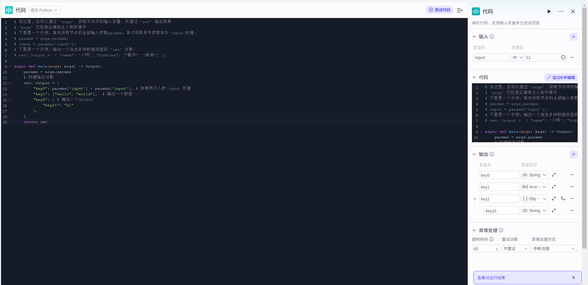

# Code

## 节点概述
**核心Features**：将自定义编程能力None缝集成到可视化Workflow中，突破标准节点的Features限制，实现任意复杂的业务逻辑、Data处理和系统集成。


## Configuration指南
ConfigurationCode节点主要分为三个核心Steps：**准备Input -> 编写Code -> 定义Output**。
##### 1、准备Input参数
Input参数YesCode与WorkflowOther部分沟通的“桥梁”。你需要在这里声明Code中需要用到的所有变量。
* **Settings参数名**：为变量起一个有意义的名字（例如 `user_input_text`, `api_key`）。这个名字将用于在Code中引用该变量。
*   **Settings变量值**：为参数赋值。你可以选择：
    
    *   **引用变量**：从上游节点的Output中选择，这Yes最常用的方式，实现了Data的动态传递。
    *   **固定值**：直接Input一个常量，如一个固定的字符串、数字或布尔值等，适用于Configuration信息。
*   **在Code中如何引用**：
    在CodeEdit器中，所有Input参数都被封装在一个名为 `params` 的对象中。通过 `params['你的参数名']` 即可获取其值。
    
    > **Example**：如果你添加了一个参数名为 `user_query`，那么在PythonCode中，你可以通过 `query_text = params['user_query']` 来获取它的值。


##### 2、编写核心Code

1.  在“**Code**”Edit区，选择你熟悉的编程语言（目前支持 **Python**）。
3.  **手动编写/修改**：直接从头编写你的Code逻辑。
4.  **试运行：**
    - 在Code节点的Configuration界面，找到并点击“**测试Code**”或“**测试该节点**”按钮。
    - 界面会弹出一个测试面板，其中会列出你在“**Input**”Configuration中定义的所有参数。
    - 为每个参数**填写一个模拟值**。这个值应该能代表你在真实Workflow中可能遇到的Data情况（例如，测试一个Text Processing函数，就Input一段典型的User文本）
    - **Output参数：**
      - **CodeOutput：**这Yes你的Code `return` 语句返回的、**未经任何修饰的、最原始的JSON对象**。它反映了Code内部定义的所有键值对。
      - **节点Output**：按照Code节点中指定的**Output**参数结构生成的Output结果。

* **核心规则与限制**：

  *   **函数限制**：CodeEdit区**不支持定义多个函数**。请将所有逻辑写在主执行体中。
  *   **Output格式**：**必须以对象（Object）的形式Return Result**。即使你只想返回一个简单的字符串或数字，也必须将其包装在一个对象中，并以 `return` 一个对象来Output处理结果。这Yes确保与下游节点稳定通信的关键。
  > **Example (Python)**：
  >
  > ```python
  > # Error的返回方式
  > # return "Hello, world!"
  > 
  > # 正确的返回方式
  > async def main(args: Args) -> Output:
  >     params = args.params
  >     # 构建Output对象
  >     ret: Output = {
  >         "key0": params['input'] + params['input'], # 拼接两次入参 input 的值
  >         "key1": ["hello", "world"],  # Output一个数组
  >         "key2": { # Output一个Object 
  >             "key21": "hi"
  >         },
  >     }
  >     return ret
  > ```


##### 3、定义Output结构

Output结构定义了Code执行Success后，会向下游节点传递哪些Data，明确了Code节点的产出。
1.  在“**Output**”Configuration区，系统会根据你Code中 `return` 的对象**自动解析并预填充**参数名和Type（可在试运行节点时，点击“同步Output”）。
2.  **核对与精简**：请务必仔细检查，确保此处定义的**参数名、DataType**与Code `return` 对象中的键值对**完全一致**。
3.  你可以根据下游节点的需求，Delete不必要的Output参数，保持Interface的简洁。

*   **异常处理Output**：
    当你在节点属性中开启了“异常处理”Features，Code节点还会在运行Failed时，额外返回两个标准参数：
    *   `isSuccess` (Boolean): 标识执行YesNoSuccess，Failed时为 `false`。
    *   `errorBody` (String): 包含详细的Error Message，帮助你调试问题。



## 典型App场景

*   **复杂Data处理**：对UserUpload的CSVFile进行解析、统计、并生成可视化图表Data。
*   **自定义算法**：实现一个特殊的推荐算法，根据User历史行为和实时Input，动态生成推荐内容。
*   **外部系统集成**：调用天气API获取实时天气，并根据天气情况（晴天、雨天）生成不同的回复策略。
*   **AI模型调用**：使用开源的Hugging Face模型，对UserInput的文本进行情感分析，并将分析结果（积极、消极、中性）作为后续流程的判断依据。
