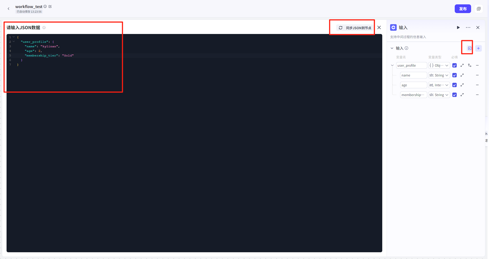

# Input

## 节点概述
核心Features：在Workflow执行过程中，主动暂停并收集来自User的额外信息，实现与User的动态、多轮交互。


## Configuration指南

Input节点的Configuration核心在于**定义你想要问User的问题**。这通过Settings“Input参数”来完成。
##### 1 、参数Configuration
在Input节点的Configuration面板中，你可以定义一个或多个需要收集的参数。每个参数都包含以下四个关键属性：

- **变量名：**Input参数的Name，用于在后续节点中引用此Data。
- **变量Type**：Input参数的DataType，如 `String`（字符串）、`Number`（数字）等。
- **Description** ：对参数的清晰说明或提示语，这YesUser**直接看到的问题**。
- **YesNo必选**：设定此参数YesNo为必须提供的项。


##### 2、批量Import JSON

当需要收集的参数较多且结构复杂时，手动逐个添加会非常低效。Input节点支持直接Import JSON 格式的Data结构，一键生成所有参数。
**OperationSteps**：

1.  准备一个符合规范的 JSON 对象。
2.  点击Configuration区域的“JSONImport”。
3.  将 JSON Data粘贴进去，系统将自动解析并填充所有参数。Import后，系统会自动创建 `name`, `age`, `membership_tier` 三个参数，并填充好对应的Type、Description和Required项。
    **JSON Example**：
    假设你需要收集User的“个人档案”信息，可以准备如下 JSON：
4.  **提示：**将 JSON Data转换为节点上的Data结构，Input请遵循以下规则: 
    - key的名字长度最长 20 字符，超出将自动截断；
    - value值不能为 null，No则将自动忽略；
    - 嵌套层级最多3 层，超出将自动截断
```json
{
  "user_profile": {
    "name": "kylinan",
    "age": 2,
    "membership_tier": "Gold"
  }
}
```
