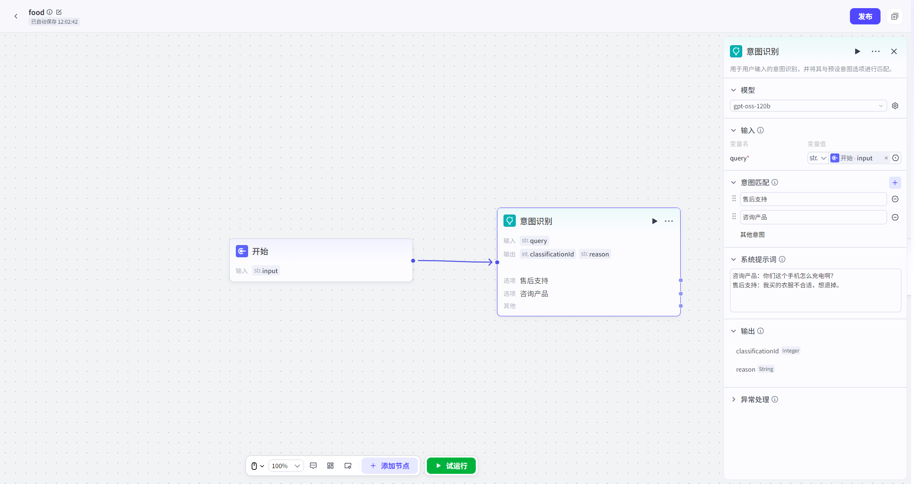

# Intent Recognition

## 节点概述
核心Features：解读User的请求，并指挥Workflow走上正确的分支，Yes实现复杂、多FeaturesAgent的必备核心节点。


## Configuration指南
*   **模型**
    *   **说明**：可自由选择一个用于Intent Recognition的LLM，以获得最佳效果。
*   **Input**
    *   **说明**：指定需要进行Intent Recognition的文本内容。
    *   **Configuration**：通常引用Start节点中的 `query` 参数（即UserInput），也可以引用Other前置节点的Output。
*   **意图匹配**
    *   **说明**：定义你的意图分类List。这Yes整个节点的核心。
    *   **Configuration**：
        *   点击 添加意图”，为每个分类起一个**清晰、None歧义**的Name（如 `咨询产品`、`Query订单`、`投诉建议`）。
        *   **关键原则**：意图Name之间应有明确的区分度，避免语义交叉（如 `看电影` 和 `看Video` 就容易混淆），这能极大提高模型的识别准确率。
* **系统提示词**

  * 你可以在这里补充指令，例如：**请特别Note，当User提到‘退款’、‘退货’时，一律归类为‘售后支持’意图。**

  * **提供Example**：最有效的方法Yes提供一些UserInput和对应意图的Example。能显著提升模型在复杂场景下的分类能力。例如：

    ```
    咨询产品：你们这个手机怎么充电啊？
    售后支持：我买的衣服不合适，想退掉。
    ```
* **Output**

  *   **说明**：节点执行后产生的结果，可供后续节点引用。
      *   `classificationId`：匹配到的意图ID。按意图List从上到下，依次为 `1, 2, 3...`。若未匹配任何意图，则为 `0`。
      *   `reason`：模型给出的分类原因。例如，User说我想听周杰伦的歌”，模型可能会Output `reason: "User表达了想听音乐的意图，并指定了歌手周杰伦。"`。这个参数对于调试和优化Intent Recognition非常有帮助。

- **异常处理**
  - **超时Time**：Settings一个合理的等待上限，避免WorkflowNone限期卡死。
  - **重试次数**：对于偶发性网络Error，可以Settings自动重试。
  - **异常处理方式**：Configuration一个“备用方案”。当节点异常时，可选择终端流程、返回设定内容、执行异常流程。



## 典型App场景

*   **智能客服**：自动识别User问题Yes咨询产品、Query订单还Yes申请售后，并分别引导至产品Knowledge Base、订单Query系统或人工客服入口。
*   **医疗咨询**：作为第一道防线，判断User咨询的YesNo为医学相关问题。对于非医学问题（如闲聊），可以礼貌拒绝或引导至Other话题，确保专业性和安全性。
*   **多Features综合Agent**：对于一个集成了新闻、天气、日程管理、闲聊等Features的复杂Agent，Intent Recognition节点Yes总调度台”，负责将User请求精准地派发给对应的子Features模块。

