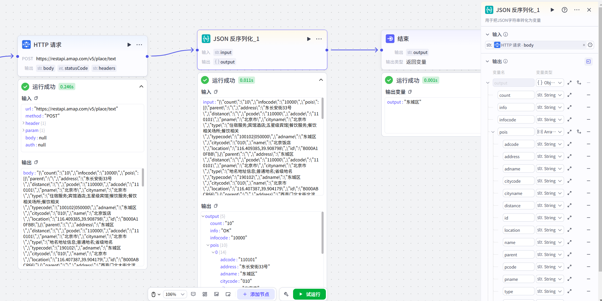

# JSON Deserialization

## 节点概述
核心Features：将一个标准化的JSON字符串，拆解还原成结构化的Data对象，并让你能像使用普通变量一样，轻松调用其中的每一个字段。


## Configuration指南

##### 1、添加节点

在Workflow画布中，点击 **+ 添加节点**，在组件区域搜索并选择 **JSON Deserialization节点**，即可将其添加到画布中。

##### 2、 Configuration节点

**Input**

*   **引用上游变量（最常用）：** 点击Input框，在弹出的变量List中选择上游节点的Output变量。例如，上游节点（如HTTP节点）的Output变量 body 通常就Yes一个字符串Type的JSONData，因此可以直接作为本节点的Input。
*   **直接Input内容：** 你也可以直接Input一个符合JSON格式的字符串，String格式的文本。


**Output**

- **Configuration项：** output (固定参数)

- **DataType：** 默认为 Object (对象)，也可根据需要指定为 String、Integer 等Other基础Type。

-  **Configuration子项**

  - **方式一：手动Configuration（精准控制）**

    - 如果你只需要JSON中的部分字段，可以手动添加。例如，API返回了店名、地址、城市、邮编等，但你只需要将店名和地址存入Data库。那么，你只需为 output Configuration name 和 address 两个子项即可。这样做的好处YesOutput更干净，避免None用Data的传递。

  -  **方式二：ImportExample（智能快捷）**

    -  当JSON结构复杂、字段繁多时，手动Configuration会很麻烦。此时，你可以点击ImportExample”，将一段典型的JSONData粘贴进去。系统会自动解析其结构，并将所有字段一键Configuration为 output 的子项。这极大地提升了Configuration效率和准确性。

      **Example：**

      ```
      {
          "count": "10",
          "info": "OK",
          "infocode": "10000",
          "pois": [
            {
              "adcode": "110101",
              "address": "东长安街33号",
              "adname": "东城区",
              "citycode": "010",
              "cityname": "北京市",
              "distance": "",
              "id": "B000A10FBB",
              "location": "116.409385,39.908798",
              "name": "北京饭店",
              "parent": "",
              "pcode": "110000",
              "pname": "北京市",
              "type": "住宿Service;宾馆酒店;五星级宾馆|餐饮Service;餐饮相关场所;餐饮相关",
              "typecode": "100102|050000"
            }
          ],
          "status": "1"
      }
      ```



