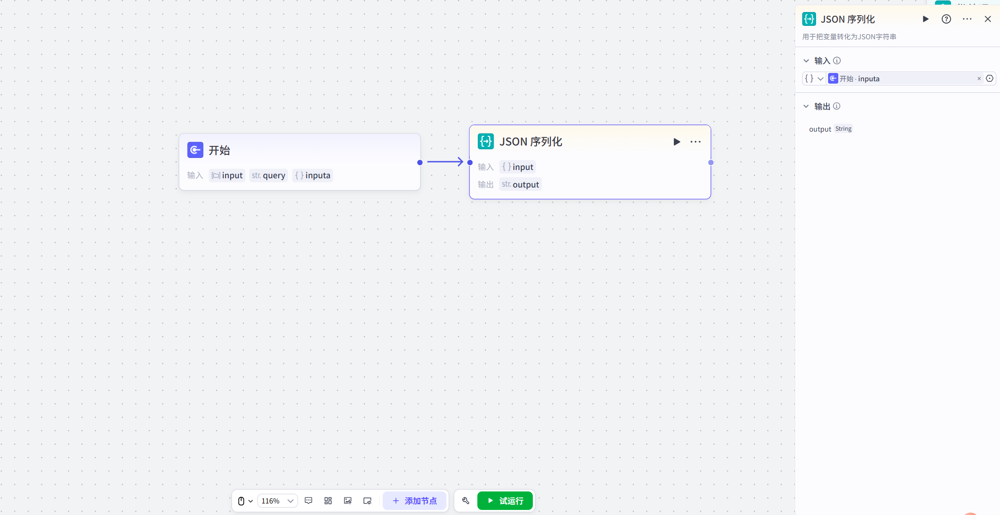
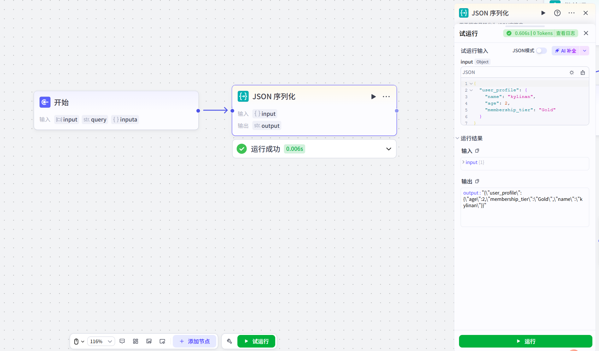

# JSON Serialization

## 节点概述
核心Features：将复杂的Data结构（如对象、数组）打包成一个标准、通用的字符串格式，使其能够在不同节点、不同系统间顺畅传递。

## Configuration指南
##### 1、添加节点
在Workflow画布中，点击 **+ 添加节点**，在组件区域搜索并选择 **JSON Serialization节点**，即可将其添加到画布中。
##### 2、 Configuration节点
**Input**

*   **引用上游变量（最常用）：** 点击Input框，在弹出的变量List中选择上游节点的Output变量。例如，选择一个Code节点Output的 `userProfile` 对象。
*   **直接Input内容：** 你也可以直接Input一个符合JSON格式的文本。但请Note，系统会将其视为一个字符串，而不Yes一个对象。此Features主要用于测试或处理已经Yes字符串但需要确保其格式正确的场景。

**Output**

*   **Configuration项：** `output` (固定参数)
*   **DataType：** `String`
*   **说明：** 这Yes节点唯一的Output参数，它包含了Input变量被转换后的JSON格式字符串。下游节点可以直接引用这个 `output` 参数进行后续处理。

