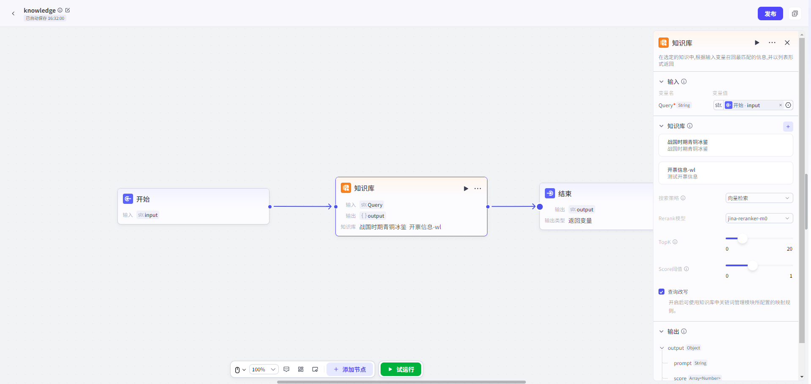

# Knowledge Base

## 节点概述
**核心Features**：赋予Agent精准、高效地访问和利用私有知识的能力。能根据User的问题，从海量的专属Knowledge Base中，快速找到最相关的信息片段，为Agent提供准确、可靠的回答依据。

## Configuration指南
ConfigurationKnowledge Base检索节点，核心Yes完成三大步：**ConfigurationInput -> 选择Knowledge Base -> Output**。
##### 1、ConfigurationInput
* **Configuration项**：`Query`

* **DataType**：`String`

*   **如何Configuration**：
    
    *   此参数**必须引用上游节点的Output**。最常见的Yes引用“Start节点”的Input参数（User原始Input），也可以Yes经过Other节点处理后的文本。
    
    
##### 2、选择Knowledge Base

*   **如何Operation**：在“Knowledge Base”区域，点击“+”，然后选择一个或多个你已创建的Knowledge Base。

*   **召回策略Configuration**：这Yes影响检索效果的核心，决定了“图书管理员”用什么方法找书。
    *   **向量检索：**通过向量相似度找到语义相近、表达多样的文本片段，适用于理解和召回语义相关信息。
    *   **全文检索：**基于关键词匹配，能够高效Query包含指定词汇的文本片段，适用于精确查找。
    *   **混合检索-Rerank模型：**重排序模型会根据候选文档与User问题的语义匹配度，对初步检索结果进行重新排序从而进一步提升最终Return Result的相关性和准确性。
    *   **混合检索-权重Settings：**结合向量和关键词检索，融合语义理解与关键词匹配，兼顾相关性和准确性，提升检索效果。
    *   **TopK：**用于控制检索阶段返回的最相关的文档片段的数量。这些文档片段将被送入生成模型中，用于生成最终的回答。
    *   **Score阈值：**检索结果的相似度阈值，低于该值的结果将被过滤。
    *   **Query改写：**开启后可使用Knowledge Base中关链词管理模块所Configuration的映射规则。

*   **元Data过滤-使用元Data筛选精准定位文档：**

    在Workflow中，知识节点的**元Data筛选**Features，能让你像使用高级搜索一样，根据文档的“标签”（如 `category`、`status`、`author` 等）精确过滤，从而大幅提升检索结果的相关性和准确性。

    **1）选择筛选模式**

    首先，你需要从以下2种模式中选择一种来定义筛选规则。

    - **Disable模式**

      *   **说明**：这Yes默认选项。选择此模式将完全关闭元Data筛选Features，节点会检索所有选中的Knowledge Base，不考虑任何元Data。

      *   **适用场景**：当你需要全面检索，或Knowledge Base文档没有统一的元Data标准时。

    - **手动模式**

      *   **说明**：完全由你自定义筛选规则，自由组合多个条件，实现最精细的控制。

      *   **适用场景**：处理复杂的、多条件的、逻辑固定的筛选需求。这Yes最常用也最强大的模式。

    **2）手动模式Configuration详解**

    如果你选择了**手动模式**，请按照以下Steps进行Configuration：

    **第1步：添加筛选条件**

    a.在选择Knowledge Base后，点击**Settings**按钮，打开元Data过滤按钮。

    b.在Configuration框内，点击 **+Add条件**。

    c.在弹出的下拉List中，选择一个元Data字段。

    *   **提示**：该List会显示你当前选中的**Knowledge Base的所有**元Data字段。
    *   如需添加更多字段，重复点击 **+Add条件** 即可。

    **第2步：Configuration筛选规则**

    选择字段后，你需要根据该字段的**DataType**（字符串、数字、Time），来设定具体的筛选规则。

    ##### **A. 字符串Type**

    适用于文本字段，如 `标签`、`分类`、`Status` 等。

    | 筛选条件   | 说明与Example                                                   |
    | :--------- | :----------------------------------------------------------- |
    | **Yes**     | 完全匹配。例如 `is "Published"`，只返回Status**恰好Yes**“Published”的文档。 |
    | **不Yes**   | 排除匹配。例如 `is not "Draft"`，返回所有Status**不Yes**“Draft”的文档。 |
    | **为空**   | 字段为空。返回**未填写**该字段的文档。                       |
    | **不为空** | 字段不为空。返回**已填写**该字段的文档。                     |
    | **包含**   | 包含文本。例如 `contains "Report"`，会返回“Monthly Report”、“Annual Report”等。 |
    | **不包含** | 不包含文本。例如 `not contains "Secret"`，会返回所有不含“Secret”的文档。 |
    | **StartYes** | 以...开头。例如 `starts with "Doc"`，会返回“Doc1”、“Document”等。 |
    | **EndYes** | 以...结尾。例如 `ends with "2024"`，会返回“Report 2024”、“Summary 2024”等。 |

    > **⚠️ 大小写敏感提醒**：字符串匹配Yes**大小写敏感**的。`contains "App"` 会匹配 “Apple”，但**不会**匹配 “apple” 或 “APPLE”。

    ##### **B. 数字Type**

    适用于数值字段，如 `阅读量`、`版本号`、`评分` 等。

    | 筛选条件     | 说明与Example                                              |
    | :----------- | :------------------------------------------------------ |
    | **等于**     | 等于。例如 `= 100`，返回标记为100的文档。               |
    | **不等于**   | 不等于。例如 `≠ 5`，返回所有标记不为5的文档。           |
    | **大于**     | 大于。例如 `> 100`，返回标记大于100的文档。             |
    | **小于**     | 小于。例如 `< 50`，返回标记小于50的文档。               |
    | **大于等于** | 大于或等于。例如 `≥ 20`，返回标记大于或等于20的文档。   |
    | **小于等于** | 小于或等于。例如 `≤ 200`，返回标记小于或等于200的文档。 |
    | **为空**     | 字段为空。返回**未Settings**该数字字段的文档。              |
    | **不为空**   | 字段不为空。返回**已Settings**该数字字段的文档。            |

    ##### **C. TimeType**

    适用于日期字段，如 `Publish日期`、`最后修改Time` 等。

    | 筛选条件   | 说明与Example                                                   |
    | :--------- | :----------------------------------------------------------- |
    | **Yes**     | 日期完全匹配。例如 `is "2024-01-01"`，只返回该日期的文档。   |
    | **早于**   | 早于指定日期。例如 `before "2024-01-01"`，返回2024年1月1日之前的所有文档。 |
    | **晚于**   | 晚于指定日期。例如 `after "2024-01-01"`，返回2024年1月1日之后的所有文档。 |
    | **为空**   | 字段为空。返回**未Settings**该Time字段的文档。                   |
    | **不为空** | 字段不为空。返回**已Settings**该Time字段的文档。                 |

    **第3步：Settings筛选值**

    定义好规则后，你需要为规则提供一个具体的**筛选值**。

    *   **字符串/数字**：直接Input即可，如 `Published`、`100`。
    *   **Time**：系统会提供一个**TimeSelector**，让你直观地选择日期，而None需手动Input格式。

    **第4步：定义条件间的逻辑关系**

    当你添加了**多条**筛选条件时，需要设定它们之间的关系。

    *   **且逻辑**
        *   **含义**：文档**必须同时满足**所有条件，才会被检索到。
        *   **Example**：`category is "报告" 且 status is "已Publish"`，只会检索出“分类为报告”**并且**“Status为已Publish”的文档。
    *   **或逻辑**
        *   **含义**：文档**只需满足其中任意一个**条件，就会被检索到。
        *   **Example**：`author is "张三" 或 author is "李四"`，会检索出所有作者Yes“张三”**或者**“李四”的文档。

##### 3、Output
*   `output` (`Object`): **召回的文本片段内容**。通常会作为上下文传递给后续的LLM节点。

## 典型App场景

*   **智能客服**：基于公司产品手册、FAQ文档，回答User关于产品Features、故障排除的咨询。
*   **企业知识助手**：连接公司内部的规章制度、财务流程、人事政策等Knowledge Base，为员工提供即时QueryService。
*   **学习辅导机器人**：Upload教材、课件、论文，根据学生的问题，精准定位知识点并进行讲解。
*   **个人知识管理**：连接个人的笔记、文档、阅读摘要，打造一个能回答你关于任何个人记录问题的“第二大脑”。