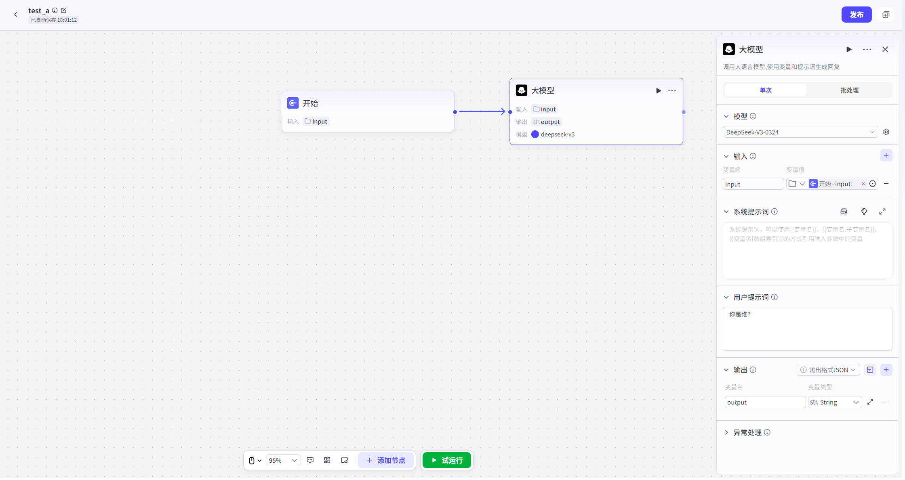

# LLM

## 节点概述
核心Features：在Workflow中注入“大脑”，赋予其理解、推理、生成和决策的能力。

## Configuration指南
ConfigurationLLM节点，本质上Yes**选择一位合适的专家，并为他下达清晰、完整的指令**。
##### 1、选择模型
* **如何Operation**：在节点Configuration区的“模型”下拉菜单中，选择一个大型语言模型。Model Import Guide详见[Model Import Guide-详细版](../Model Import Guide-详细版.md)

* 支持User选择所有已Import平台的LLM并进行参数Configuration。

*   **建议**：
    
    *   **按需选择**：没有“最好”的模型，只有“最合适”的模型。对于简单的文本润色，基础模型即可胜任；对于复杂的逻辑推理或Code生成，则需要选择更高级的模型。
    
    
##### 2、Configuration提示词
*   **系统提示词**
    *   **作用**：定义模型的**核心人设、Role和基本原则**。它为模型设定了一个宏观的框架，影响其所有后续的思考和回答。
    *   **如何编写**：
        *   **明确Role**：直接告诉模型“你Yes一个XX”。例如：“你Yes一位专业的科技博主。”
        *   **定义任务**：清晰地说明它的核心职责。例如：“你的任务Yes将复杂的技术概念，用通俗易懂的语言解释给普通读者。”
        *   **设定风格**：规定回复的语言风格。例如：“你的语言风格应该风趣幽默，可以适当使用网络流行语。”
        *   **规定限制**：明确不能做什么。例如：“不要使用任何专业术语，不要生成超过200字的回复。”
*   **User提示词**
    *   **作用**：承载**本次具体任务**的指令和内容。
    *   **如何Configuration**：
        *   通常，它不会Yes固定的文本，而Yes需要**引用上游节点的Output参数**（例如，引用“Input节点”的 `INPUT`）。
        *   这样，每次Workflow运行时，LLM节点接收到的User提示词都Yes动态的、实时的。

##### 3、Output

- 将LLM的生成结果结构化为参数。这些参数可直接被下游节点引用，实现Workflow的Data流转与自动化。
- **Output格式**：
  - **文本/Markdown**：适用于直接将模型回复展示给User的场景。Output为一个简单的文本字符
  - **JSON**：**强烈推荐用于复杂Workflow**。通过定义结构化的JSON（如`{"new_query": "改写后的Query", "reason": "改写原因"}`），可以让下游节点精确地获取和使用模型Output的不同部分，实现更精细的流程控制。为每个字段Settings清晰的“Name”和“Description”能极大提升模型OutputJSON的准确性。

##### 4、异常处理

- **超时Time**：Settings一个合理的等待上限，避免WorkflowNone限期卡死。
- **重试次数**：对于偶发性网络Error，可以Settings自动重试。
- **异常处理方式**：Configuration一个“备用方案”。当节点异常时，可选择终端流程、返回设定内容、执行异常流程。
- **⚠️ 流式Output的特殊性**：一旦开启流式Output，模型Start“说”出第一个字，即使后续发生异常，也None法再进行重试或Jump异常分支。因为Data流已经Start了。

****
