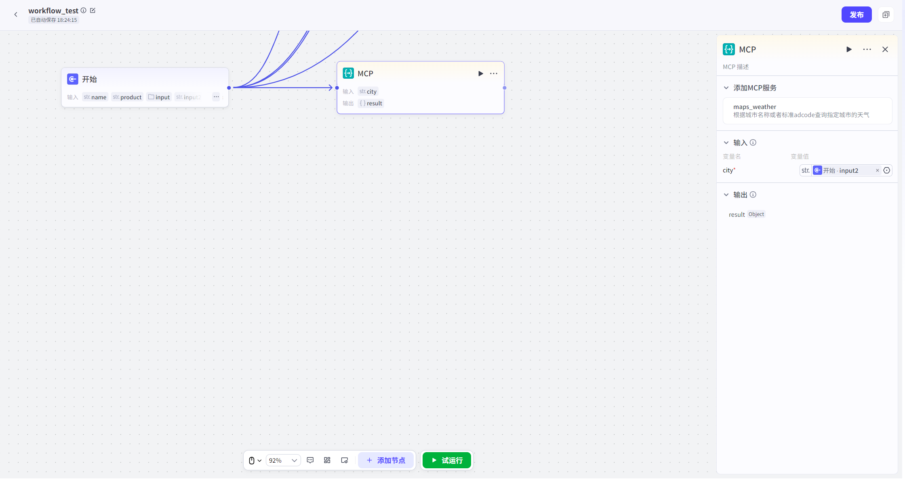

# MCP

调用MCP server的能力。可添加已Publish在MCP Square中的MCP server，并关联对应Interface生成结果。具体添加MCP的方式详见[MCPImport方式](../3.Tools广场.md)

本节点支持User选择一个已Import的自定义MCPTools中的一个子Tools。

Input参数：选择对应的MCPTools后，可Edit本节点的Input字段，Input字段的参数由MCP server决定，不可自行修改。参数Type可选字符串或直接引用Start节点Input参数、Other节点的Output参数。

Output参数：Output参数及参数Type由MCP server决定，不可自行修改。

