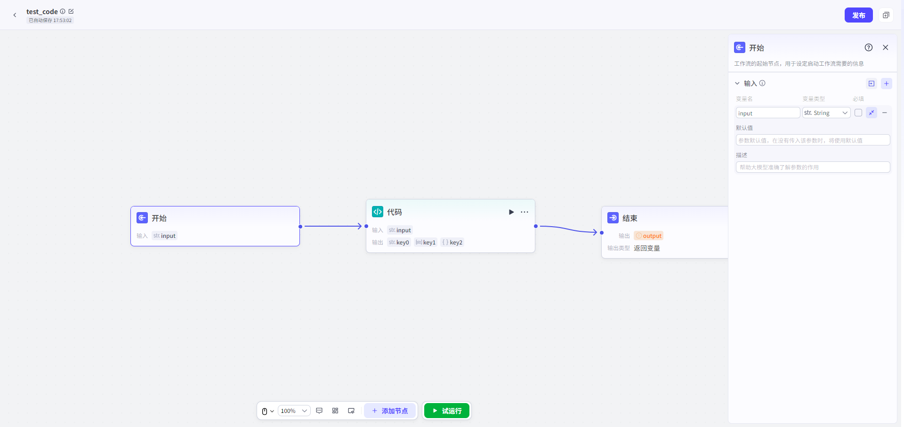

# Start

## 节点概述

负责定义启动Workflow所需的All条件，YesData流入的源头。

## Configuration指南

**1. 添加参数**

*   **手动添加**：Settings**变量名**、**变量Type**。
*   **批量Import（高效）**：如果你已经有一个清晰的参数结构，可以点击“**ImportJSON**”图标。在弹出的面板中粘贴你的JSONData结构，系统会自动解析并为你创建所有参数，极大提升Configuration效率。

**2. SettingsDataType**

*   支持多种基础Type，包括字符串（String）、数字 (Integer, Number)、布尔值（Boolean）、Time（Time）、对象（Object）、数组（Array）、File（File）。
*   强大的 `Object` (对象) Type支持最多 **3层嵌套**，可以满足复杂Data结构（如地址信息、产品Details）的定义需求。

**3. 撰写参数Description**

*   一个高质量的Description能让模型更准确地理解参数的用途和期望格式。
*   **Example**：
    *   **差Description**：`city`
    *   **优Description**：`User希望Query天气的目标城市，例如：北京、上海、纽约。`

**4. SettingsYesNoRequired**

*   **Required**：勾选后，如果UserInput中未能提供该参数的信息，Workflow将不会被触发。这适用于核心业务逻辑不可或缺的参数（如Query天气时的“城市”）。
*   **可选**：如果参数未提供，Workflow仍会启动，该参数值为空。这适用于增强性或补充性的信息。

