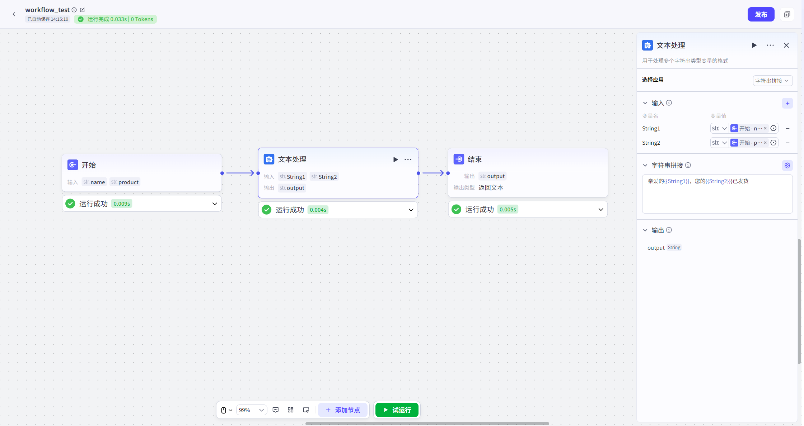
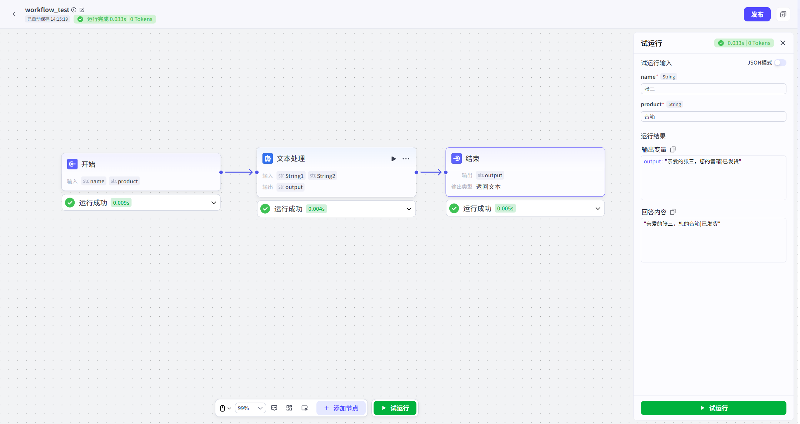

# Text Processing

## 节点概述
**核心Features**：在Workflow中扮演“文本工匠”的Role，专门对字符串Data进行高效、灵活的加工、重组和格式化，以满足下游节点的特定Input要求。

## Configuration指南
Text Processing节点的Configuration非常直观，核心在于选择“处理方式”并定义相应的规则。
##### 1、选择App
在节点Configuration区，首先要从两种核心模式中选择一种：
* **字符串拼接**：将多个Input源合并成一个单一的字符串。

* **字符串分隔**：将一个单一的Input源拆分成一个字符串数组。

  
##### 2、根据模式进行Configuration
###### **A. 模式一：字符串拼接**
此模式的目标Yes“**合成**”。
*   **如何Operation**：
    1.  在“**Input**”区域，添加所有你希望参与拼接的变量。
    2.  在“**拼接模板**”文本框中，定义最终的Output格式。
*   **核心语法**：
    *   **引用变量**：使用 `{{变量名}}` 的语法，将你在“Input”区域定义的变量插入到模板的任意位置。
    *   **混合固定文本**：你可以在变量前后或之间添加任意的固定文本、标点符号、换行符等。
*   **Example**：
    *   **Input变量**：`user_name` (值为 "张三"), `product_name` (值为 "智能音箱")
    *   **拼接模板**：尊敬的{{user_name}}，您购买的“{{product_name}}”已发货。
    *   **最终Output**：尊敬的张三，您购买的“智能音箱”已发货。

###### **B. 模式二：字符串分隔**
此模式的目标Yes“**拆解**”。
*   **如何Operation**：
    1.  在“**Input**”区域，添加一个待处理的字符串变量。
    2.  在“**分隔符**”Configuration项中，指定用于切分字符串的“标志”。
*   **核心Configuration**：
    *   **Input变量**：选择一个上游节点Output的、包含待分隔内容的字符串变量。
    *   **分隔符**：可以Yes一个或多个字符。平台提供的分隔符包括：
        *   逗号 (,)
        *   换行(\n)
        *   制表符(\t)
        *   句号(。)
        *   分号（；）
        *   空格（ ）
        *   自定义
*   **Example**：
    *   **Input变量**：`tags` (值为 "苹果,香蕉,橙子")
    *   **分隔符**：`,` (一个英文逗号)
    *   **最终Output**：一个字符串数组 `["苹果", "香蕉", "橙子"]`。

##### 3、定义Output
None论选择哪种模式，最终都需要定义节点的Output。
*   **Output**：`output` 
*   **DataType**：
    *   **拼接模式**：Output为 `String` (字符串)。
    *   **分隔模式**：Output为 `Array` (字符串数组)。
*   **如何使用**：这个Output结果可以被Workflow中的任何下游节点引用，例如作为LLM节点的Input、作为Loop节点的遍历对象，或作为Code节点的处理Data。

## 典型App场景

*   **场景一：动态提示词构建**
    *   **需求**：根据多轮对话，提取关键信息（如User喜欢的绘画风格、画面主体、色彩要求），然后拼接成一个完整的文生图提示词。
    *   **实现**：
        1.  上游节点通过“Knowledge Base检索”或“Code节点”提取出 `style` (风格)、`subject` (主体)、`color` (色彩) 三个变量。
        2.  使用Text Processing节点的“**拼接**”Features，将它们与固定文本组合：`一幅{{style}}风格的画，主体Yes{{subject}}，主要色调为{{color}}，高清，细节丰富。`
        3.  Output的完整提示词可直接传递给“文生图”LLM。
*   **场景二：内容二次总结**
    *   **需求**：一个长文档被分成了多个部分，并由LLM节点分别生成了摘要。现在需要将这些子摘要合并成一段总的摘要。
    *   **实现**：
        1.  上游的“Batch Processing节点”或“Loop节点”Output了一个包含所有子摘要的数组 `summary_list`。
        2.  使用Text Processing节点的“**分隔**”Features（如果结果Yes一个长字符串）或直接处理数组，将所有摘要用换行符或特定分隔符连接成一个长文本。
        3.  将这个长文本再传递给一个LLM节点，进行最终的“总摘要”生成。
*   **场景三：格式化Output**
    *   **需求**：需要将User信息（姓名、电话、邮箱）格式化为一个标准的CSV行或JSON字符串。
    *   **实现**：
        1.  获取上游节点Output的 `name`, `phone`, `email` 变量。
        2.  使用Text Processing节点的“**拼接**”Features，构建CSV格式：`"{{name}}","{{phone}}","{{email}}"`。
        3.  Output的结果可直接写入File或传递给Other系统。
