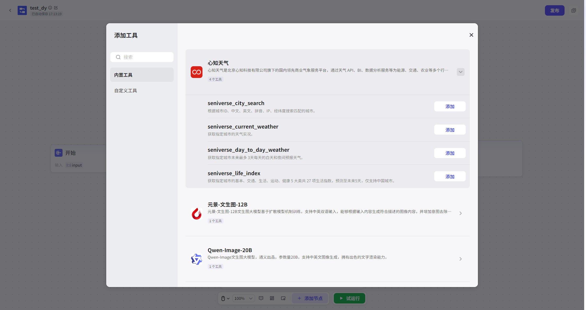

# Tools

调用Tools（内置Tools、自定义Tools）的能力。

本节点支持User选择一个Tools中的一个子Tools。

Input参数：选择对应的Tools后，可Edit本节点的Input字段，Input字段的参数由Tools决定，不可自行修改。参数Type可选字符串或直接引用Start节点Input参数、Other节点的Output参数。

Output参数：Output参数及参数Type由Tools决定，不可自行修改。

