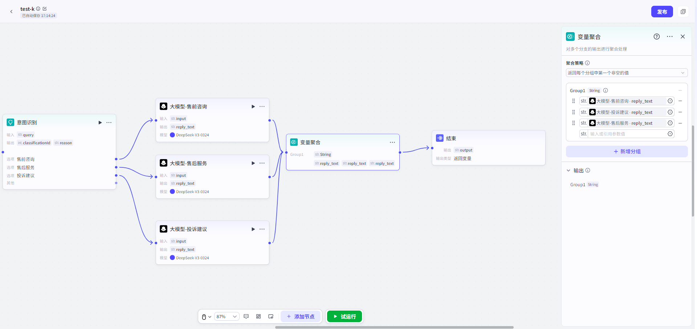

# Variable Aggregation

## 节点概述
**核心Features**：智能合并多路分支的Output，为下游节点提供一个统一、可靠的变量引用，简化Workflow设计，避免因分支未执行而导致的空值Error。

**一句话总结**：当你的Workflow存在“多选一”的分支时，用这个节点来统一收集结果，None论哪个分支被执行，下游都能用同一个变量名拿到最终结果。

## Configuration指南

ConfigurationVariable Aggregation节点主要分为三个Steps：**定义分组 -> 选择变量 -> 设定策略**。
##### 创建聚合分组
分组Yes聚合的基本单位，**每个分组最终会生成一个独立的Output变量**。
*   **默认分组**：节点创建后，会自动提供一个默认分组 `Group 1`。
*   **添加分组**：如果需要聚合多个不同Type的变量（例如，每个分支都Output了一个`String`Type和一个`File`Type），你可以点击“**Add分组**”按钮，创建多个分组，分别用于聚合不同Type的变量。

**核心规则**：**同一个分组内的所有变量，其DataType必须完全相同**。例如，不能将`String`Type和`Integer`Type的变量放在同一个分组内。

##### 选择聚合变量

在每个分组中，你需要从上游分支的Output变量List中，选择需要参与聚合的变量。
* **支持的DataType**：节点支持聚合所有主流DataType，包括：
  * **字符串（String）**
  
  * **数字 (Integer, Number)**
  
  * **布尔值（Boolean）**
  
  * **Time（Time）**

  * **对象（Object）**
  
  * **数组（Array）**
  
  * **File（File）**
  
    
  

##### 设定聚合策略
策略决定了如何从分组内的多个变量中生成最终的Output值。
*   **当前策略**：目前系统支持唯一策略——**“返回每个分组中第一个非空的值” **。
*   **工作原理**：系统会按照你在分组中**排列的变量顺序**，从上到下依次检查，一旦发现某个变量的值不为空，就立即将其作为该分组的Output结果，并停止检查后续变量。
*   **调整顺序**：你可以通过**拖拽**变量List中的项目，来调整变量的优先级。**排在前面的变量拥有更高的优先级**。
**ConfigurationExample：**
假设在 `Group 1` 中，你按以下顺序添加了三个变量：
1.  `high_priority_result`
2.  `default_result`
3.  `fallback_result`
其运行逻辑如下：
*   如果 `high_priority_result` 有值，则 `Group 1` 的Output就Yes `high_priority_result` 的值。
*   如果 `high_priority_result` 为空，则检查 `default_result`。如果 `default_result` 有值，则 `Group 1` 的Output就Yes `default_result` 的值。
*   只有当 `high_priority_result` 和 `default_result` 都为空时，`Group 1` 的Output才会Yes `fallback_result` 的值。

## 典型App场景

**智能客服意图分流**
假设你的Workflow通过一个“Intent Recognition”节点，将User咨询分流到“售前咨询”、“售后Service”和“投诉建议”三个分支。每个分支都会处理并Output一个名为`reply_text`的回复内容。

*   **未使用聚合节点**：
    *   如果User触发“售前咨询”，那么“售后Service”和“投诉建议”分支的`reply_text`都为空。
    *   下游的“发送消息”节点，必须通过复杂的条件判断（如检查`intent_type`）来决定引用哪个`reply_text`，Configuration繁琐且容易出错。
*   **使用Variable Aggregation节点**：
    1.  将三个分支的`reply_text`Output，All连接到Variable Aggregation节点的Input。
    2.  在聚合节点中，将这三个`reply_text`Configuration为一个分组Group1。
    3.  下游的“发送消息”节点，直接引用分组内容即可。
    4.  **Workflow执行时**：None论哪个分支被触发，其`reply_text`都会被聚合节点捕获并赋值给Group1，而未运行分支的空值则被自动忽略。下游节点始终能拿到一个有效的、非空的回复内容。

