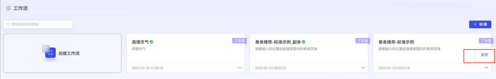
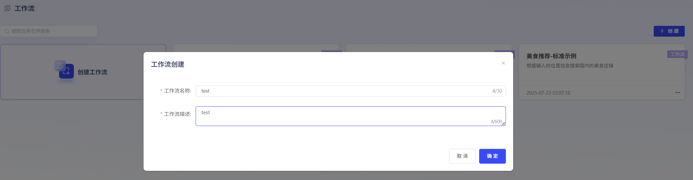
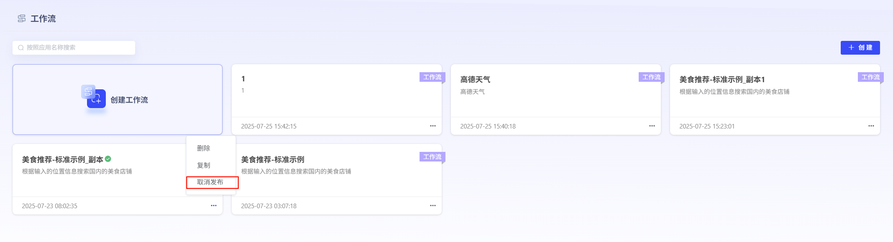
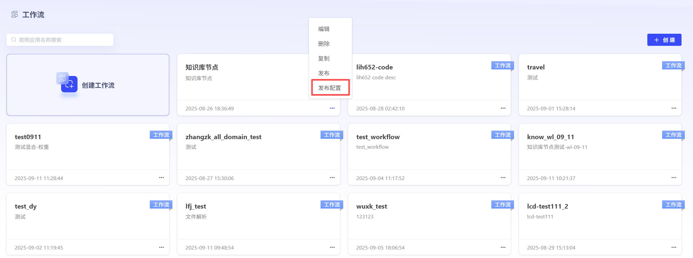
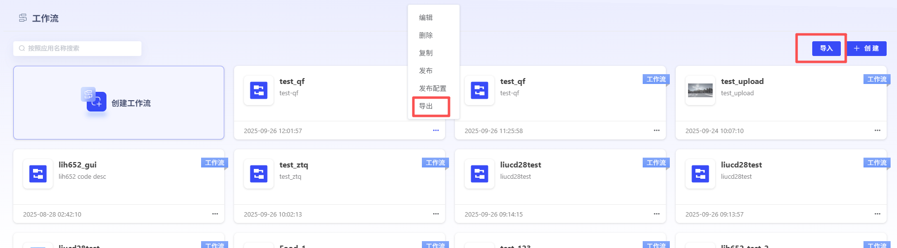

# Workflow

### 1、Workflow创建

点击“创建Workflow”即可进入Workflow创建界面。User可自行设定WorkflowName、WorkflowDescriptionDescription。平台内置了标准WorkflowExample，User也可直接复制使用。

### 2、WorkflowEdit

平台提供MCP、Intent Recognition、API、Code、LLM、分支器、Knowledge Base、Document Generation、Document Parsing等节点。

### 3、Workflow调试与Publish

Edit完毕的Workflow，点击“调试”，运行Success后，即可进行Publish。点击“Publish”可进行Publish方式选择，User可进行私密Publish，也可进行公开Publish。Publish完成的Workflow可作为Tools，被Agent调用。支持Publish为API。

**私密Publish：**Publish后仅对自己可见。

**公开Publish：**Publish后可对AllUser进行共享。

已Publish的Workflow也可CancelPublish后，重新进行Edit。并可进行PublishConfiguration，创建OpenAPI。

### 4、WorkflowImportExport

支持WorkflowImportExport。

