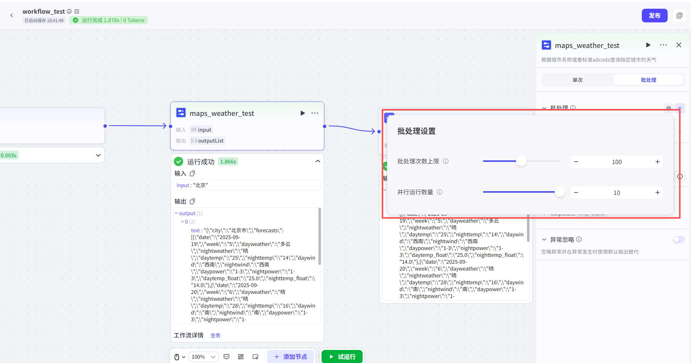
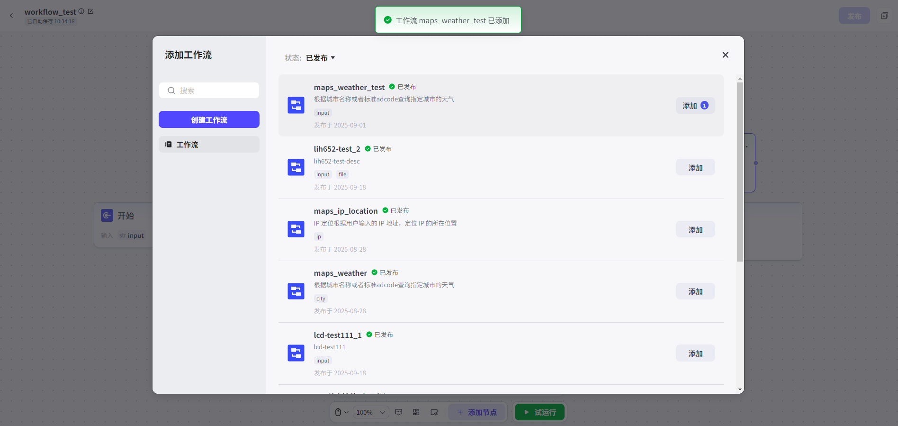
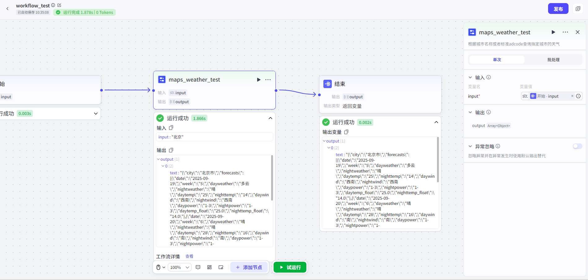

# Workflow

## 节点概述

**核心Features**：它允许你在一个Workflow（主流程）中，嵌入另一个Workflow（子流程），实现“Workflow调用Workflow”的强大Features。

## Configuration指南

#### 1. Input与Output：Data的传递
*   **结构固定**：Workflow节点的Input和Output结构，完全由它所调用的**子Workflow**决定，你None法在父Workflow中自定义修改。
*   **ConfigurationInput**：你需要为子Workflow定义的**RequiredInput参数**，在父Workflow节点中指定Data来源。Data来源支持两种方式：
    *   **固定值**：直接Input一个静态的值，如 `Hello World` 或 `2024`。
    *   **引用变量**：引用上游Other节点的Output结果，实现Data的动态传递。

#### 2. Batch Processing模式：从“单件处理”到“批量生产”

默认情况下，Workflow节点只执行一次。但开启**Batch Processing模式**后，它就能像一条流水线一样，根据你提供的InputList，反复运行子Workflow，直到达到次数限制或者List的最大长度。
**它能做什么？**
Batch Processing模式能极大提升处理海量Data的效率，特别适合需要重复执行相同任务的场景。
**经典场景**：
假设你的子WorkflowFeaturesYes“图文问答”。

* **单次模式**：Input一张Image，进行图文理解。

* **Batch Processing模式**：Input一个包含 50张不同Image的List，Workflow节点会自动运行 50 次，批量进行50次图文理解。
  **Batch Processing的高级Settings**：

  *   **运行次数上限**：控制Batch Processing的最大运行次数，防止意外消耗过多资源（默认为 100 次）。
  *   **并行运行数量**：Settings同时可以运行多少个任务。
      *   设为 `1`：表示任务一个接一个地**串行**执行，速度较慢但资源占用少。
      *   设为大于 `1`：表示多个任务可以**并行**执行，速度更快但资源占用多。

  
#### 3. 异常处理：让流程更健壮
Workflow节点内置了**忽略异常**Features，这Yes一个强大的“容错”机制。
*   **Features说明**：开启后，如果该Workflow节点在运行时Failed（例如，子Workflow内部出错），整个父Workflow**不会因此中断**，而Yes会跳过这个Error，继续执行后续的节点。
*   **如何处理Output**：如果下游节点需要引用这个Failed节点的Output，系统会使用你为该节点**预先Configuration的默认Output内容**，从而避免因Data缺失而导致整个流程崩溃。

