# 统计看板

系统管理员可查看全局用户使用情况。组织管理员可查看本组织及下级组织使用情况。其余用户可查看本人使用情况。

## 应用

可从**我发布的**，和**我使用的**两大维度进行统计。支持用户选择不同类型的应用（智能体、工作流、知识问答、通用智能体、知识库、模型、MCP、提示词、插件工具、Skill、安全护栏），查看模型调用总次数、平均响应耗时等参数，并支持导出下载。

**我发布的：**我发布的应用的使用情况

**我使用的：**我使用的应用的情况

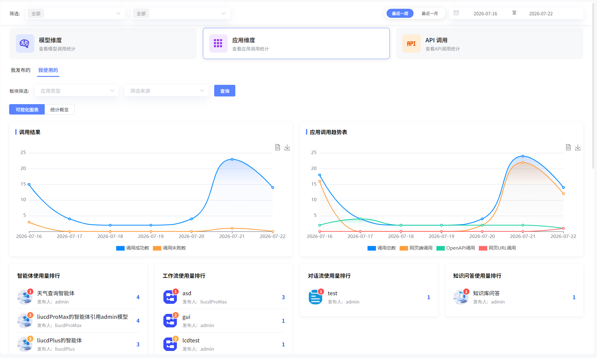

### 调用统计

应用调用统计可从用户和模型维度进行统计。

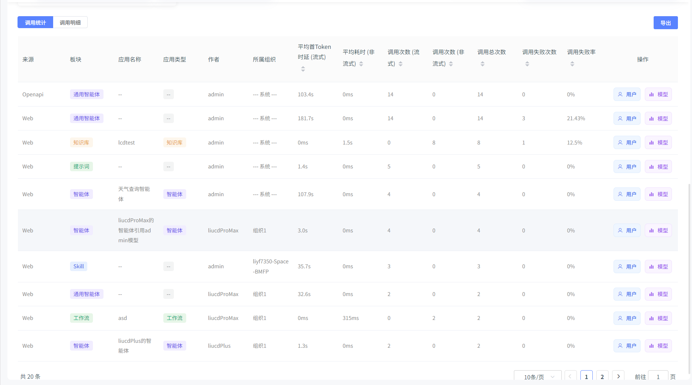

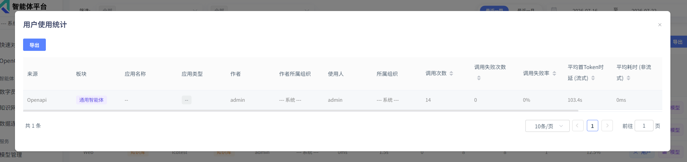

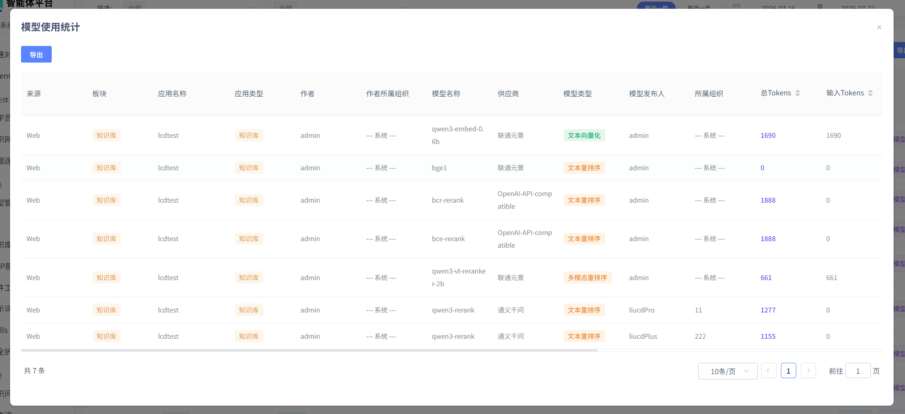

### 调用详情

可按照调用时间查看具体详情信息。

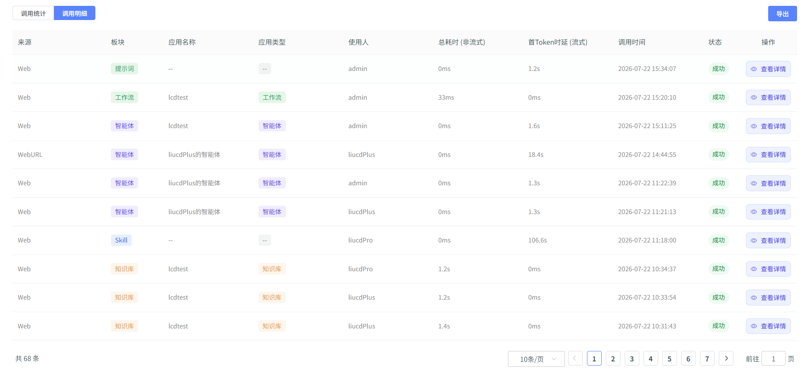

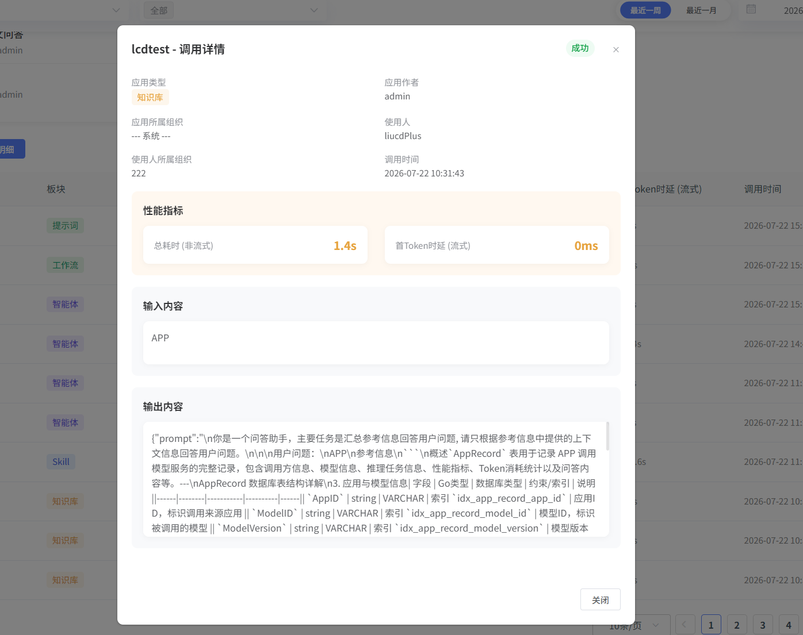

## 模型

可从**我发布的**，和**我使用的**两大维度进行统计。支持用户选择不同类型的模型，查看模型tokens总数、调用次数等参数，并支持导出下载。可分别从用户、模型、组织维度查看模型使用量排行。

**我发布的：**我发布的模型的使用情况

**我使用的：**我使用的模型的情况

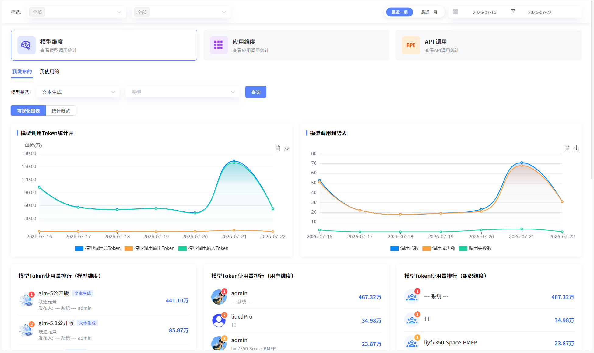

### 调用统计

模型调用统计可从用户和应用维度进行统计。

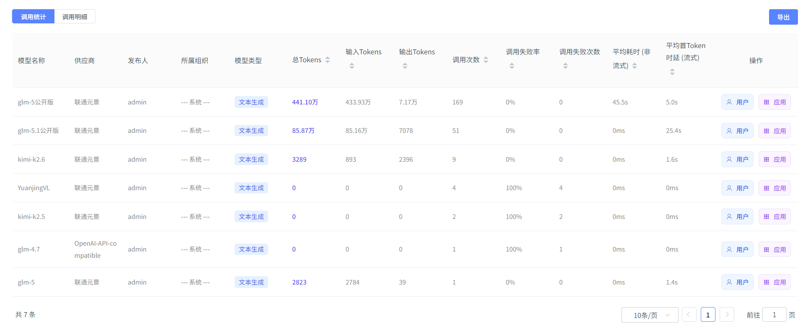

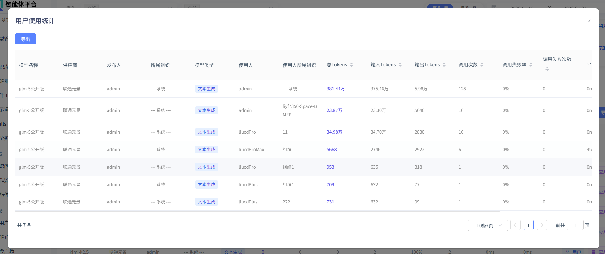

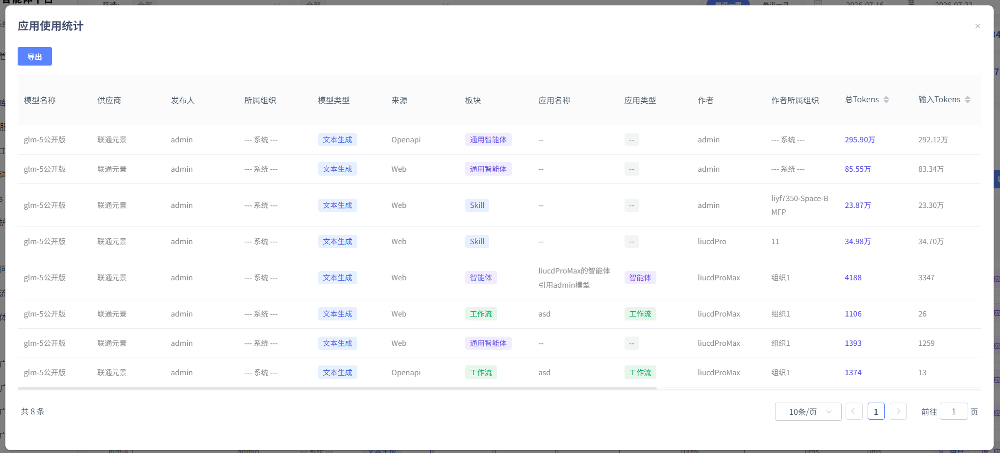

### 调用详情

可按照调用时间查看具体详情信息。

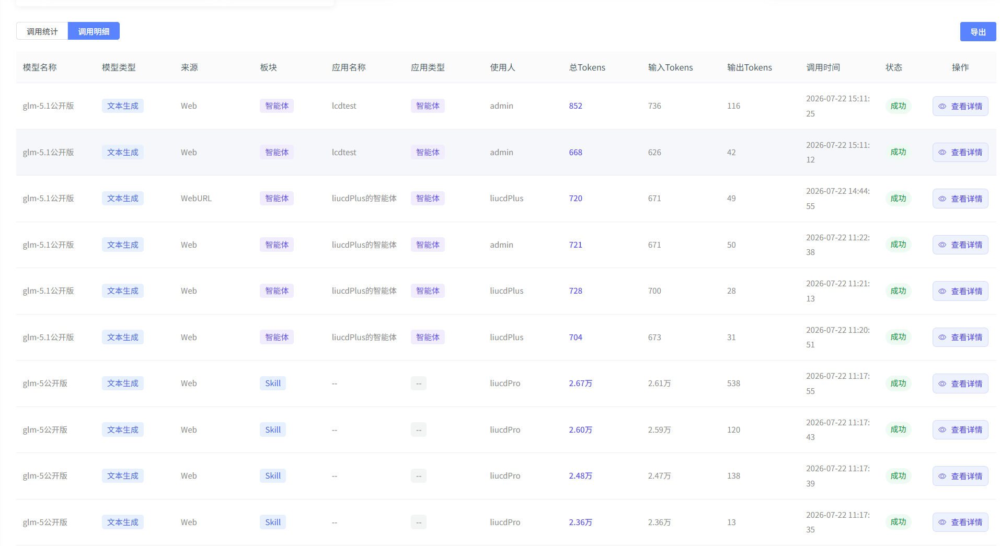

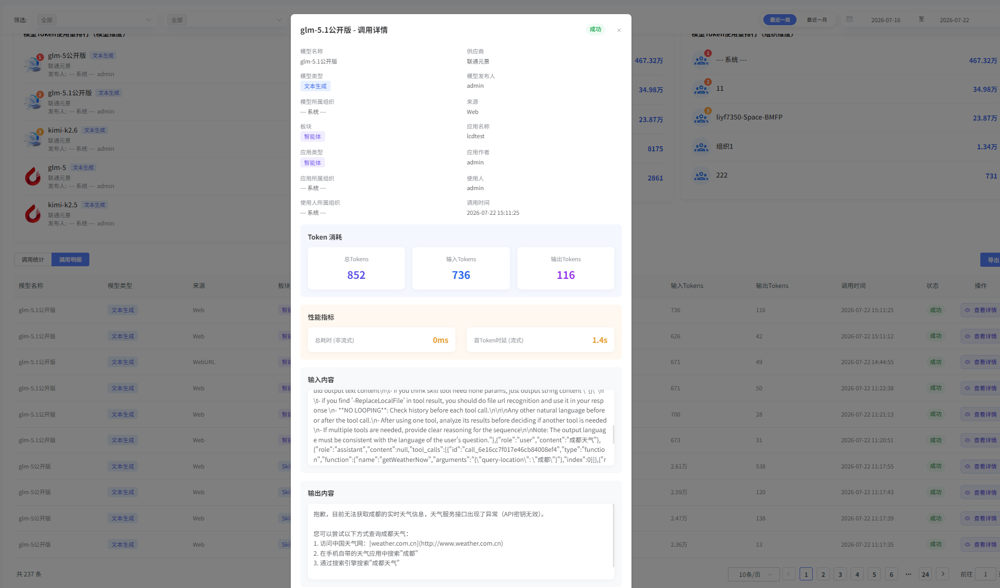

## API

支持用户选择API，查看API调用总次数、平均耗时等参数，并支持导出下载。点击详情也可查看API调用详情，如请求内容、响应内容等。

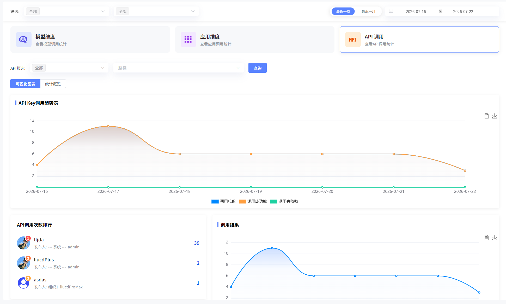

### 调用统计

API调用统计可从应用和模型维度进行统计。

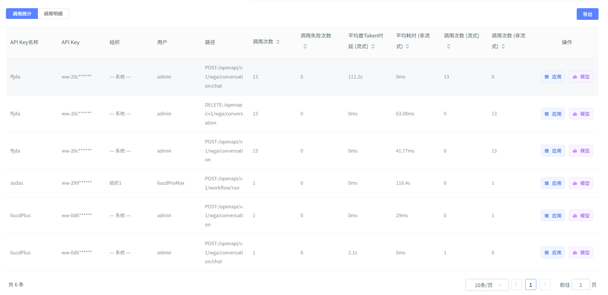

### 调用详情

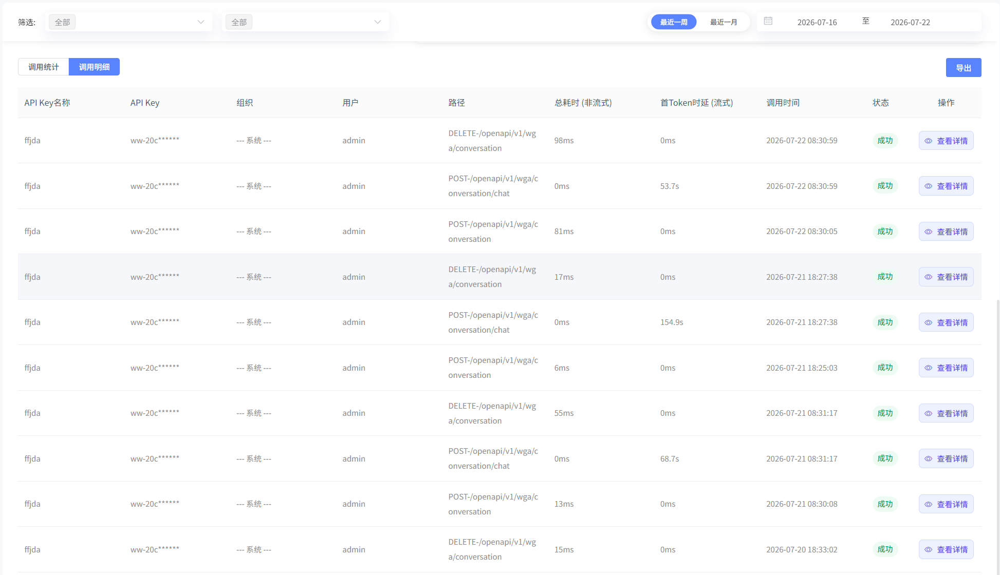

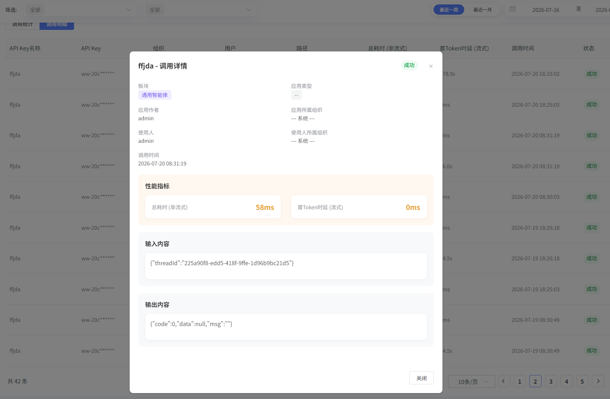