# 本体建模使用教程

首次部署服务的内置本体建模或任何新建的本体建模，需要先参考 **8. 本体建模任务管理** 创建全量任务后即可使用。

## 1. 本体建模创建

在元景万悟智能体平台左侧导航栏的“决策智能体”分类下，点击进入“本体建模”。

以卡片形式展示当前用户下所有的本体建模

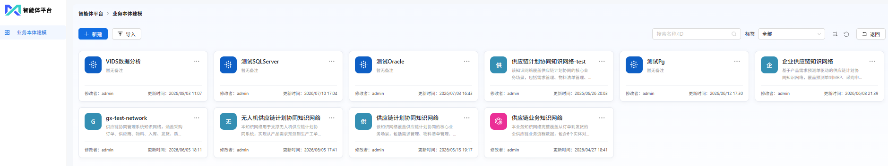

点击【新建】按钮手动新建一个本体建模，内部数据为空。建议优先使用【通用智能体】的【创建决策智能体】功能自动化构建。

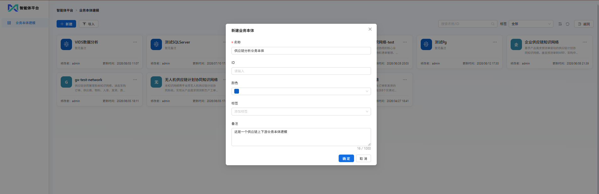

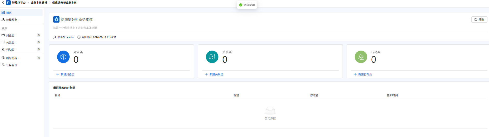

每个本体建模支持查看、编辑、导出、删除。编辑同【新建】功能，删除后数据无法恢复，请谨慎操作。

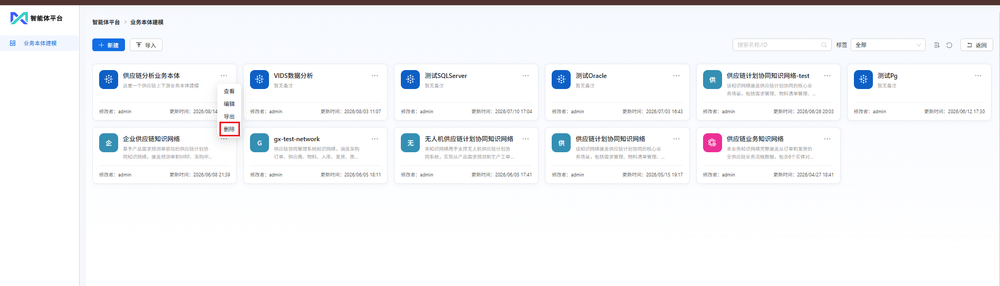

选择导出后，会保存成json文件，可以进行导入。

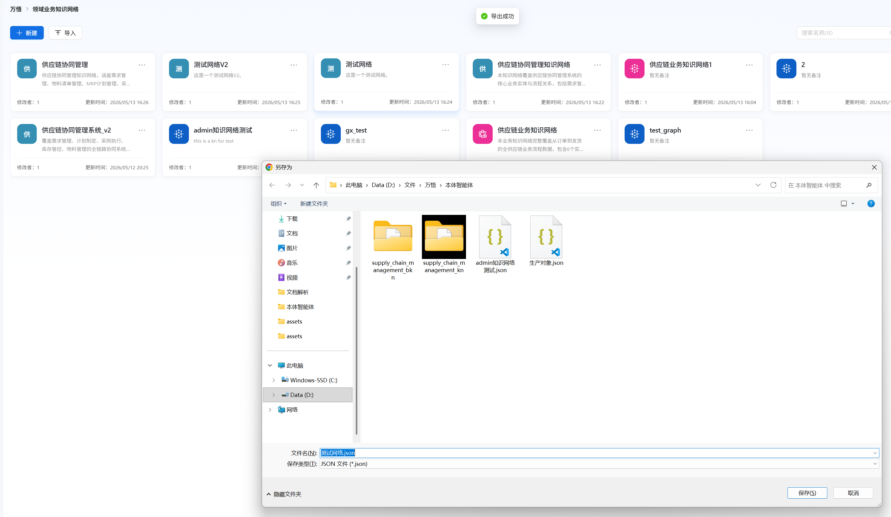

## 2. 本体建模概述

展示当前本体建模的描述和统计数据，提供新建对象类、关系类、行动类和指标的快速入口。

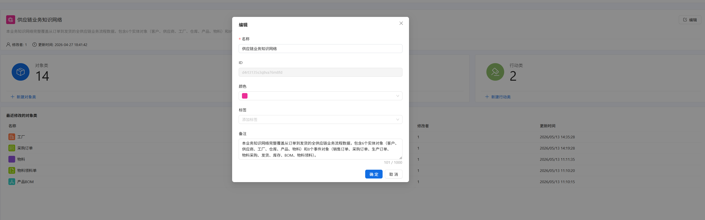

## 3. 本体建模建模预览

对象类和关系类创建完成后，可在“建模预览”页面查看对象图谱结构与关联关系。

## 4. 本体建模对象类

进入对象类模块，该模块上支持对象类的新建、删除/批量删除、按名称或ID模糊查询、按名称或更新时间排序，并可一键刷新列表数据。

1. 在“新建对象类”页面先填写必填的“对象类名称”，再按需补充ID、图标、颜色、标签、概念分组和描述后点击“下一步”。

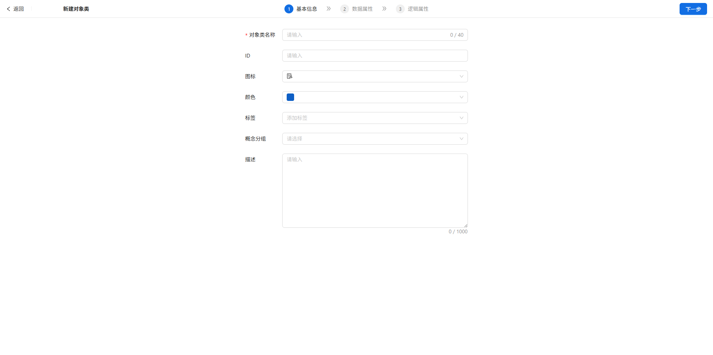

2. 在“选择数据视图”弹窗中勾选目标数据表（如 inventory_event），确认预览无误后点击【确定】。

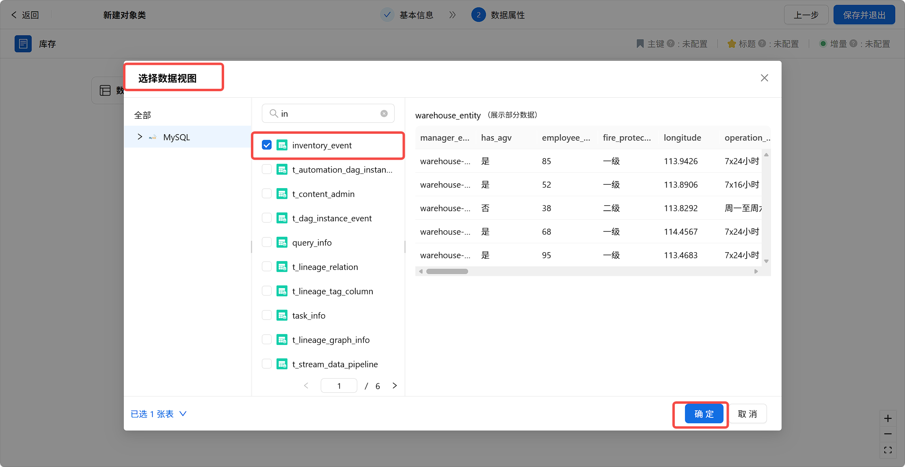

3. 然后配置主键、标题和增量：主键用于唯一标识对象实例（可多字段并对重复值融合）、标题用于对象默认展示名称、增量用于按新增数据进行增量构建以避免重复处理。

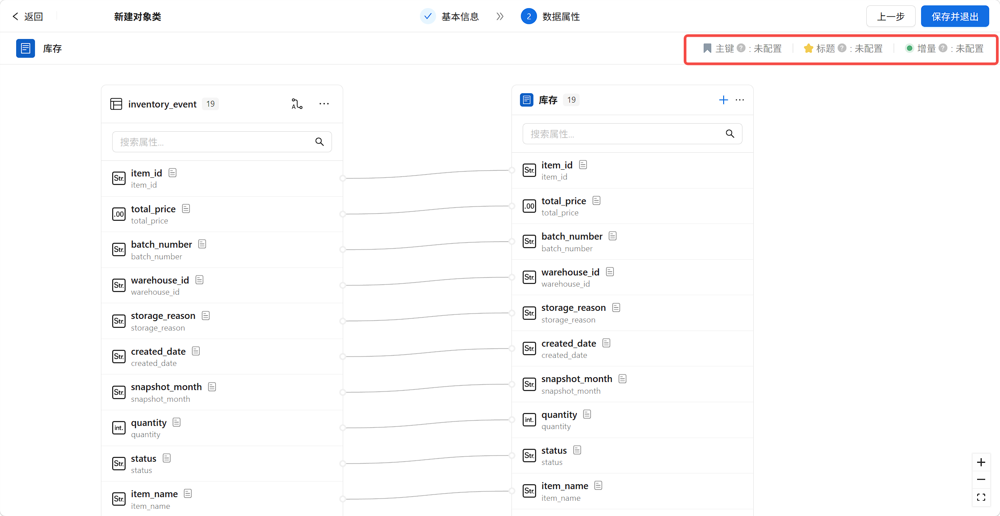

4. 在数据属性配置中点击目标字段，按业务需求修改“显示名称”后点击“确定”即可更新前端展示名称。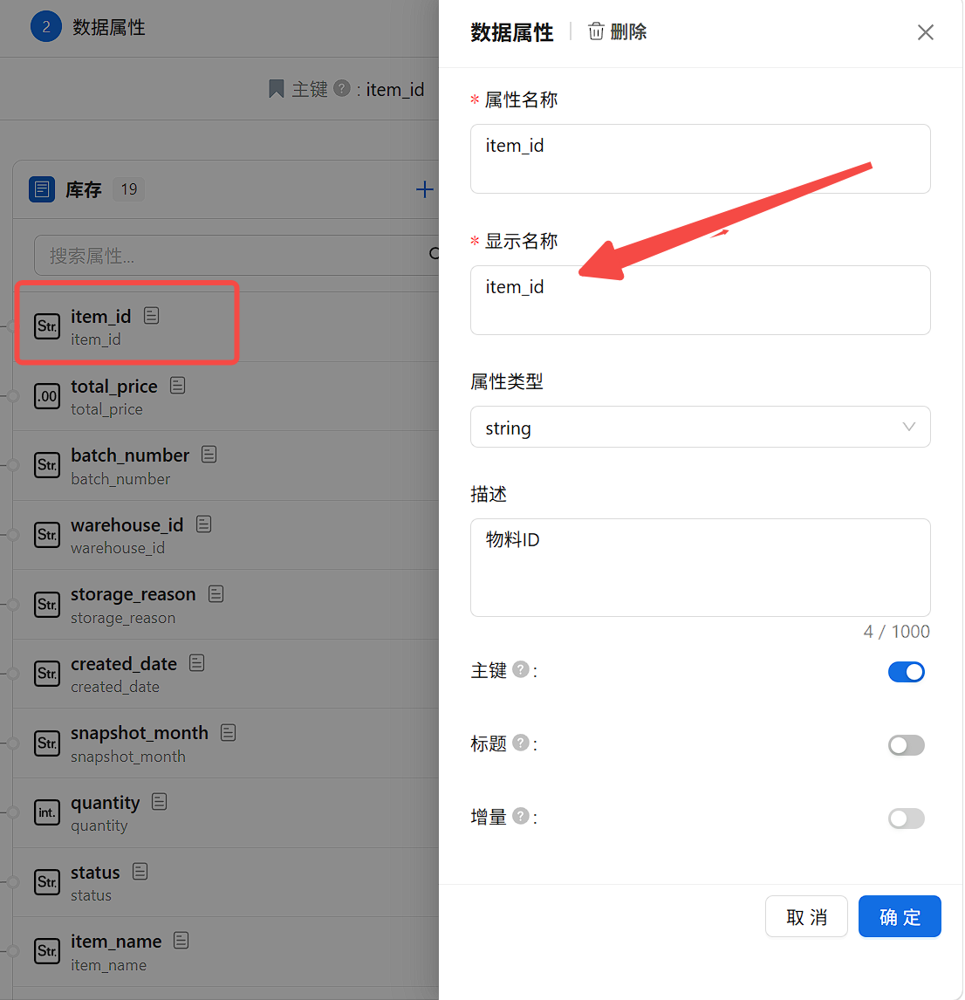

5. 确认无误后保存数据属性，点击【下一步】进入逻辑属性配置页面，点击“新建”配置逻辑属性。

6. 逻辑属性需要配置属性名称，属性显示名，工具集和工具，其中工具集和工具的定义需要参考 **10. 逻辑工具管理**：**属性名称**是逻辑属性在当前对象类中的唯一名称，用于系统识别和引用；**属性显示名**是逻辑属性在页面上展示的名称。**工具集**用于选择计算该逻辑属性所需工具所属的工具集，选定后可选择其中的工具。**工具**就是选择实际执行计算的工具，系统根据配置的参数调用该工具获取逻辑属性值。

   

7. 选中工具后会在**配置参数**中同步显示工具定义的函数参数，可点击【新建】新增函数参数，其中需要修改**值来源**和**值**：值来源用于指定工具输入参数的取值方式，可选择对象属性、固定常量或运行时输入。完成后配置**结果路径**：指定从工具返回结果中提取逻辑属性值的路径，例如 `$.result` 表示提取返回结果中的 `result` 字段（可默认填入 `$.result`）。
   

8. 配置好逻辑属性映射后点击【确定】，逻辑属性栏中即新增一条逻辑属性，可以点击“【...】选择编辑或删除这条逻辑属性，完成好逻辑属性配置后点击保存并退出。

   

9. 在“对象类”列表中点击目标条目右侧【…】操作菜单，可执行查看、编辑、索引配置和删除等管理操作。**查看**仅查看该对象类的详情与配置内容，不会修改数据。**编辑**进入可编辑状态，修改对象类的名称、属性、展示规则等配置并保存生效。**删除**：移除该对象类及其相关配置数据，删除后通常不可恢复，需谨慎操作。**索引配置**：用于设置对象类实例数据的索引规则，提升数据查询与检索效率。

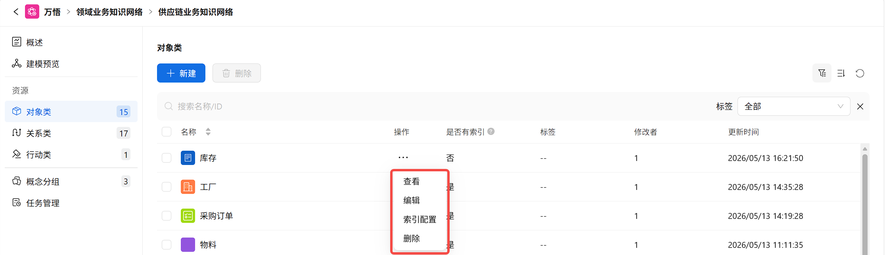

下面展示**查看**对象类详情的操作：
点击【**数据属性**】展示对象类的字段定义，包括属性名称、显示名称、数据类型、描述及对应的数据视图字段，支持搜索。下方”**数据**“展示对象类的实例记录及各数据属性的实际取值，支持搜索和筛选。

点击【**逻辑属性**】显示对象类绑定的逻辑属性，**逻辑属性试算**栏中可以根据配置的工具计算并展示对象实例的逻辑属性值，支持单条试算、勾选批量试算和试算全部。

下面展示**索引**配置的操作：
可按业务需求完成索引配置：索引字段长度支持手动填写（默认1024），其余参数（如分词器、小模型等）通过下拉列表选择后点击“保存”生效，小模型是接入的万悟模型广场中的模型。

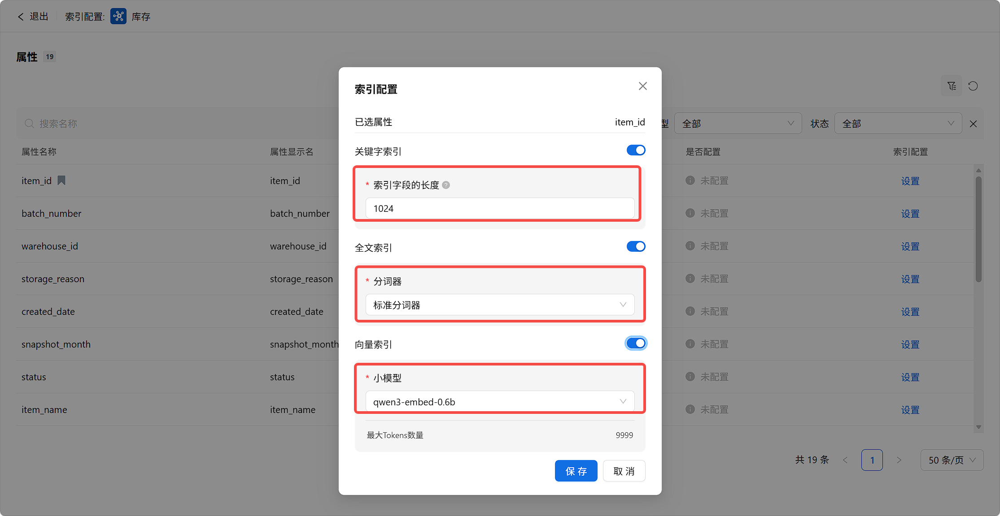

## 5. 本体建模关系类

本体建模关系类列表查询，查看所有对象之间的关联关系。支持筛选、排序、刷新功能，可根据关系中的起点、终点对象类型进行筛选；按名称、更新时间排序。

点击【新增】按钮新建关联关系，选择映射的对象类属性，或通过数据视图连接。

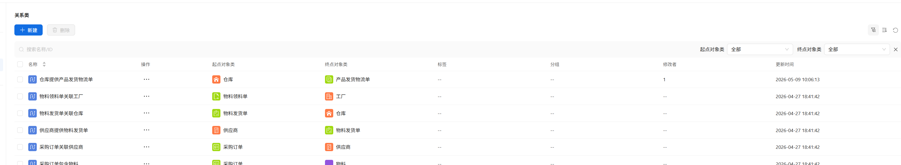

选中某个关系类，点击【删除】按钮，删除选中的关系类，支持批量删除。删除后数据无法恢复，请谨慎操作。

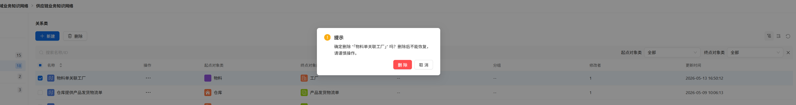

对某个关系类，支持查看、编辑和删除。【编辑】与【新建】按钮界面、功能相同。

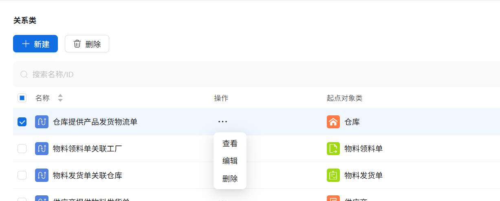

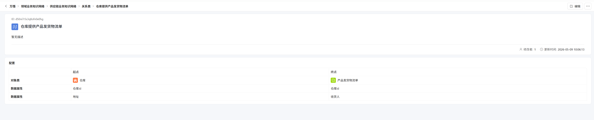

## 6. 本体建模行动类

进入行动类模块，该模块上支持行动类的新建、删除/批量删除，筛选功能支持按名称或ID模糊查询，也可根据行动类型和绑定的对象类来进行筛选。其余功能有 按名称或更新时间排序，并可一键刷新列表数据。

1.在“新建行动类”的“概念定义”步骤中，填写行动类名称、描述、行动类型与绑定对象类，并配置触发条件及影响对象类后点击“下一步”。

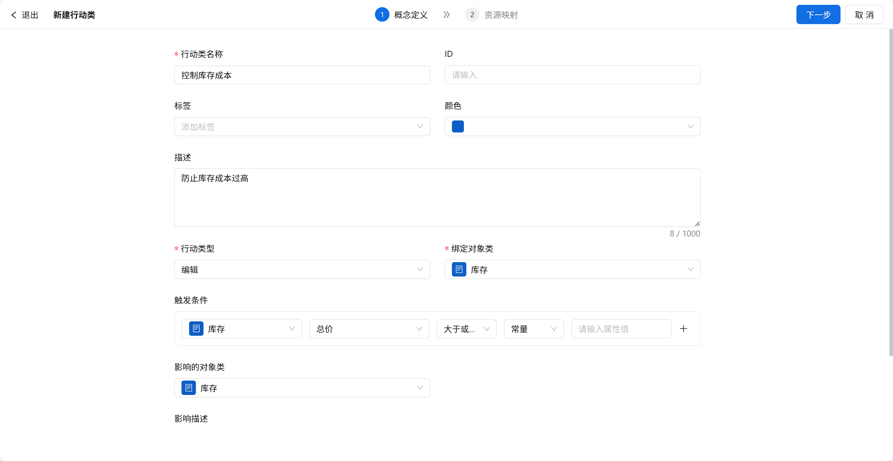

2.在“资源映射”中仅可配置一个算子，可通过模糊搜索或下拉列表查找，并查看工具介绍后选择确认。

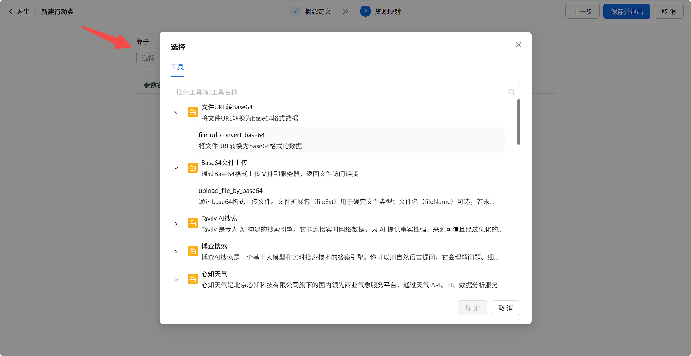

3.选择工具后，可按需求为各参数设置取值类型（固定值、数据属性或动态输入）。点击右上方，即可创建成功。

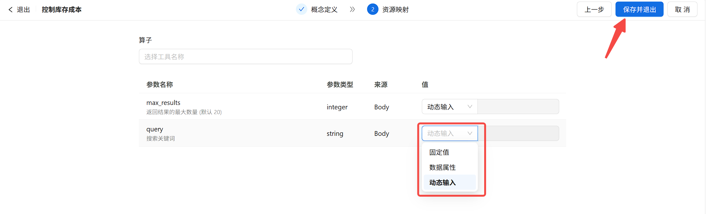

4.在“行动类”列表中点击目标条目右侧“…”可进行查看、编辑或删除等管理操作。

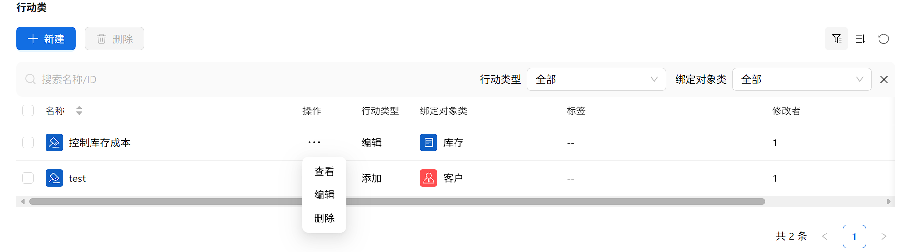

## 7. 指标功能

进入指标功能模块，该模块上支持指标的新建、删除/批量删除，筛选功能支持按绑定对象类和标签进行筛选。其余功能有按名称或更新时间排序，并可一键刷新列表数据。

1.点击“新建”，在新建指标页面基础信息中填写名称、标签和描述并在在指标配置中绑定对象类和填写指标配置信息；计算公式中，**聚合属性**根据绑定的对象类提供属性名称下拉选项，**单位类型**支持数值、存储、百分比、传输速率、时间等，**单位**根据单位类型联动显示；**聚合方式**支持求和、平均值、最大值、最小值、计数和去重计数，注意数值属性支持全部方式，日期属性支持最大值、最小值和计数类，文本属性仅支持计数和去重计数。

**过滤字段**选择绑定对象类的属性，用于限定参与指标计算的数据记录；**判断关系**根据属性类型动态显示：数值支持等于、大小比较、范围等；文本支持等于、包含、前缀和正则匹配等；日期支持早于、介于、范围等；**条件关系**支持多个过滤条件之间可选择“且”或“或”，也可新增嵌套条件；**分组维度**支持多选对象属性，使指标按照这些字段分别聚合；**排序**选择结果排序依据，排序方向可选“升序”或“降序”。
**Having**对已经聚合出的指标值进行二次过滤，可选 `>`、`>=`、`<`、`<=`、`==`、`!=`，并填写阈值；**时间属性**仅展示日期或时间类型属性，用于趋势、同环比及时间范围查询，**默认时间范围**可选“最近1小时、最近24小时、自然日、无”；纯 `date` 类型只支持“自然日”或“无”，不选择时间属性不支持趋势和同环比查询并无法绑定默认时间范围。**分析维度**声明查询时可以临时选择的分析维度，它不会像分组维度一样固定参与每次计算。

2.在“指标”列表中点击目标条目右侧“…”可进行查看、编辑或删除管理操作。

3.点击右侧“…”中的“查看”进入指标的详情页，支持查看基础信息、指标信息预览以及数据查询。右上角支持删除和编辑功能。

4.点击“数据查询”，选择**查询模式**，支持“即时值、趋势、同环比、占比”，即时值返回单次汇总结果；趋势按时间连续统计；同环比计算当前值与历史同期的差异；占比计算各维度数据在总体中的比例。**未配置时间属性时，趋势和同环比不可选。**
查询模式选择**即时值**时，可以多选**下钻维度**即可多选创建指标时配置的分析维度，用于将指标结果进一步拆分成多个数据序列。可以多选**过滤条件**，选择绑定对象类中已映射的数据属性，只让满足条件的记录参与指标计算。**结果上限**限制本次查询最多返回的结果数量，范围为1～10000，默认值为100。点击“执行查询”查看执行结果。

查询模式选择**趋势**时，需要选择**时间范围**和**时间粒度**，分别用于限定本次统计的数据区间和用于决定趋势结果按照什么周期分桶统计。

查询模式选择**同环比**时，需要选择**对比结果**，**对比偏移量**和**对比粒度**。**对比结果**可多选“增长值”和“增长率”。增长值表示当前值减去对比期值，增长率表示相对对比期的变化百分比；对比偏移量设置向前对比几个周期；对比粒度包括“日、月、季度、年”，用于确定同环比向前偏移的时间单位。例如对比偏移量为“1”并且对比粒度为“年”表示与上一年同期比较。

查询模式选择**占比**时，需要选择占比形态。**汇总占比**计算整个查询范围的比例；**时序占比**按时间粒度分别计算比例。若选择时序占比需要选择时间范围和时间粒度。

5.指标绑定具体对象后，可以在绑定的对象中查看指标信息，也支持指标试算。

6.配置好指标后，也可以在主界面“快速对话”中调用指标绑定的知识网络数字员工，直接询问指标名称得到指标查询结果。

## 8. 本体建模概念分组

概念分组列表查询，查看所有配置的概念分组，可在新增/编辑对象类时关联到概念分组。右上方功能支持搜索名称/ID，按名称/更新时间排序。

通过【新建】按钮新建概念分组。

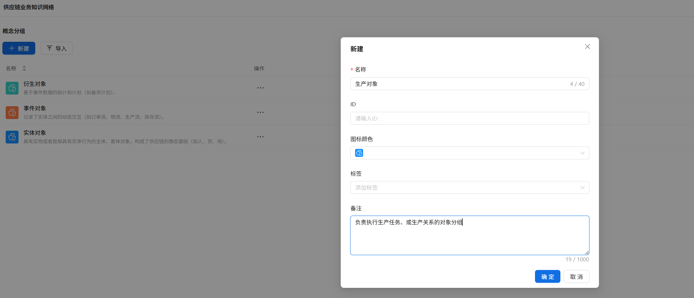

对每个概念分组，支持查看、编辑、导出、删除。编辑与【新增】功能一致，删除生产对象不能恢复，请谨慎操作。

选择导出后，会保存成json文件，可以进行导入。

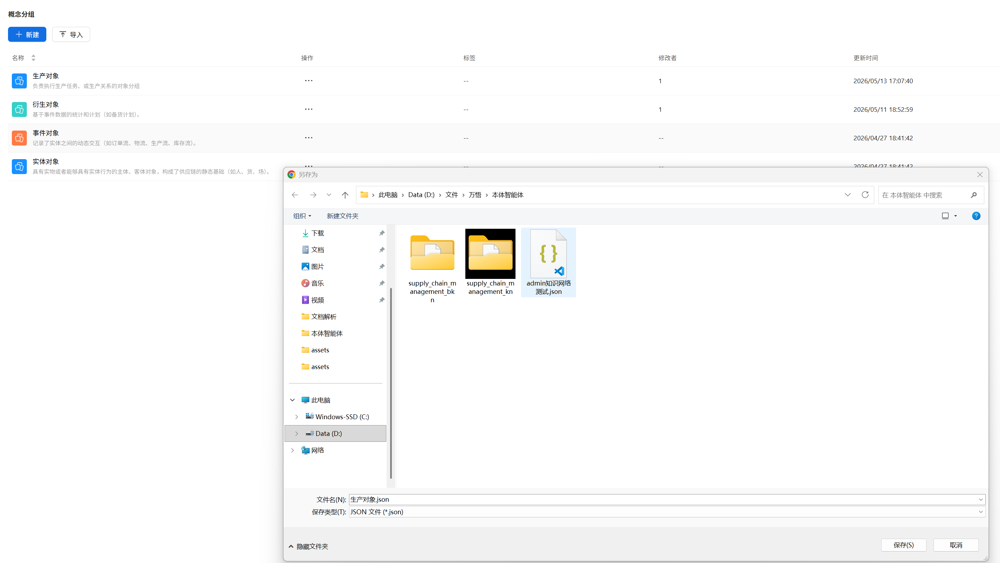

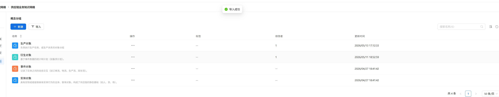

## 9. 本体建模任务管理

定义：业务本体建模索引构建任务是 ADP 业务本体建模引擎提供的核心索引管理能力，支持为 **BKN** 中的对象类构建对象索引。通过该功能可实现基于语义的知识查询，弥补虚拟化查询的局限性，提升对象查询的效率与召回率，帮助用户快速定位符合业务条件的对象实例。

另外**数据库底表** 和 **本体建模（BKN）索引** 是两层独立存储，BKN 的对象类实例是通过**构建索引**（build）从底表同步的，不会自动感知底表变更。写入数据库后，需执行重建索引，BKN 数据才会与底表同步。

进入任务管理功能模块，该模块上支持任务的立即新建和定时构建，筛选功能支持按名称或ID模糊查询，也可根据构建类型和任务状态来进行筛选。其余功能有 按名称或更新时间排序，并可一键刷新列表数据。

右侧任务列表展示已执行任务的记录，可查看任务名称、构建类型、构建方式、任务状态、创建人、任务总耗时，以及开始时间和结束时间等信息。

1.在“任务管理”中点击“新建”，填写任务名称并选择构建类型和构建方式，点击“确定”发起构建任务。

首次构建需要选择“全量构建”；“增量更新”是基于对象类已配置的‘增量标识（incremental_key）’，且该对象类存在可用历史索引并保存了上次增量值时，按‘增量标识 > 上次增量值’拉取数据；不满足时自动回退为全量构建。

注：任务执行过程会用到小模型（如果该字段开了向量索引）

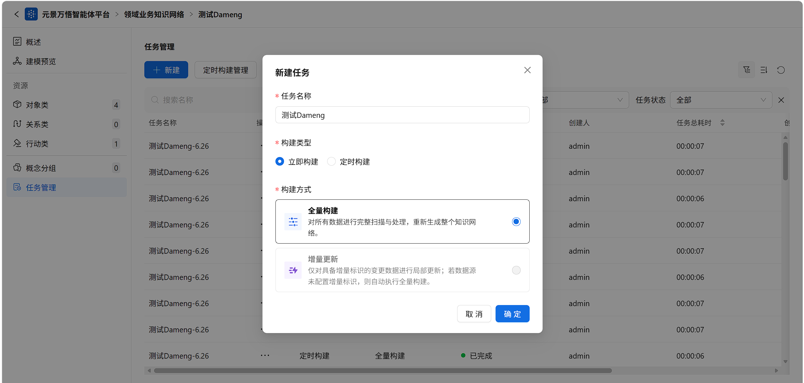

选择“定时构建”后，请设置执行频率和构建方式。任务创建成功后，系统会先立即触发一次构建；该次构建完成后，再根据完成时间和执行频率计算下一次构建时间。

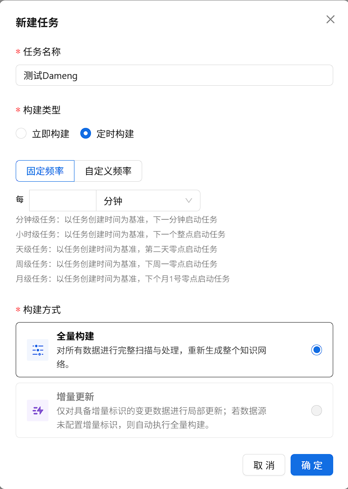

新建完定时构建任务，可以在新建按钮的右侧，点击定时构建管理任务，可以对定时构建任务进行开启或者关闭、编辑、查看、删除管理功能。

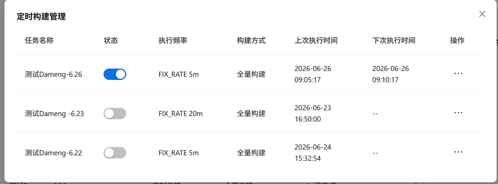

点击操作中的编辑，可以修改任务的名称、执行频率、构建方式。

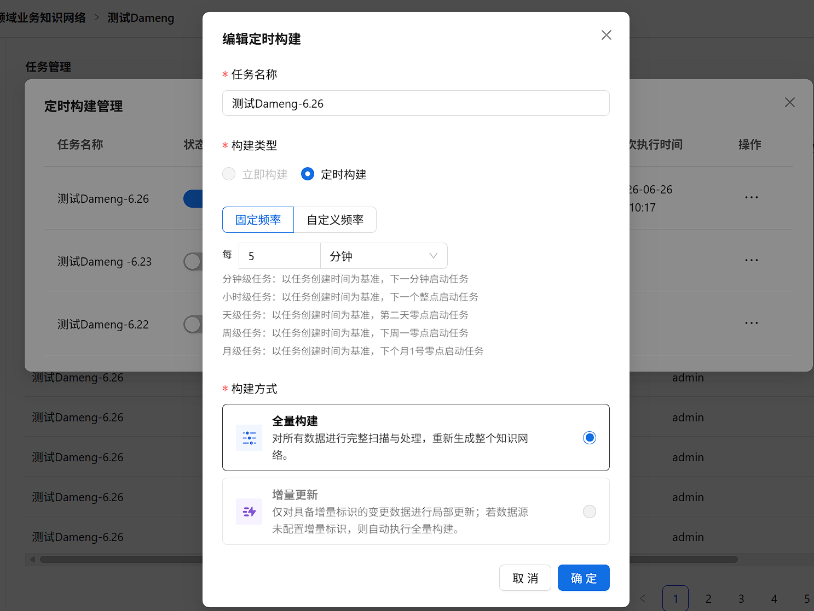

## 10. 本体对接各类通用智能体

1.获取配置信息

目前已经支持通过MCP接入包括万悟平台在内的各类通用智能体平台，如deepseek harness，UniClaw，workbuddy等。在【万悟平台】-【本体建模】- 【业务本体对接】页面可以看到通用mcp.json的配置。

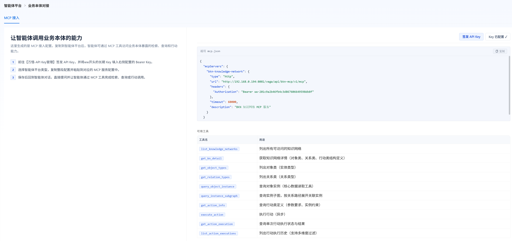

点击"签发API Key"按钮跳转到万悟API Key管理界面，在当前账号下，新创建一个API Key或者选择一个现有API Key，点击复制按钮。

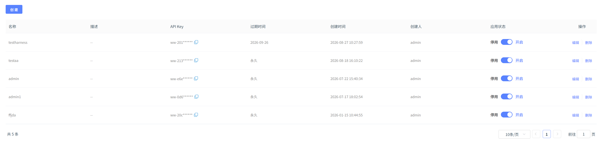

回到【业务本体对接】页面，点击右上角的"配置API Key"按钮，将复制的API Key填入，点击"应用配置"按钮。通用 mcp.json代码块中的API Key将自动替换成您的配置。

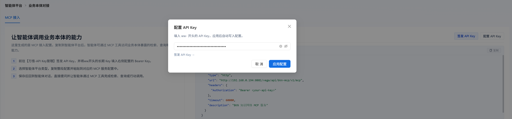

2.下面演示如何将决策智能体在Deepseek Harness（DSH）导入MCP配置并进行本体问答。

复制"通用 mcp.json代码块"的内容，交由DSH自己配置成一个MCP插件。

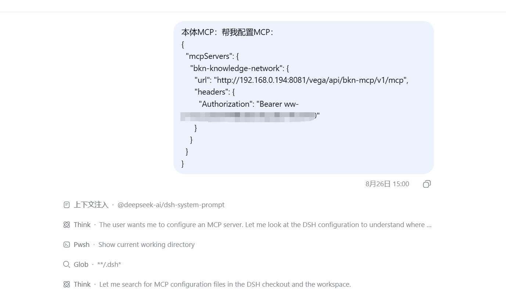

当DSH提示配置完成后，在【设置】-【插件】中可以看到配置好并启用的插件（可能需要重启DSH使其生效）。

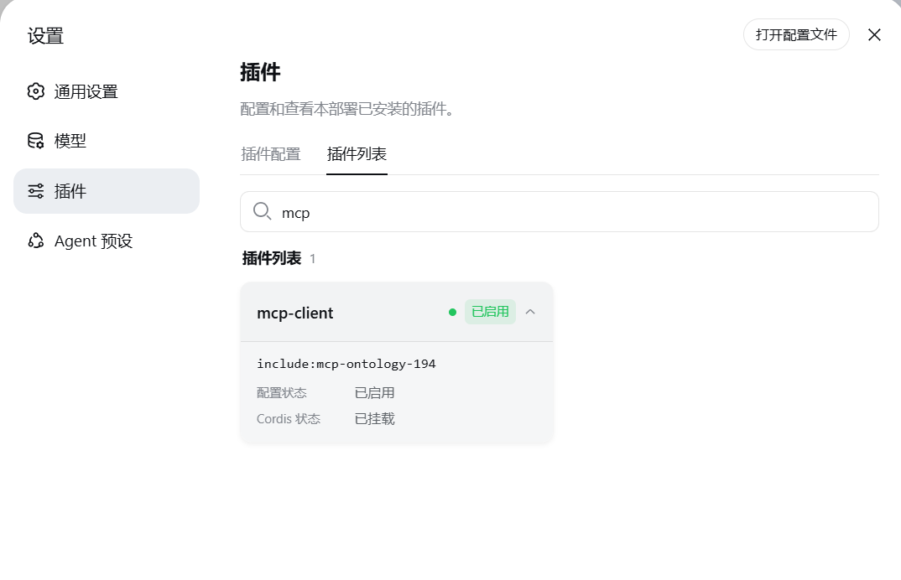

在DSH的插件列表中检查MCP配置状态为【已启用】时，可以在DSH中针对本体业务知识网络进行问数和数据分析：

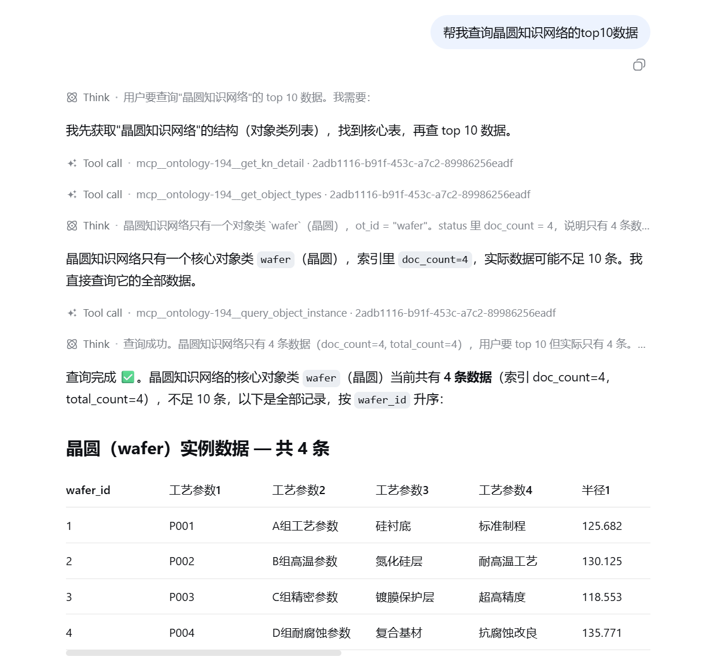

3.下面演示如何将决策智能体在中国联通自研通用智能体"元景UniClaw"中导入配置并进行本体问答。

复制"通用 mcp.json代码块"的内容，交由元景UniClaw自己配置成一个MCP插件。

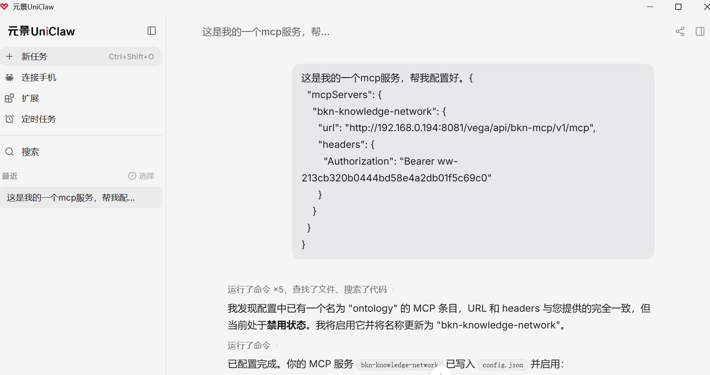

当元景UniClaw提示配置完成后，在【设置】-【MCP】中可以看到自定义好的MCP服务（可能需要重启元景UniClaw使其生效）。

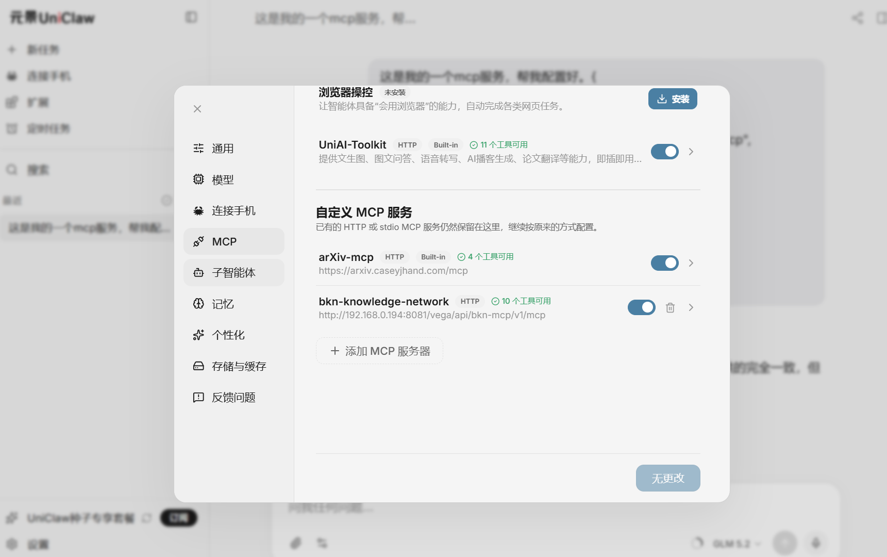

此时可以进行针对本体知识网络的问答。

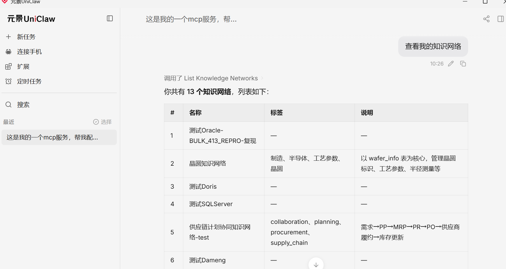

## 11. 逻辑工具管理

1. 在左侧菜单选择【**逻辑工具管理**】，点击'【新建】可以新建工具集，填写工具集名称和描述后点击确认后新增工具集。

2. 点击工具集卡片右上角的【...】，可以编辑、发布和删除工具集。**工具集发布**：将工具集设为已发布状态，只有发布状态下的工具集中的工具可供对象类逻辑属性选择和绑定。**工具集删除**：删除不再使用的工具集及其包含的工具，**删除前应确认并解除相关引用**。**工具集编辑**：用于修改工具集的名称、描述基本信息。

3. 点击工具集卡片进入工具编辑页面，点击左下角【新建函数】在左侧工具列表中新增工具，然后编辑【未命名函数】和【添加描述】为工具添加名称和描述基本信息。

4. 按照处理业务逻辑，使用**sandbox_sdk的@tool方式**或点击【模板】根据模板提示来编写python代码。
   
   5. 点击【接口参数】根据编写的代码定义工具的输入参数和输出结果结构，包括参数名称、数据类型、是否必填及说明，规范工具调用与结果返回。【反推参数】仅支持@tool方式。

6. 点击【按参数重新生成】在“测试入参”内以 JSON 格式填写工具运行所需的输入数据，用于验证工具的处理逻辑。点击【运行】后，可以根据“返回值”查看工具执行后返回的结果数据，检查输出是否符合预期。“stdout”展示程序运行时的标准输出，例如通过 `print()` 打印的信息。”stderr“展示程序运行时的标准错误输出。“指标”：展示工具执行的耗时及资源使用情况。

7. 完成好工具配置后点击【保存】并点击右上角【启用】按钮可以将工具设为可用状态，使其在所属工具集已发布时可供逻辑属性绑定和调用。点击【...】可以删除该工具。只用当前**工具在启用状态下和工具集在发布状态下**可以被逻辑属性绑定。

