# 数字员工使用教程

## 1. 数字员工概览  

在元景万悟智能体平台左侧导航栏的“决策智能体”分类下，点击进入“数字员工”。

在【数字员工】列表页，可查看当前用户下所有数字员工，支持按名称/ID模糊查询、按草稿或已发布状态筛选，并可按名称或更新时间进行排序。

点击数字员工卡片右上角【…】，对于已经发布和未发布的数字员工，都支持查看、编辑、嵌入配置、定时任务和删除功能。

## 2.创建数字员工

点击【新建】按钮，在弹出的【新建数字员工】窗口中填写名称和简介，点击【确定】完成数字员工创建。

注：名称具有唯一性，不可重复。

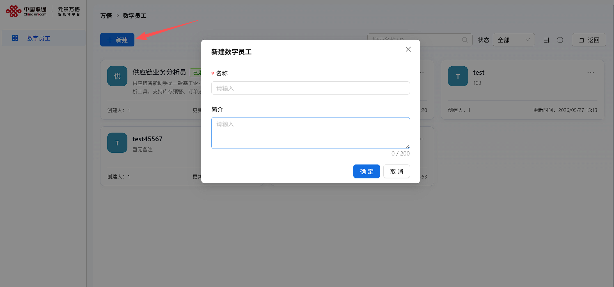 

在【基本信息】处，完成角色、任务、工作流程及技能使用优先级等信息填写后，点击【保存】。

在【关联技能】处，点击【添加技能】打开技能列表，可选择已有技能进行添加；点击【技能创建/导入】将跳转至资源库的Skill页面进行创建或导入。

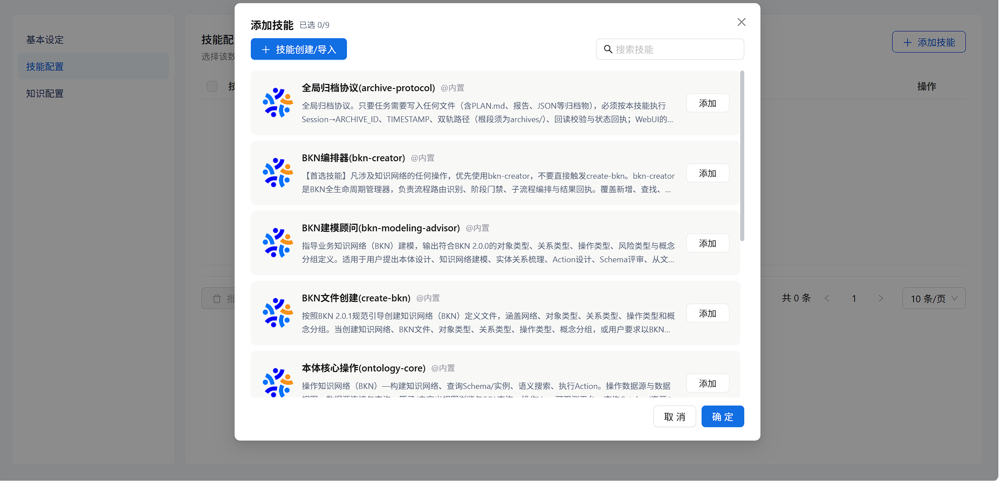

在【技能配置】列表中可同时添加多个技能，支持勾选多个技能后批量删除，也可点击单个技能右侧删除图标进行单独删除。

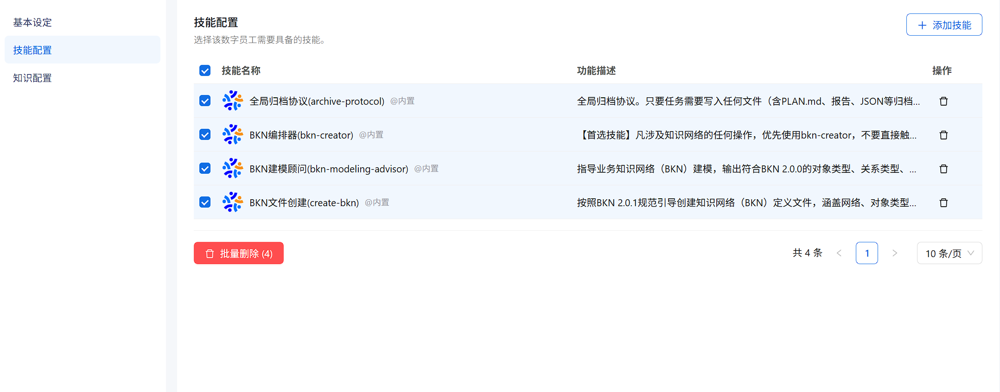

在【关联本体】处，点击【添加业务本体】，在弹窗中选择需要关联的知识网络并点击【添加】，最后点击【确定】完成配置。

注：只可以选择一个知识网络，若知识配置中暂无知识网络，请先去添加知识网络。

添加完成后，可在【知识配置】列表中查看已关联的知识网络，并可勾选后进行删除或批量删除操作。

三个步骤编辑填写成功后，完成数字员工的创建。

### 嵌入配置（可选）

嵌入配置用于将数字员工以对话浮窗或全屏的形式嵌入第三方站点，访客在第三方页面即可与该数字员工问答。**此步为可选配置，不设置也能完成数字员工的创建与保存；仅当需要把数字员工嵌入第三方站点时才配置。** 配置分四块：模型配置、访问凭证、外观设置、嵌入脚本。其中敏感的 APIKey 仅在本页保存、不会进入第三方页面源码，嵌入脚本只携带公开的 EmbedId。

点击数字员工卡片右上角【…】，选择**「嵌入配置」**即可进入该页面。

#### 模型配置

在「LLM 模型」下拉中选择该嵌入问答使用的 LLM 模型（列表来自平台的 LLM 模型，显示为 `provider / 模型名`），该项必填。

注：所选模型需与下方填写的 APIKey 归属同一用户/组织，否则对话会被上游校验拒绝。

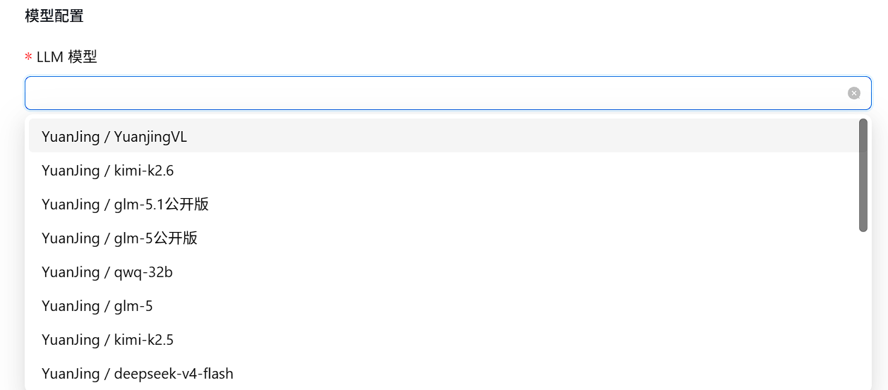

#### 访问凭证

- **EmbedId（公开）**：点击【生成 EmbedId】为该数字员工颁发公开嵌入标识；点击【重置 EmbedId】会作废旧 EmbedId（已复制的旧脚本失效，需重新复制）。EmbedId 可放第三方脚本，不涉及敏感信息。
- **APIKey（敏感）**：手动填写平台颁发的 APIKey（须以 `ww-` 开头），仅在本页保存、绝不进入第三方页面源码；右侧【复制】按钮便于本地备份。

#### 外观设置

- 展示模式：浮窗（默认，右下角悬浮按钮，点击展开对话面板）/ 全屏（撑满视口）。
- 主题色 / 标题文字颜色：通过取色器设置浮窗或全屏头部的配色。
- 欢迎语 / 欢迎描述：面板打开时顶部展示的问候文案。
- 水平位置 / 水平距离(px)：浮窗按钮水平靠左或靠右，以及距屏幕边缘的像素值。
- 垂直位置 / 垂直距离(px)：浮窗按钮垂直靠顶或靠底，以及距屏幕边缘的像素值。
- 允许拖拽：开关，开启后浮窗按钮可被拖到屏幕任意位置（仅浮窗模式生效）。

#### 嵌入脚本

- 展示推理过程：开关。开启后嵌入脚本会带 `data-render="full"`，对话区额外显示推理过程与工具调用状态；关闭（默认）则只展示最终回复。
- 「嵌入脚本」文本框会实时生成 ``，并随上方各项配置自动更新。
- 点击【复制脚本】复制到剪贴板，粘贴到第三方站点页面中即可生效。

第三方站点粘贴脚本后，访客侧的效果为：浮窗模式下页面右下角出现悬浮按钮（开启允许拖拽时可拖动），点击展开对话面板即可与数字员工问答；全屏模式下则直接以撑满视口的对话界面呈现。

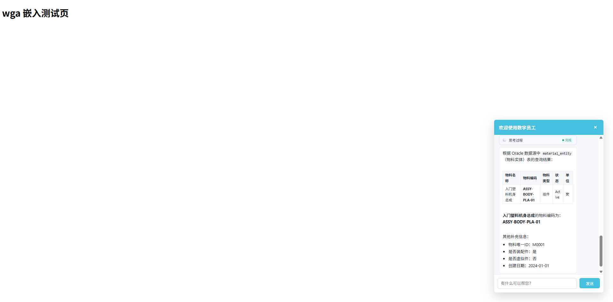

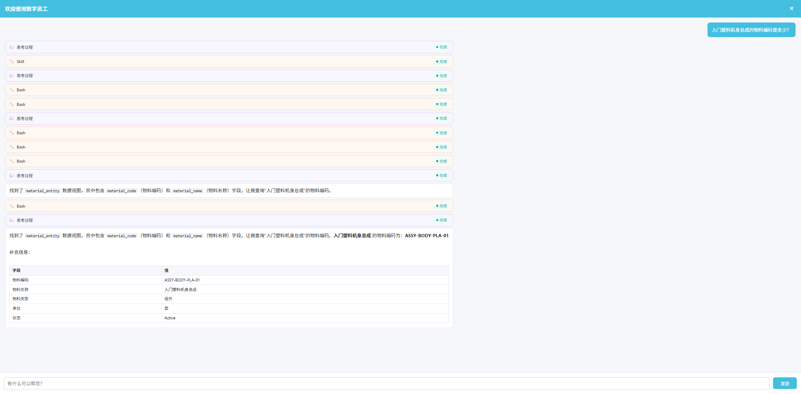

### 定时任务（可选）

定时任务用于让数字员工在设定的时间**自动执行一次问答，并按所选通知方式把结果推送出去**，适用于每日库存日报、每周巡检汇总等周期性场景。**此步为可选配置，不设置也能完成数字员工的创建与保存；仅当需要周期性自动问数并推送时才配置。**

点击数字员工卡片右上角【…】，选择**「定时任务」**即可进入该页面。定时任务关联的是万悟运营管理中的**数字员工（dip）渠道**，而非某个具体数字员工本身——渠道里已保存问答所需的模型、APIKey 与数字员工信息，定时任务复用该渠道凭证到点问数并推送。
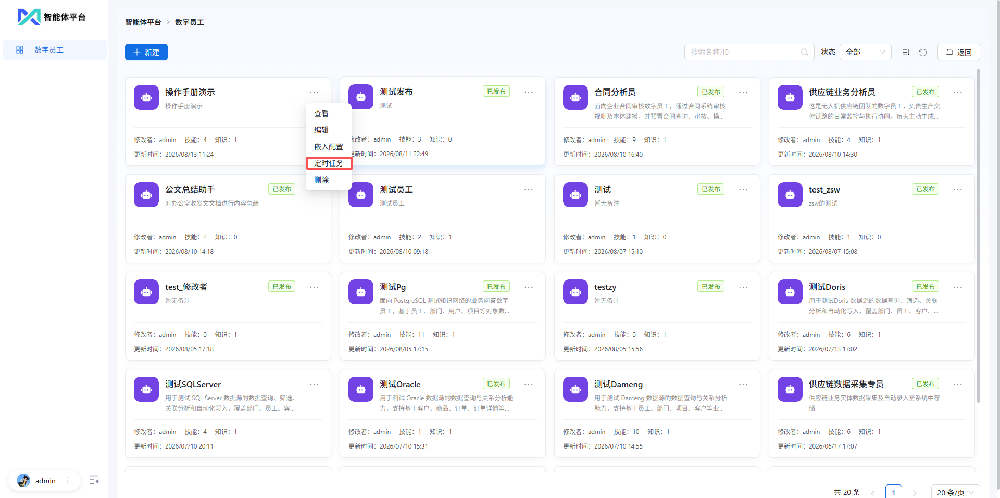

#### 通知方式

页面顶部「通知方式」下拉切换查看任务：**全部 / 渠道推送 / 邮件通知**。选「渠道推送」时会展开「关联渠道」次级筛选；选「邮件通知」时进入无渠道任务视图。【新建定时任务】按钮仅在选了具体通知方式（非「全部」）时可用。

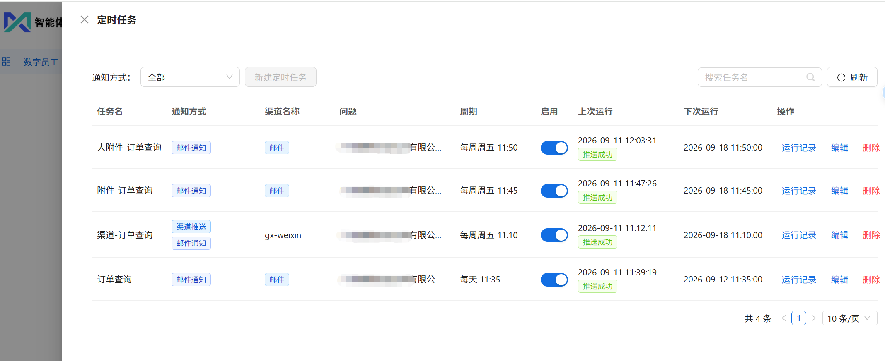

两种通知方式：

- **渠道推送**：任务关联一个 dip 渠道，到点把答案（或流式分块）推送到该渠道对应的 IM（钉钉、微信等）。需要渠道已配置 APIKey。
- **邮件通知**：无渠道任务，手动填写 API Key 与选择 LLM 模型，到点把答案以 HTML 邮件发给收件人。邮件通知在无渠道任务里**恒开、不可关**。

两者可共存：渠道推送任务里也可再开启「邮件通知」开关，到点同时推 IM 与发邮件。

列表「通知方式」列用标签展示：蓝色「渠道推送」、极客蓝「邮件通知」，两者皆有则双标签；都未配置则显示「未配置」。【来源渠道】列对渠道推送任务显示渠道名，对邮件通知任务显示「邮件」标签。

> 注：定时任务的增删改启停**独立于数字员工的发布状态**，即使数字员工已发布（查看模式）下也可随时管理其定时任务。

#### 新建/编辑定时任务

先选具体通知方式（渠道推送或邮件通知），再点击【新建定时任务】，在弹窗中填写。**任务模式（渠道 / 无渠道）创建时即定型，编辑时模式锁定、不可互转。**

公共字段：

- **任务名**：必填。
- **预设问题**：必填，到点后会自动把该问题发送给数字员工（wanwubot）执行并获取答案。
- **周期**：每天 / 每周。选「每周」时需选择星期。
- **执行时间**：HH:mm，到该时间点触发执行。

渠道推送特有字段：

- **关联渠道**（必填）：下拉选 dip 渠道，仅显示已配置 APIKey 的渠道。
- **异常处理**：默认【不推送】（仅执行成功才推送，失败时静默）；可选【推送错误信息】——任务失败时把一段自定义文案推送到关联渠道用于运维告警，选中后需填写【任务失败默认推送文案】（≤500 字）。
- **邮件通知**开关：可另开启邮件通知，开启后需填写收件人（与抄送人）。

邮件通知（无渠道）特有字段：

- **API Key**（必填，新建时）：手动填写 `ww-` 开头的 API Key。
- **LLM Model**（必填）：选择万悟 LLM 模型。
- **邮件通知**开关：恒开、不可关。
- **收件人**（必填）：逗号分隔多个邮箱，逐个校验格式。
- **抄送人**（可选）：同样逗号分隔、逐个校验格式。

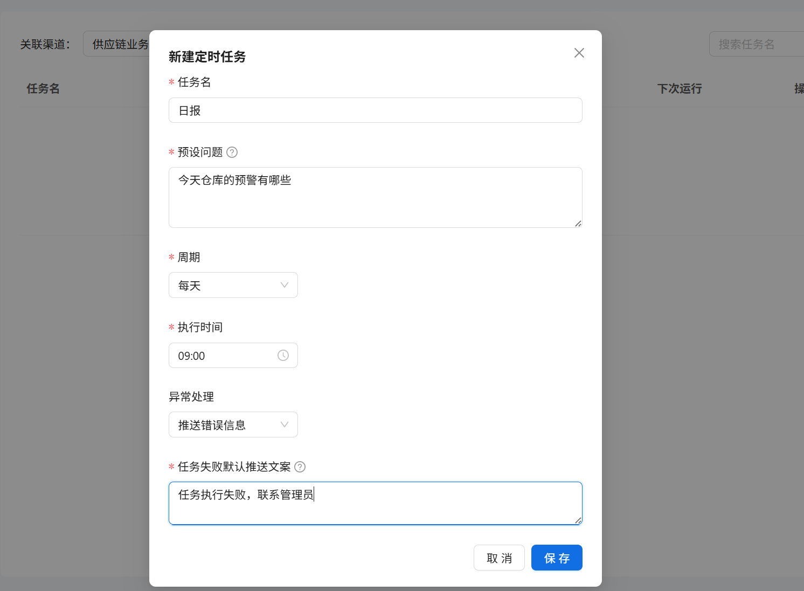

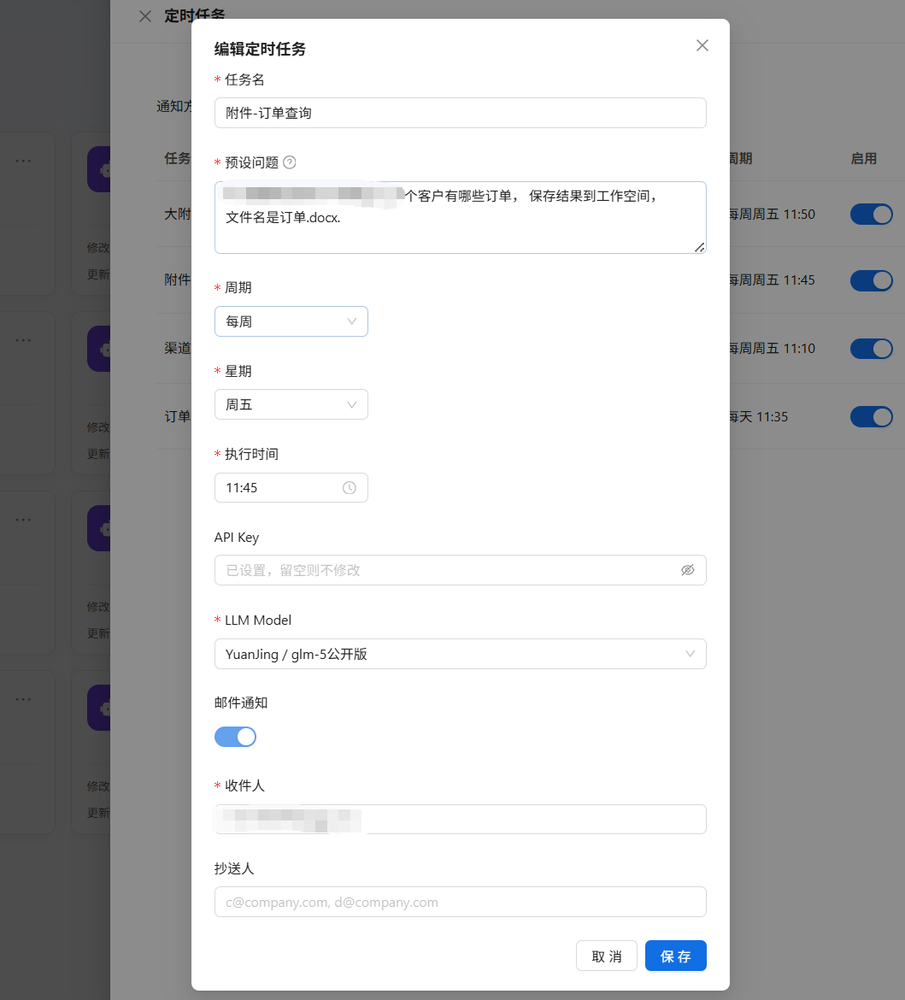

#### 启停、运行记录与删除

- **启用开关**：列表【启用】列可随时开启/停用任务，停用后到点不再执行。孤儿任务（关联渠道已被删除）开关禁用。
- **运行记录**：点击操作列【运行记录】打开抽屉，查看该任务的历史执行记录，包括运行时间、状态（推送成功/执行成功/推送失败/执行失败）、邮件状态（发送成功/发送失败/未发送）、耗时，以及每次的问题快照与答案。
- **编辑/删除**：可随时编辑任务配置或删除任务。删除后连同运行记录一并清除，不可恢复。

  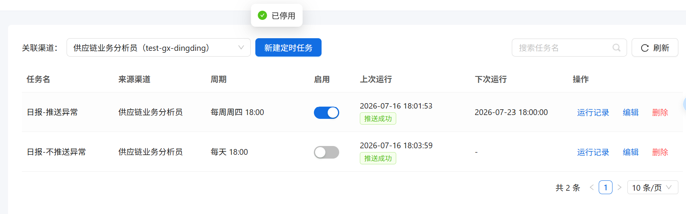

> 注：对于关联渠道已被删除的【孤儿】任务，仅支持查看运行记录与删除，不支持启停与编辑（渠道已删，凭证与推送链路已断，继续执行或改配置无意义）。

#### 到点执行

到点后，系统自动用渠道凭证（或邮件通知任务手动填的 API Key）向数字员工发起问数，仅推送最终正文（不含思考过程），并将执行结果写入运行记录，任务列表的【上次运行/下次运行】也会实时更新。

- **渠道推送**：答案以 Markdown 形式推送到关联 IM 渠道。
- **邮件通知**：答案以 HTML 邮件推送到收件人（含抄送）；工作区产生的小文件作为附件，大文件（≥ 阈值）上传对象存储后在正文放 presigned 下载链接（默认 7 天有效）。

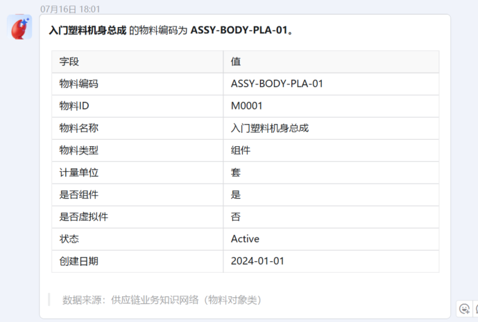

#### 邮件通知服务端配置（.env.ontology）

邮件通知依赖服务端的 SMTP 配置。服务启动时需在 **`.env.ontology`**中填写以下变量；**留空则邮件功能不可用**（`send_result` 返回 `failed`），但不影响定时任务主流程。

**SMTP 发信变量**：

| 变量 | 说明 | 默认值 |
| --- | --- | --- |
| `DH_SMTP_HOST` | SMTP 服务器地址 | （空） |
| `DH_SMTP_PORT` | 端口 | `465` |
| `DH_SMTP_USER` | 发信账号（同时作登录用户名） | （空） |
| `DH_SMTP_PASS` | 发信账号授权码 | （空） |
| `DH_SMTP_FROM_NAME` | 发件人显示名 | `数字员工` |
| `DH_SMTP_USE_SSL` | SSL 模式 | `auto` |
| `DH_SMTP_TIMEOUT` | 超时秒数 | `15` |

> SSL 自动判断：`port=465` → SSL，`port=587` → STARTTLS，其他端口按 `DH_SMTP_USE_SSL` 取值。

**大文件对象存储变量**（可选）：工作区文件 ≥ `DH_WS_ATTACH_THRESHOLD_MB` 时上传到对象存储，邮件正文放 presigned 下载链接；小于阈值的文件直接作为邮件附件。复用 infra 的 `WANWU_MINIO_*` 凭证，`WANWU_MINIO_HOST` 留空则禁用对象存储，大文件直接跳过。

| 变量 | 说明 | 默认值 |
| --- | --- | --- |
| `DH_OSS_BUCKET` | 对象存储桶名 | `dh-attachments` |
| `DH_OSS_SECURE` | 是否启用 HTTPS | `false` |
| `DH_OSS_LINK_TTL_DAYS` | presigned URL 有效期（天），SDK 硬上限 7 | `7` |
| `DH_WS_ATTACH_THRESHOLD_MB` | 小于该阈值的文件直接作为邮件附件 | `25` |
| `DH_WS_MAX_FILE_SIZE_MB` | 单文件大小上限 | `200` |

一句话总结：SMTP 三件套（`DH_SMTP_HOST` / `DH_SMTP_USER` / `DH_SMTP_PASS`）填齐即可发邮件；大文件下载链接需额外配置对象存储；不配邮件变量，定时任务照常跑，只是不发邮件。

## 3.发布数字员工

点击选中的数字员工，右上角可以查看版本历史和选择发布配置。点击【时钟】标志可以快速查看当前数字员工的版本历史。

点击【发布配置】后进入编辑页面，需要填写版本号信息、版本描述和选择发布范围，需注意**首次发布默认 `v0.0.1`，后续版本号须符合 `v主版本.次版本.修订号`且需要严格大于当前生效版本号，未发布的数字员工版本默认为草稿。**

发布配置后填写完后，点击【发布】即可发布成功，在**【发布配置】**的版本历史中可以看到之前发布的版本，选择指定历史版本点击右上角【...】覆盖当前草稿，**会将该版本的完整配置复制到当前草稿中供继续编辑**，但不改变当前生效版本号也不会产生新版本。

## 4.删除数字员工

点击数字员工卡片右上角【…】，选择对于已发布的数字员工和未发布的数字员工都可以直接删除。

## 5.调用数字员工

**数字员工发布后**会同步到万悟应用广场，左侧【快速对话】界面用户点击【数字员工】，可以先择**配置大模型**并**@数字员工名称** 后调用对应数字员工；对数字员工发送任务指令，万悟会根据【决策智能体】中数字员工最新配置执行角色、任务、技能和知识网络配置，并返回处理结果。

同样可以选择左侧【应用广场】点击【数字员工】浏览**当前发布的最新版本**的数字员工，点击数字员工卡片可以直接调用对应数字员工，然后对数字员工发送任务指令。

